---

# 📦 Module 2: Case Study - 1 (EC2-EBS-EFS)
## 📝 Tasks to Be Performed

1. Create an EC2 instance in the **US-East-1 (N. Virginia)** region with Linux OS and configure it as a web server using an AMI.
2. Replicate the instance in the **US-West-2 (Oregon)** region.
3. Build two EBS volumes and attach them to the instance in **US-East-1**.
4. Detach and delete one volume, then extend the size of the other.
5. Take a backup of the remaining EBS volume.

---

## ⚙️ Setup Steps

### 🚀 Create EC2 Instance in US-East-1
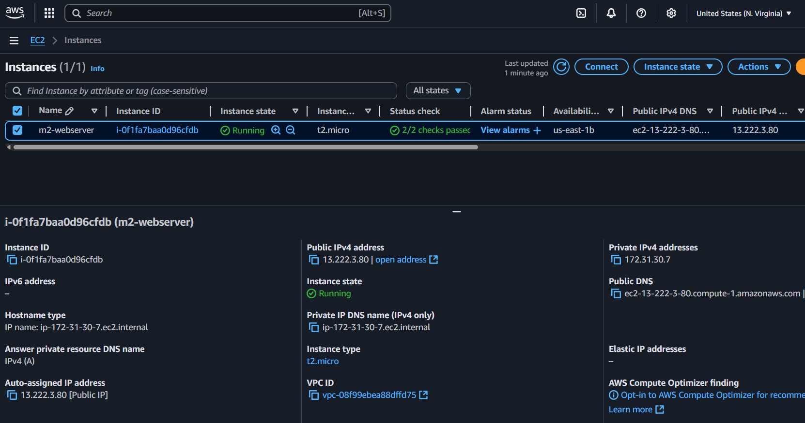

### 🔧 SSH into Instance and Install Nginx
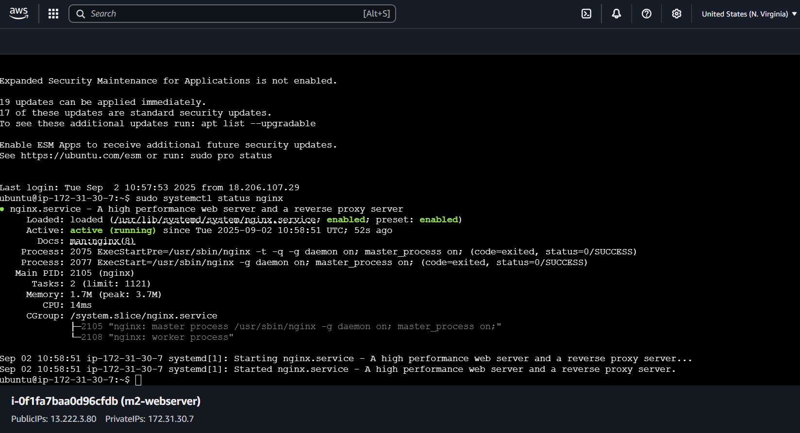

### 🌐 Verify Web Server via Public DNS
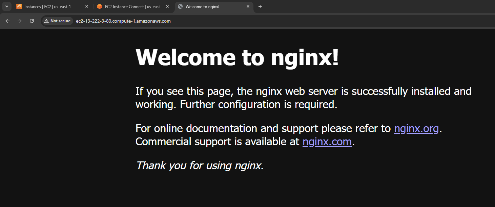

---

## 📸 Create AMI from EC2 Instance

### 🧱 Create Image
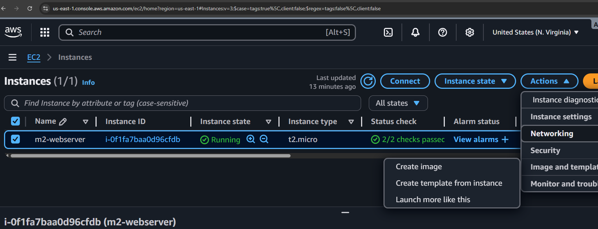

### ✅ AMI Created
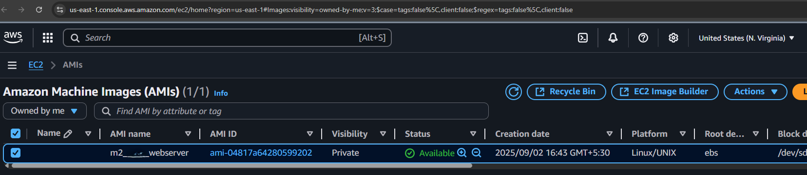

---

## 🌍 Replicate Instance in US-West-2 (Oregon)

### 📤 Copy AMI to Oregon
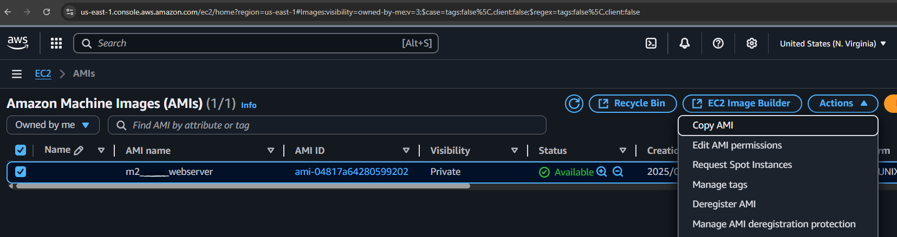  

### 🔄 Switch Region and Verify AMI Availability
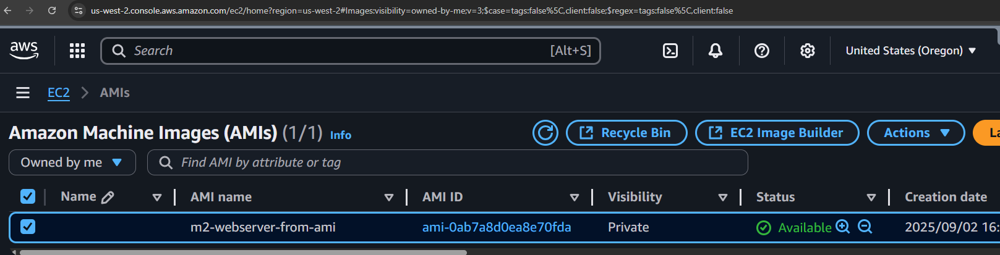

---

## 💾 Manage EBS Volumes in US-East-1

### ➕ Create Two EBS Volumes
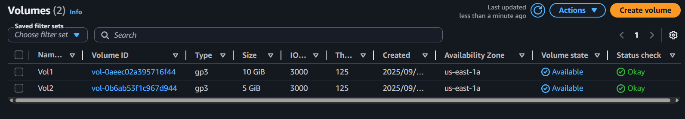

### 🔗 Attach Volumes to EC2 Instance
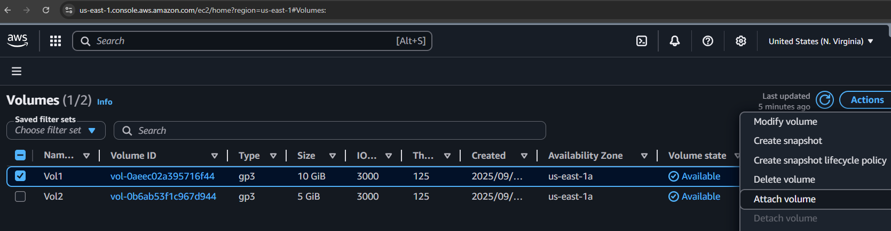

#### 📎 Volume 1 Attached
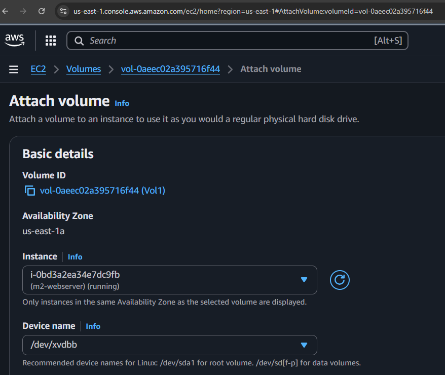

#### 📎 Volume 2 Attached
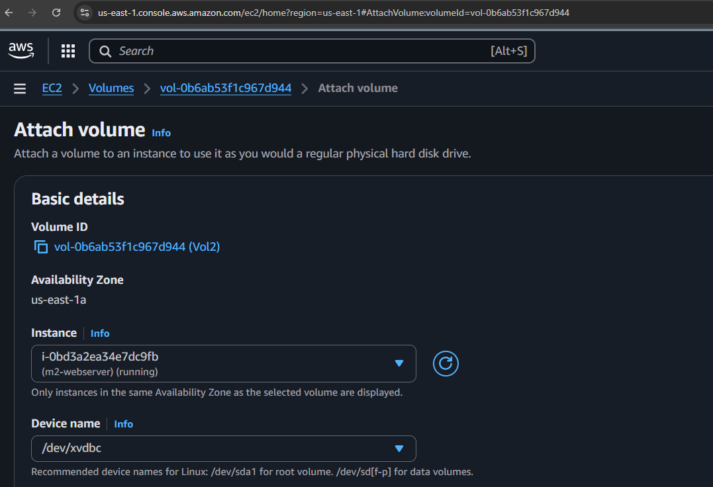

---

## 🧪 Configure Volumes on Instance

### 🔍 Confirm Volumes via SSH
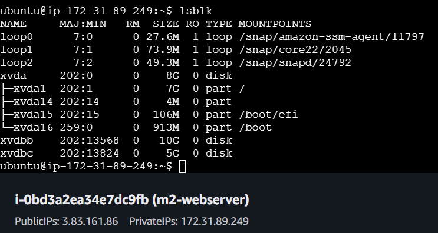

### 🧼 Format Disks
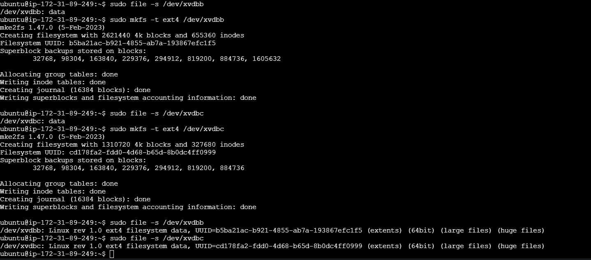

### 📂 Mount Volumes
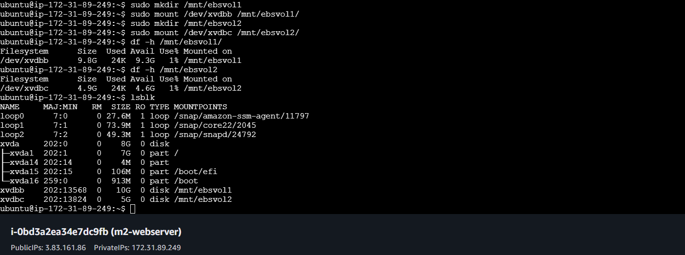

---

## 🧹 Detach and Delete Volume 2

### 🔌 Detach Volume 2
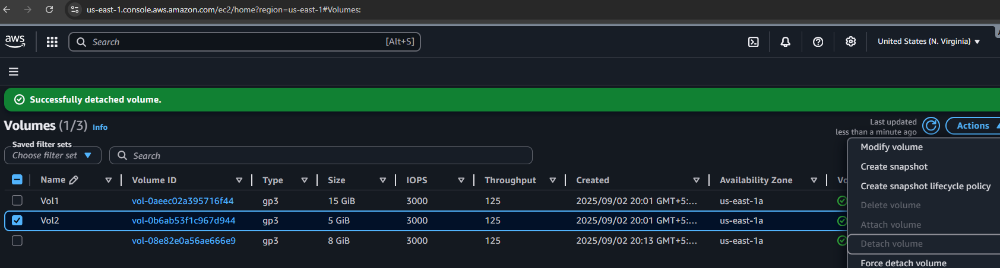

### 🗑️ Delete Volume 2
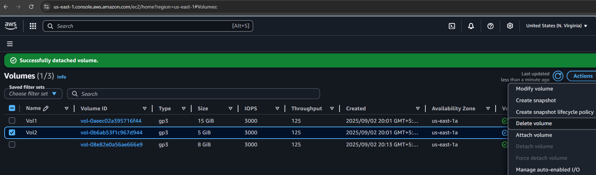

---

## 📏 Resize Volume 1

### 🔧 Modify Volume from 10GB to 15GB
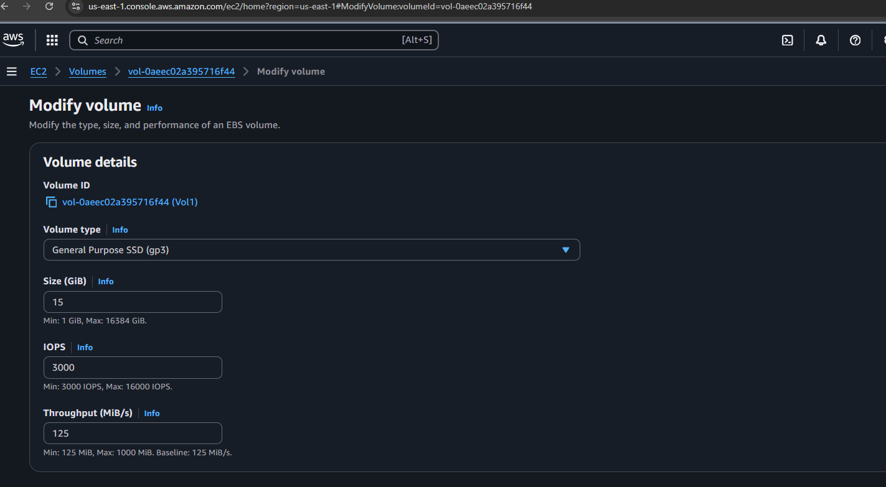

### 📊 Verify Resized Volume in Terminal
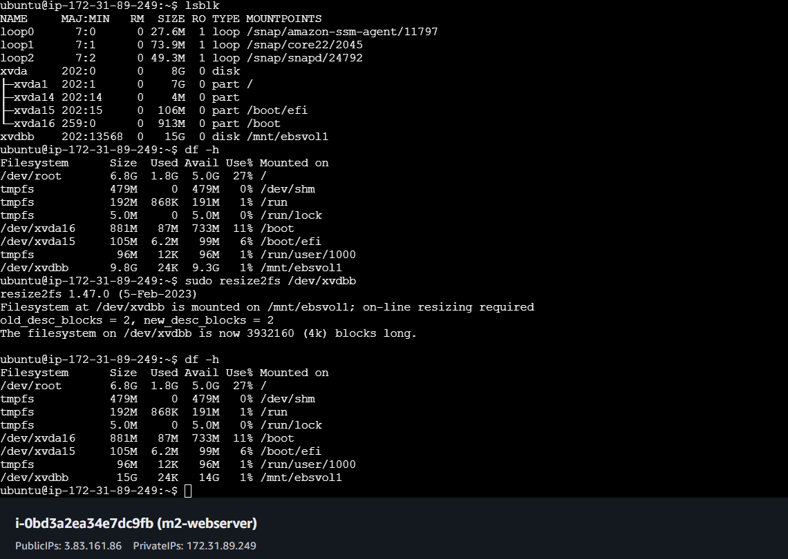

---

## 🛡️ Backup Volume 1

### 📸 Create Snapshot
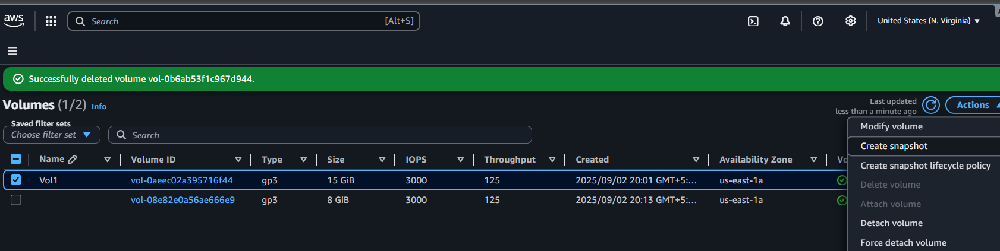  
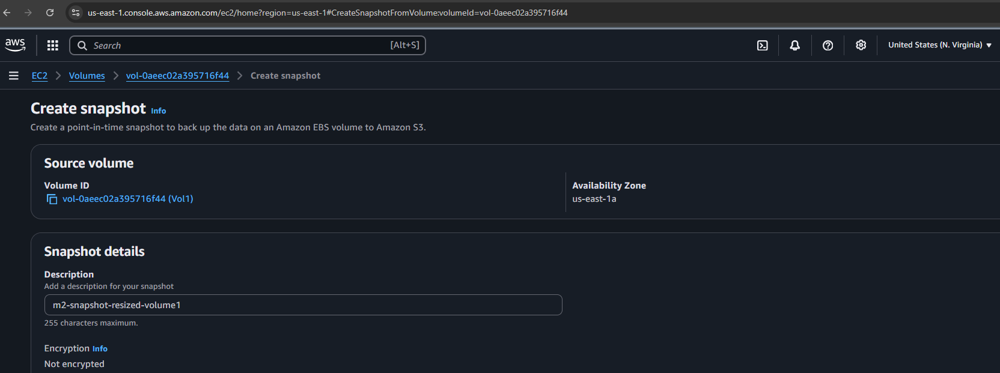

### ✅ Snapshot Completed
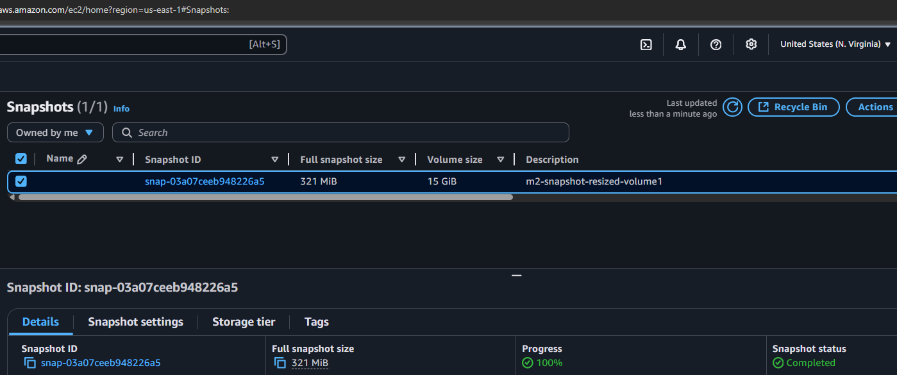

---
