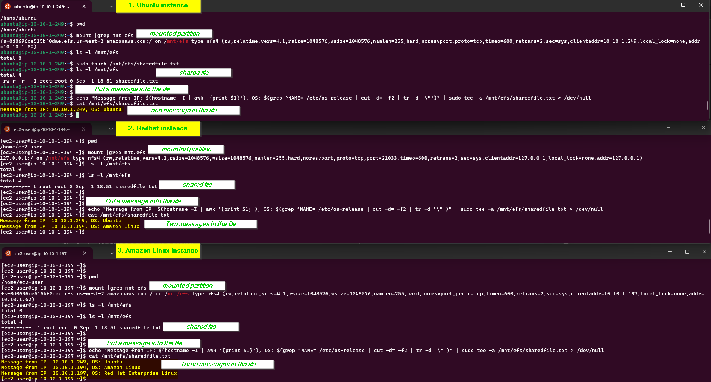

# Module 2: EC2 and EFS

### Tasks To Be Performed:
1. Create an EFS and connect it to 3 different EC2 instances. Make sure that all instances have different operating systems. For instance, Ubuntu, Red Hat Linux and Amazon Linux 2.
***
### Setup Steps

1. **Create VPC** (`10.10.0.0/16`)
2. **Create Internet Gateway (IGW)** and attach to VPC
3. **Create Public Subnet** (`10.10.1.0/24`)
4. **Create Route Table:** add default route (0.0.0.0/0) to IGW; associate with public subnet
5. **Create EC2 Key Pair** for SSH access
6. **Create Security Groups:**
    - **EC2 SG:** Inbound SSH from anywhere (0.0.0.0/0)
    - **EFS Mount Target SG:** Inbound NFS (TCP 2049) from public subnet CIDR
7. **Launch EC2 Instances:**
    - 1 x Ubuntu
    - 1 x Red Hat
    - 1 x Amazon Linux
    - All in the public subnet, with EC2 SG attached
    - (Optional) Attach IAM role for SSM and AWS access if automation is used
8. **Create EFS File System**
9. **Create EFS Mount Target** in the public subnet with the EFS SG attached
10. **Configure User Data Scripts:** EC2 instances auto-install required packages and mount EFS on `/mnt/efs` at boot

### Test Procedure

- SSH to each instance and verify `/mnt/efs` is mounted
- Create a test file from one instance and read/write it from others
- Confirm data is synchronized (shared) across all mounts

### Cleanup

- Terminate EC2 instances
- Delete EFS mount targets, file system
- Remove security groups, route tables, subnets, IGW
- Delete VPC

### Troubleshooting

- Check security group rules if SSH or NFS fails
- Ensure EFS uses the fully-qualified DNS name in mount commands
- Resolve dependency errors when deleting VPC (see [Cleanup](#cleanup))

### Assumptions

- All resources deployed in AWS region `us-west-2`
- Only a public subnet is created (no private subnet required)
    

### Execution details
#### Edit config.py and set values
```bash
$ cat config.py
REGION = 'us-west-2'  # Oregon, for sandbox/testing
AVAILABILITYZONE='us-west-2a'

ANY_CIDR = '0.0.0.0/0'

VPC_NAME="m2-vpc"
VPC_CIDR = '10.10.0.0/16'
VPC_SUBNET_NAME="m2-vpc-pvt-subnet"
VPC_PVT_SUBNET = '10.10.1.0/24'

INSTANCE_TYPE='t2.micro'
EFS_NAME='m2-efs'
```
### Create a VPC and networking
```bash
$ python3 vpc.py --action create-vpc
```
```bash
# Example Output
Created VPC m2-vpc-network with ID vpc-0defc353743e9fe48 and CIDR 10.10.0.0/16
Created and attached IGW igw-073a2a1c979a90dd9 to VPC vpc-0defc353743e9fe48
Created subnet m2-pub-subnet with ID subnet-0554fc55d2e7cab9a and CIDR 10.10.1.0/24
Created route table m2-pub-routetable with ID rtb-07ebba2fd4626f16d
Associated route table rtb-07ebba2fd4626f16d with subnet subnet-0554fc55d2e7cab9a
Created route 0.0.0.0/0 => igw-073a2a1c979a90dd9 in rtb-07ebba2fd4626f16d
--- VPC Network Resources Summary ---
VPC ID: vpc-0defc353743e9fe48
IGW ID: igw-073a2a1c979a90dd9
Public Subnet ID: subnet-0554fc55d2e7cab9a
Public Route Table ID: rtb-07ebba2fd4626f16d
```


```bash
# Set environment variables
$ export VPC_ID="vpc-0defc353743e9fe48"
$ export IGW_ID="igw-073a2a1c979a90dd9"
$ export SUBNET_ID="subnet-0554fc55d2e7cab9a"
$ export ROUTE_TABLE_ID="rtb-07ebba2fd4626f16d"
```
### Create a Security groups
```bash
$ python3 sg.py --action create-sg --vpc-id $VPC_ID
```
```bash
# Example Output
Created security group sg-for-efs with ID sg-0ec4621860f2c45d6
Ingress rules set for sg-for-efs
Created security group sg-for-ec2 with ID sg-0d50b3afaea7489d2
Ingress rules set for sg-for-ec2
```


```bash
# Set environment variables
$ export EFS_SG_ID="sg-0ec4621860f2c45d6"
$ export EC2_SG_ID="sg-0d50b3afaea7489d2"
```
### Create EFS 
```bash
$ python3 efs.py --action create-efs
```
```bash
# Example Output
EFS FileSystemId: fs-0d0696ce515bf0dae
```

```bash
# Set environment variables
$ export EFS_ID="fs-0d0696ce515bf0dae"
```
### Create mount target
```bash
$ python3 efs.py --action create-mount-target --efs-id $EFS_ID --subnet-id $SUBNET_ID --sg-id $EFS_SG_ID
````
```bash
# Example Output
Created mount target ID: fsmt-07a039536d789a09a for EFS fs-0d0696ce515bf0dae
```

```bash
# Set environment variables
$ export MOUNT_TARGET_ID="fsmt-07a039536d789a09a"
```
### Create Keypair
```bash
$ python3 keypair.py --action create 
```
```bash
# Start the SSH agent:
$ eval "$(ssh-agent -s)"
Agent pid 63080

# Add private key
$ ssh-add MyKeyPair.pem
Identity added: MyKeyPair.pem (MyKeyPair.pem)

# Verify the key was added
$ ssh-add -l
2048 SHA256:wCwjgfzd4/H74AaCeiO99ZqgK1SENwg+yupKBtMJWDU MyKeyPair.pem (RSA)
```
### Create EC2 instance with Ubuntu linux
```bash
$ python3 ec2.py --action create --subnet-id $SUBNET_ID --sg-ids $EC2_SG_ID --key-name "MyKeyPair" --os ubuntu --efs-id $EFS_ID
```
```bash
# Example Output
OS: ubuntu AMI: ami-0a15226b1f7f23580
Instance ubuntu_server created
Instance ubuntu_server running with ID: i-04594eb5e2cd972cb
```
```bash
# Set environment variables
export EC2_INST_UBUNTU_LINUX="i-04594eb5e2cd972cb"
```
### Create EC2 instance with Redhat linux
```bash
$ python3 ec2.py --action create --subnet-id $SUBNET_ID --sg-ids $EC2_SG_ID --key-name "MyKeyPair" --os redhat --efs-id $EFS_ID
```
```bash
# Example Output
Instance redhat_server created
Instance redhat_server running with ID: i-0de1949bac2f70384
```
```bash
# Set environment variables
export EC2_INST_REDHAT_LINUX="i-0de1949bac2f70384"
```
### Create EC2 instance with Amazon linux
```bash
$ python3 ec2.py --action create --subnet-id $SUBNET_ID --sg-ids $EC2_SG_ID --key-name "MyKeyPair" --os amzn-linux --efs-id $EFS_ID
```
```bash
# Example Output
OS: amzn-linux AMI: ami-022552c8354f3cb14
Instance amzn-linux_server created
Instance amzn-linux_server running with ID: i-0dd53d267d1ba52e9
```
```bash
# Set environment variables
export EC2_INST_AMZN_LINUX="i-0dd53d267d1ba52e9"
```


### Connect to the EC2 instances
```bash
# Ubuntu linux
$ ssh ubuntu@34.219.232.74
```
```bash
# Redhat linux
$ ssh  ec2-user@44.244.90.13
```
```bash
# Amazon linux
$ ssh  ec2-user@35.95.121.100
```
### Mount package configuration already done through user data script as part of instance creation through ec2.py script.
#### Refer 'get_user_data_script' function in ec2.py script
```python
# EFS FQDN
efs_dns = f"{efs_id}.efs.{region}.amazonaws.com"

# User data script for Redhat and Amazon linux
user_data_script = f"""#!/bin/bash
sudo yum install nfs-utils -y
sudo mkdir -p /mnt/efs
sudo mount -t efs {efs_dns}:/ /mnt/efs
"""

# User data script for Ubuntu linux
nfs_options="rsize=1048576,wsize=1048576,hard,timeo=600,retrans=2,noresvport"
user_data_script = f"""#!/bin/bash
sudo apt-get update
sudo apt-get install -y nfs-common
sudo mkdir -p /mnt/efs
sudo mount -t nfs4 -o nfsvers=4.1,{nfs_options} {efs_dns}:/ /mnt/efs
"""
```
### Run the following commands in each instance
```bash
# Check for the mount
$ mount |grep mnt.efs

# check contents of the folder
$ ls -l /mnt/efs

# Create a file in mounted folder
sudo touch /mnt/efs/sharedfile.txt 

# Put a unique message into the file
echo "Message from IP: $(hostname -I | awk '{print $1}'), OS: $(grep ^NAME= /etc/os-release | cut -d= -f2 | tr -d '\"')" | sudo tee -a /mnt/efs/sharedfile.txt > /dev/null
```


### Terminate the instances
```bash
$ python3 ec2.py --action terminate --terminate-ids $EC2_INST_UBUNTU_LINUX $EC2_INST_REDHAT_LINUX $EC2_INST_AMZN_LINUX
```
```bash
# Example Output
Terminating instance i-04594eb5e2cd972cb
Instance i-04594eb5e2cd972cb terminated
Terminating instance i-0de1949bac2f70384
Instance i-0de1949bac2f70384 terminated
Terminating instance i-0dd53d267d1ba52e9
Instance i-0dd53d267d1ba52e9 terminated
```
### Delete Keypair
```bash
$ python3 keypair.py --action delete
```
```bash
# Example Output
Deleted key pair: MyKeyPair
Deleted local key file: MyKeyPair.pem
```
### Delete mount target
```bash
$ python3 efs.py --action delete-mount-target --mount-target-id $MOUNT_TARGET_ID
```
```bash
# Example Output
Deleted mount target fsmt-07a039536d789a09a
```
### Delete EFS
```bash
$ python3 efs.py --action delete-efs --efs-id $EFS_ID
```bash
# Example Output
Deleted EFS filesystem fs-0d0696ce515bf0dae
```
### Delete security groups
```bash
python3 sg.py --action delete-sg --efs-sg-id $EFS_SG_ID --ec2-sg-id $EC2_SG_ID
```
```bash
# Example Output
Deleted security group sg-0ec4621860f2c45d6
Deleted security group sg-0d50b3afaea7489d2
```

### Delete VPC and networking
```bash
$ python3 vpc.py --action delete-vpc --vpc-id $VPC_ID --igw-id $IGW_ID --subnet-id $SUBNET_ID --rt-tbl-id $ROUTE_TABLE_ID
```
```bash
# Example Output
Deleting route table rtb-07ebba2fd4626f16d
Deleted subnet subnet-0554fc55d2e7cab9a
Detached IGW igw-073a2a1c979a90dd9 from VPC vpc-0defc353743e9fe48
Deleted IGW igw-073a2a1c979a90dd9
Deleted VPC vpc-0defc353743e9fe48
```
