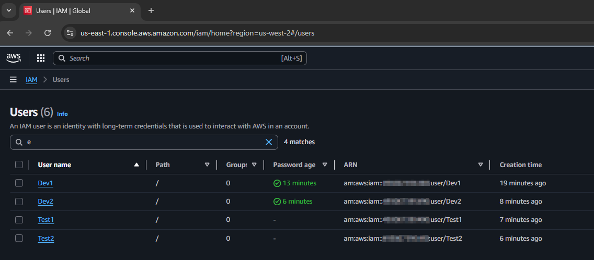
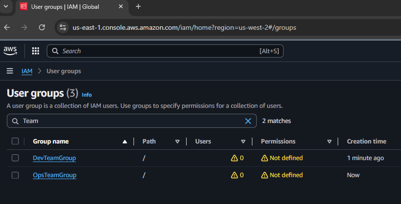
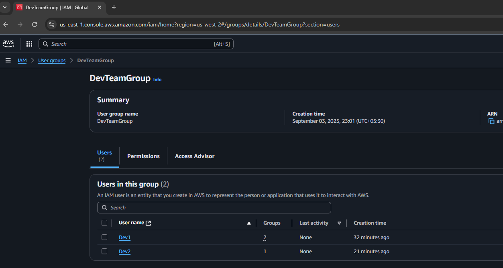
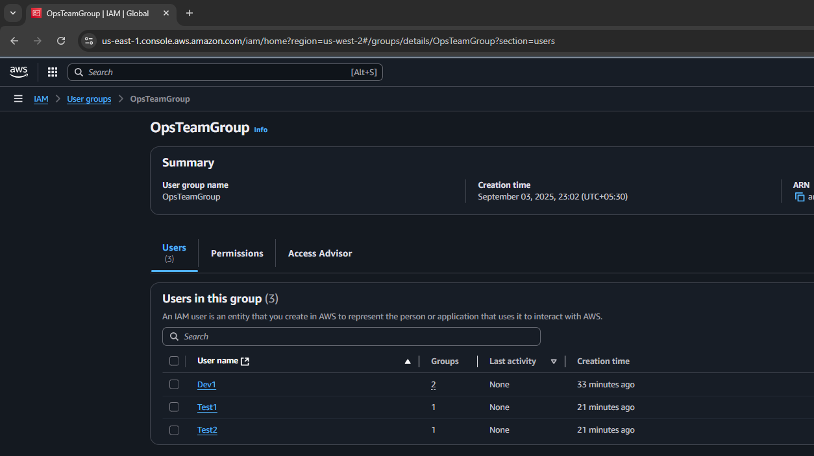

# Module 3: IAM Users

## Tasks To Be Performed

1. Create 4 IAM users: `Dev1`, `Dev2`, `Test1`, and `Test2`  
2. Create 2 IAM groups: `Dev Team` and `Ops Team`  
3. Add `Dev1` and `Dev2` to the **Dev Team**  
4. Add `Dev1`, `Test1`, and `Test2` to the **Ops Team**

## CLI Tools Used

This assignment was executed using the following AWS CLI commands:

- `aws iam create-user` – Creates IAM users
- `aws iam create-login-profile` – Sets console access credentials
- `aws iam create-group` – Creates IAM groups
- `aws iam add-user-to-group` – Assigns users to groups

All commands were run in a `Bash shell` environment with `environment variables` for parameterization. `Screenshots` from the `AWS Console` are included to visually confirm each step and outcome.

---

## Folder Structure

The repository is organized as follows:

```
.
├── README.md
└── images
    ├── 01_users.png
    ├── 02_groups.png
    ├── 03_user_group_mapping1.png
    └── 04_user_group_mapping2.png

```
- [`README.md`](README.md) This file provides a comprehensive overview of the assignment, including setup instructions, key concepts, and visual references. Screenshots embedded throughout the README are sourced from the [`images/`](images) directory.

- [`images/`](images) This folder contains all visuals used to illustrate key components. Each item includes a direct link to the file in the repository:
  - [`01_users.png`](images/01_users.png) Screenshot of configured user accounts  
  - [`02_groups.png`](images/02_groups.png) Screenshot of defined user groups and their attributes  
  - [`03_user_group_mapping1.png`](images/03_user_group_mapping1.png) Screenshot showing initial mapping of users to the `Ops Team`  
  - [`04_user_group_mapping2.png`](images/04_user_group_mapping2.png) Screenshot showing final mapping of users to the `Dev Team`  
---

### Prerequisites

Before running the commands, export the required environment variables

```bash
$ export DEV1_USER="Dev1"
$ export DEV2_USER="Dev2"
$ export TEST1_USER="Test1"
$ export TEST2_USER="Test2"

$ export DEV2_PASSWORD=<set-value>
$ export DEV2_PASSWORD=<set-value>
$ export TEST1_PASSWORD=<set-value>
$ export TEST2_PASSWORD=<set-value>

$ export DEV_TEAM_GROUP="DevTeamGroup"
$ export OPS_TEAM_GROUP="OpsTeamGroup"
```

### 1. Create 4 IAM users: `Dev1`, `Dev2`, `Test1`, and `Test2`

Each user is created using `aws iam create-user`, followed by `aws iam create-login-profile` to enable AWS Console access.

**Create Dev1 User**
```bash
$ aws iam create-user --user-name $DEV1_USER
```
```json
{
    "User": {
        "Path": "/",
        "UserName": "Dev1",
        "UserId": "<REDACTED_USER_ID>",
        "Arn": "arn:aws:iam::<REDACTED_ACCOUNT_ID>:user/Dev1",
        "CreateDate": "2025-08-12T05:23:23Z"
    }
}
```

**Set Password for Dev1 User**
```bash
$ aws iam create-login-profile --user-name $DEV1_USER --password $DEV1_PASSWORD
```
```json
{
    "LoginProfile": {
        "UserName": "Dev1",
        "CreateDate": "2025-08-12T06:46:09Z",
        "PasswordResetRequired": false
    }
}
```

**Create Dev2 User**
```bash
$ aws iam create-user --user-name $DEV2_USER
```
```json
{
    "User": {
        "Path": "/",
        "UserName": "Dev2",
        "UserId": "<REDACTED_USER_ID>",
        "Arn": "arn:aws:iam::<REDACTED_ACCOUNT_ID>:user/Dev2",
        "CreateDate": "2025-08-12T05:25:26Z"
    }
}
```

**Set Password for Dev2 User**
```bash
$ aws iam create-login-profile --user-name $DEV2_USER --password $DEV2_PASSWORD
```
```json
{
    "LoginProfile": {
        "UserName": "Dev2",
        "CreateDate": "2025-08-12T06:48:22Z",
        "PasswordResetRequired": false
    }
}
```

**Create Test1 User**
```bash
$ aws iam create-user --user-name $TEST1_USER
```
```json
{
    "User": {
        "Path": "/",
        "UserName": "Test1",
        "UserId": "<REDACTED_USER_ID>",
        "Arn": "arn:aws:iam::<REDACTED_ACCOUNT_ID>:user/Test1",
        "CreateDate": "2025-08-12T07:10:13Z"
    }
}
```

**Set Password for Test1 User**
```bash
$ aws iam create-login-profile --user-name $TEST1_USER --password $TEST1_PASSWORD
```
```json
{
    "LoginProfile": {
        "UserName": "Test1",
        "CreateDate": "2025-08-12T07:11:28Z",
        "PasswordResetRequired": false
    }
}
```

**Create Test2 User**
```bash
$ aws iam create-user --user-name $TEST2_USER
```
```json
{
    "User": {
        "Path": "/",
        "UserName": "Test2",
        "UserId": "<REDACTED_USER_ID>",
        "Arn": "arn:aws:iam::<REDACTED_ACCOUNT_ID>:user/Test2",
        "CreateDate": "2025-08-12T07:10:13Z"
    }
}
```

**Set Password for Test2 User**
```bash
$ aws iam create-login-profile --user-name $TEST2_USER --password $TEST2_PASSWORD
```
```json
{
    "LoginProfile": {
        "UserName": "Test2",
        "CreateDate": "2025-08-12T07:11:28Z",
        "PasswordResetRequired": false
    }
}
```

### Screenshot: IAM Users Created
<!-- Screenshot: Created Users -->


> Each command returns a JSON response with the user’s ARN, creation timestamp, and login profile status.

---

## 2) Create 2 groups named “Dev Team” and “Ops Team”.

Use `aws iam create-group` command to create the two groups

**Create Dev Team group**
```bash
$ aws iam create-group --group-name $DEV_TEAM_GROUP
```
Output
```bash
{
    "Group": {
        "Path": "/",
        "GroupName": "DevTeamGroup",
        "GroupId": "<REDACTED_GROUP_ID>,
        "Arn": "arn:aws:iam::<REDACTED_ACCOUNT_ID>:group/DevTeamGroup",
        "CreateDate": "2025-08-12T06:54:36Z"
    }
}
```

**Create Ops Team group**
```bash
$ aws iam create-group --group-name $OPS_TEAM_GROUP
```
Output
```bash
{
    "Group": {
        "Path": "/",
        "GroupName": "OpsTeamGroup",
        "GroupId": "<REDACTED_GROUP_ID>",
        "Arn": "arn:aws:iam::<REDACTED_ACCOUNT_ID>:group/OpsTeamGroup",
        "CreateDate": "2025-08-12T06:56:05Z"
    }
}
```
### Screenshot: IAM Groups Created
<!-- Screenshot: Created Users -->


> These groups can later be attached to IAM policies to control access across multiple users.

## 3) Add Dev1 and Dev2 to the Dev Team.

Use `aws iam add-user-to-group` command to assign users to the `Dev Team group`.

**Add Dev1 user to DevTeam Group**  
```bash
$ aws iam add-user-to-group --group-name $DEV_TEAM_GROUP --user-name $DEV1_USER
```
**Add Dev2 user to DevTeam Group**  
```bash
$ aws iam add-user-to-group --group-name $DEV_TEAM_GROUP --user-name $DEV2_USER
```
### Screenshot: Dev Team Membership


> This step ensures Dev1 and Dev2 inherit any permissions assigned to the Dev Team group.

## 4) Add Dev1, Test1 and Test2 to the Ops Team.

Use `aws iam add-user-to-group` command to assign users to the `Ops Team group`.

**Add Dev1 user to OpsTeam Group**  
```
$ aws iam add-user-to-group --group-name $OPS_TEAM_GROUP --user-name $DEV1_USER
```
**Add Test1 user to OpsTeam Group**  
```
$ aws iam add-user-to-group --group-name $OPS_TEAM_GROUP --user-name $TEST1_USER
```
**Add Test2 user to OpsTeam Group**  
```
$ aws iam add-user-to-group --group-name $OPS_TEAM_GROUP --user-name $TEST2_USER
```

### Screenshot: Ops Team Membership


> Note that `Dev1` belongs to both groups, demonstrating multi-group membership.
---
