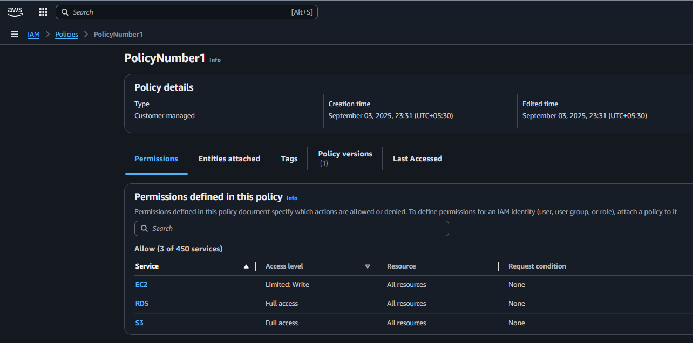
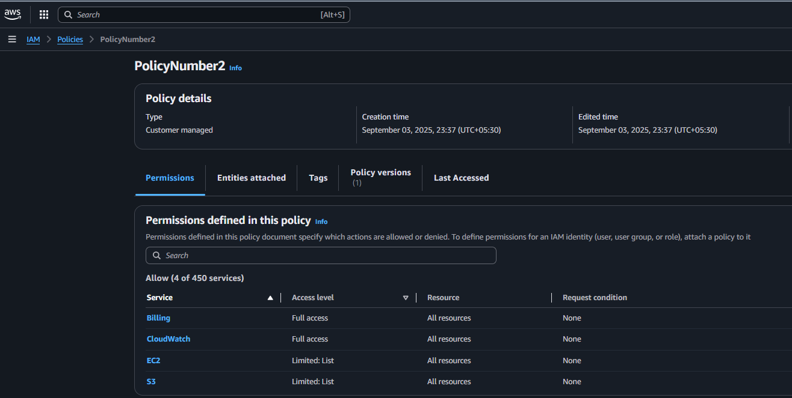
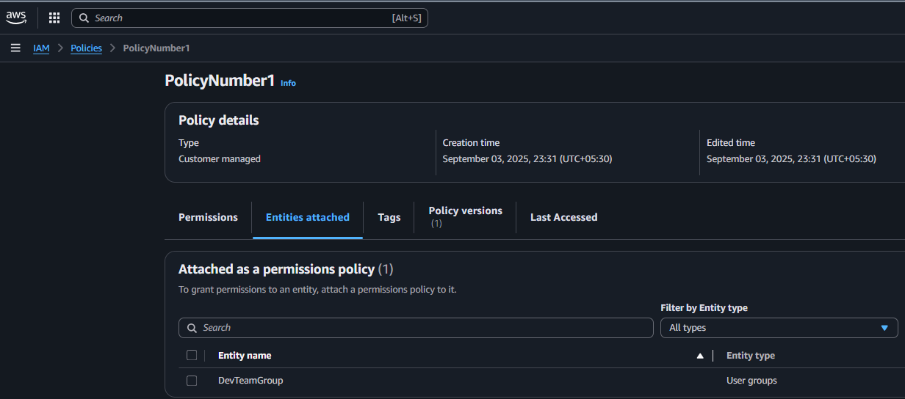
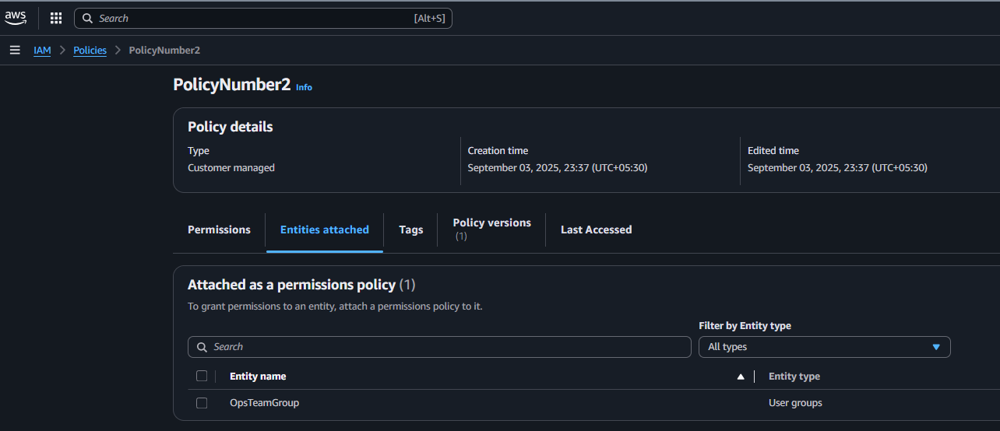

# 👥 Module 3: IAM Policies

## Tasks To Be Performed

1. Create `policy number 1` which lets the users to:  
a. Access `S3` completely  
b. Only create `EC2 instances`  
c. Full access to `RDS`  
2. Create a `policy number 2` which allows the users to:
a. Access `CloudWatch` and `billing` completely  
b. Can only list `EC2` and `S3` resources  

## CLI Tools Used

This assignment was executed using the following AWS CLI commands:

- `aws iam create-policy` — Creates a custom IAM policy.
- `aws iam list-policies` — Lists available policies and their attributes.
- `aws iam attach-group-policy` — Maps policies to IAM groups.

For generating JSON-formatted IAM policies, the [AWS Policy Generator](https://awspolicygen.s3.amazonaws.com/policygen.html) was used.

All commands were run in a `Bash shell` environment with `environment variables` for parameterization. `Screenshots` from the `AWS Console` are included to visually confirm each step and outcome.

## Folder Structure

The repository is organized as follows:

```
.
├── README.md
├── images
│   ├── 01_policy1.png
│   ├── 02_policy2.png
│   ├── 03_policy1_entities_attached.png
│   └── 04_policy2_entities_attached.png
├── policy1.json
└── policy2.json
```

- [`README.md`](README.md) This file provides a comprehensive overview of the assignment, including setup instructions, key concepts, and visual references. Screenshots embedded throughout the README are sourced from the `images/` directory.

- [`images/`](images) This folder contains all visuals used to illustrate key components. Each item includes a direct link to the file in the repository:

  - [`01_policy1.png`](images/01_policy1.png) Screenshot of IAM policy configuration for `S3`, `EC2` and `RDS`  
  - [`02_policy2.png`](images/02_policy2.png) Screenshot of IAM policy configuration `ClowdWatch`, `BIlling`, `EC2` and `S3`
  - [`03_policy1_entities_attached.png`](images/03_policy1_entities_attached.png) Screenshot showing `DevTeamGroup` entity attached to `policy1`  
  - [`04_policy2_entities_attached.png`](images/04_policy2_entities_attached.png) Screenshot showing `OpsTeamGroup` entity attached to `policy2`

[`policy1.json`](policy1.json) JSON definition of the 'Policy Number 1' IAM policy  
[`policy2.json`](policy2.json) JSON definition of the 'Policy Number 2' IAM policy

## Prerequisites

- Prepare environment as described in [`IAM Users`](../m3-a01-iam-users/README.md) assignment solution
- Before running the commands, export the required environment variables

```bash
export POLICY_NUMBER1="PolicyNumber1"
export POLICY_NUMBER2="PolicyNumber2"
```

## Inspect the contents of [`policy1.json`](policy1.json)
```json
{
  "Version": "2012-10-17",
  "Statement": [
    {
      "Sid": "Statement1",
      "Effect": "Allow",
      "Action": "s3:*",
      "Resource": "*"
    },
    {
      "Sid": "Statement2",
      "Effect": "Allow",
      "Action": [
        "ec2:RunInstances"
      ],
      "Resource": "*"
    },
    {
      "Sid": "Statement3",
      "Effect": "Allow",
      "Action": "rds:*",
      "Resource": "*"
    }
  ]
}
```
This IAM policy grants permissions across three AWS services. Each statement is described below:

- **`Statement1`** – Grants permission to perform *any* action (`s3:*`) on *all* S3 resources. Useful for enabling unrestricted access to buckets, objects, and S3 configurations.

- **`Statement2`** – Allows the `ec2:RunInstances` action on all EC2 resources. This enables users or roles to launch new EC2 instances but does **not** include other EC2 operations like termination or modification.

- `Statement3` – Grants permission to perform *any* action (`rds:*`) on *all* RDS resources. This includes creating, modifying, deleting, and managing RDS databases and instances.


## Inspect the contents of [`policy2.json`](policy2.json)

```json
{
  "Version": "2012-10-17",
  "Statement": [
    {
      "Sid": "Statement1",
      "Effect": "Allow",
      "Action": "cloudwatch:*",
      "Resource": "*"
    },
    {
      "Sid": "Statement2",
      "Effect": "Allow",
      "Action": "billing:*",
      "Resource": "*"
    },
    {
      "Sid": "Statement3",
      "Effect": "Allow",
      "Action": [
        "ec2:DescribeInstances"
      ],
      "Resource": "*"
    },
    {
      "Sid": "Statement4",
      "Effect": "Allow",
      "Action": [
        "s3:ListBucket"
      ],
      "Resource": "*"
    }
  ]
}
```
This IAM policy grants read and monitoring permissions across key AWS services. Each statement is described below:

- `Statement1` – Grants permission to perform *any* action (`cloudwatch:*`) on all CloudWatch resources. Enables monitoring, metric collection, alarm configuration, and log access across services.

- `Statement2` – Allows all actions (`billing:*`) related to billing and cost management. Useful for viewing invoices, budgets, usage reports, and managing billing alerts.

- `Statement3` – Grants permission to run `ec2:DescribeInstances` on all EC2 resources. Enables read-only access to instance metadata, configurations, and status — without modification rights.

- `Statement4` – Allows the `s3:ListBucket` action on all S3 buckets. Provides visibility into bucket names and basic metadata, but does **not** allow access to objects inside the buckets.

## 1. Create IAM Policy: `PolicyNumber1`

The following command was used to create a custom IAM policy using the JSON definition in [`policy1.json`](policy1.json):

```bash
$ aws iam create-policy --policy-name $POLICY_NUMBER1 --policy-document file://policy1.json
```
```json
{
    "Policy": {
        "PolicyName": "PolicyNumber1",
        "PolicyId": "<REDACTED_POLICY_ID>",
        "Arn": "arn:aws:iam::<REDACTED_ACCOUNT_ID>:policy/PolicyNumber1",
        "Path": "/",
        "DefaultVersionId": "v1",
        "AttachmentCount": 0,
        "PermissionsBoundaryUsageCount": 0,
        "IsAttachable": true,
        "CreateDate": "2025-08-12T08:57:47Z",
        "UpdateDate": "2025-08-12T08:57:47Z"
    }
}
```
Upon successful execution, AWS returns metadata about the newly created policy, including its ARN, version ID, and attachability status. This confirms that the policy is ready to be linked to IAM entities such as users, groups, or roles.

### Screenshot of the policy creation response:  


## 2. Create IAM Policy: `PolicyNumber2`

The following command was used to create a custom IAM policy using the JSON definition in [`policy2.json`](policy2.json):

```bash
$ aws iam create-policy --policy-name $POLICY_NUMBER2 --policy-document file://policy2.json
```
```json
{
    "Policy": {
        "PolicyName": "PolicyNumber2",
        "PolicyId": "<REDACTED_POLICY_ID>",
        "Arn": "arn:aws:iam::<REDACTED_ACCOUNT_ID>:policy/PolicyNumber2",
        "Path": "/",
        "DefaultVersionId": "v1",
        "AttachmentCount": 0,
        "PermissionsBoundaryUsageCount": 0,
        "IsAttachable": true,
        "CreateDate": "2025-08-12T09:11:06Z",
        "UpdateDate": "2025-08-12T09:11:06Z"
    }
}
```
Upon successful execution, AWS returns metadata about the newly created policy, including its ARN, version ID, and attachability status. This confirms that the policy is ready to be linked to IAM entities such as users, groups, or roles.

### Screenshot of the policy creation response:  



## 3. Attach `PolicyNumber1` to the Dev Team

The following commands were used to retrieve the ARN of `PolicyNumber1` and attach it to the IAM group representing the `Dev Team`:

```bash
$ POLICY1_ARN=$(aws iam list-policies --scope Local --query "Policies[?PolicyName=='${POLICY_NUMBER1}'].Arn" --output text)
```
```bash
$ aws iam attach-group-policy --group-name $DEV_TEAM_GROUP --policy-arn "${POLICY1_ARN}"
```

Upon successful execution, the policy becomes active for all users within the `Dev Team` group. This grants them the permissions defined in `policy1.json`, including full access to S3 and RDS, and the ability to launch EC2 instances.

### Screenshot showing the policy attached to the Dev Team group:  



## 4. Attach `PolicyNumber2` to the Ops Team

The following commands were used to retrieve the ARN of `PolicyNumber2` and attach it to the IAM group representing the Ops Team:

```bash
$ POLICY2_ARN=$(aws iam list-policies --scope Local --query "Policies[?PolicyName=='${POLICY_NUMBER2}'].Arn" --output text)
```
```bash
$ aws iam attach-group-policy --group-name $OPS_TEAM_GROUP --policy-arn "${POLICY2_ARN}"
```

Upon successful execution, the policy becomes active for all users within the `Ops Team` group. This grants them the permissions defined in `policy2.json`, including full access to CloudWatch and Billing, and read-only access to EC2 instances and S3 buckets.

### Screenshot showing the policy attached to the Ops Team group:  


---
