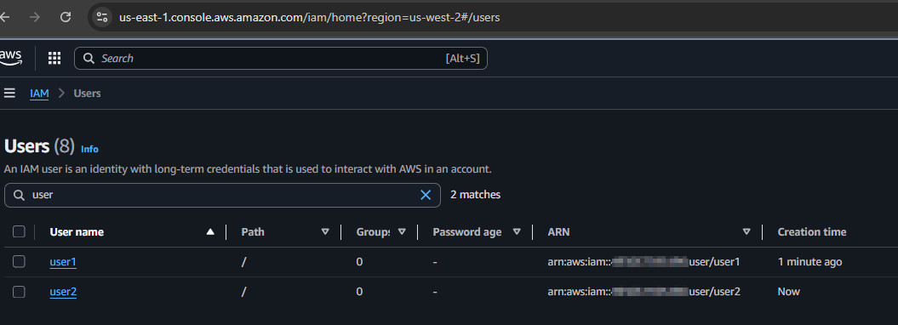
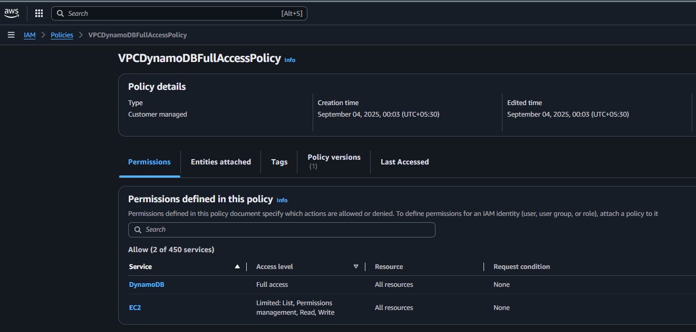
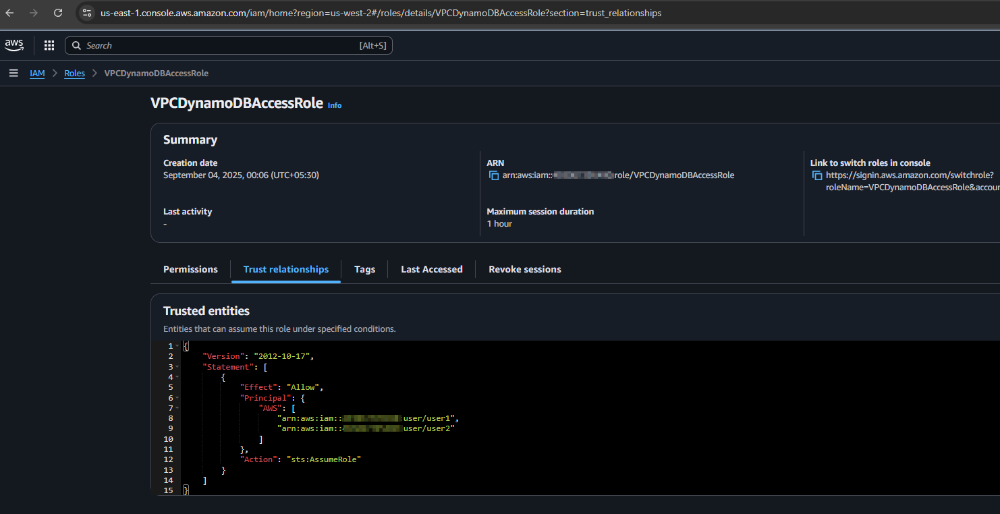
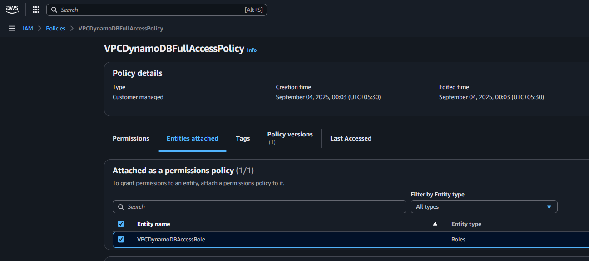
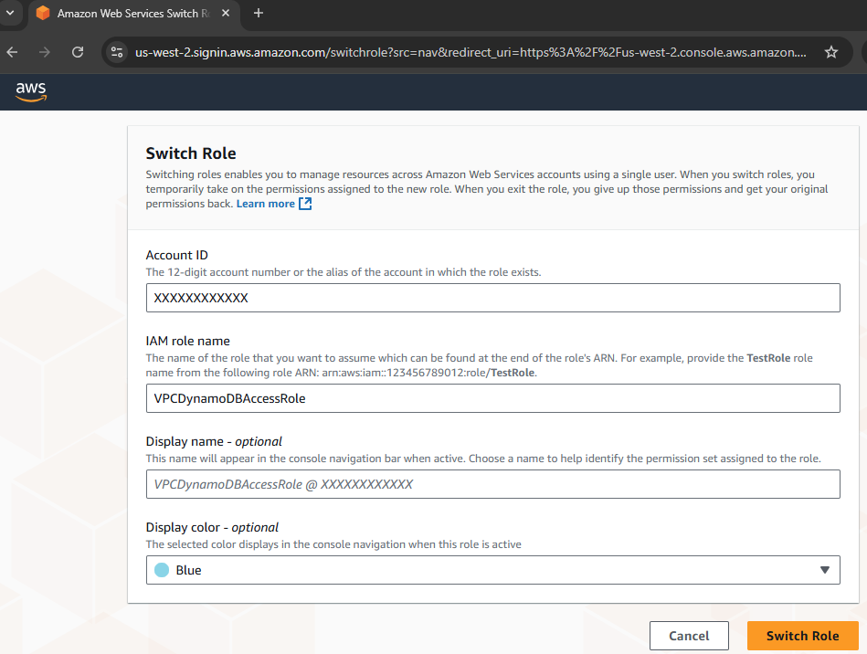
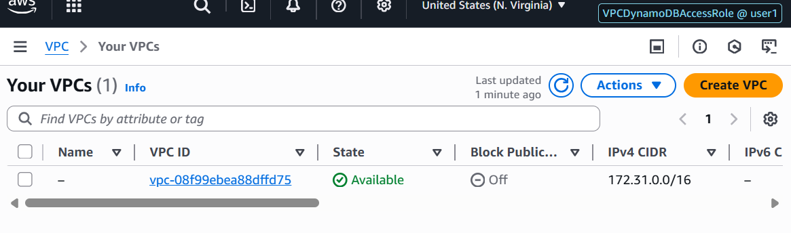
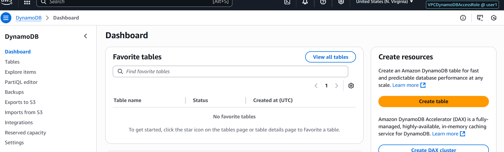
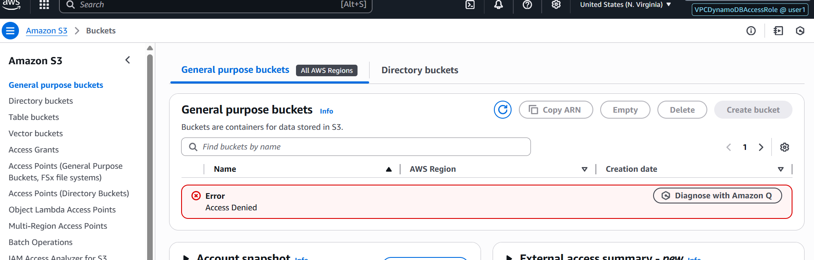

# 👥 Module 3: IAM Roles

## Tasks To Be Performed

1. Create a role which only lets `user1` and `user2` from `task 1` to have complete access to `VPCs` and `DynamoDB`.
2. Login into `user1` and shift to the role to test out the feature

## Solution Overview & Approach

This assignment was solved using a combination of **AWS CLI** and the **AWS Management Console** to demonstrate role-based access control in IAM.

- **Configuration** was performed primarily through CLI commands, including the creation of users, policies, roles, and trust relationships.  
- All key steps—such as policy creation, role attachment, and role assumption—are documented with corresponding CLI outputs and JSON definitions for reproducibility.  
- **Verification** was conducted through both the AWS Console and AWS CLI:
  - AWS Console-based role switching was used to visually confirm access boundaries.
  - AWS CLI-based role assumption was used to validate permissions programmatically.
- **Screenshots** are provided throughout to illustrate each step, including successful and denied access scenarios.
- At the end of the assignment, **cleanup commands** are included to remove all created resources, ensuring the environment can be reset or reused without residual configurations.


## CLI Tools Used

The following AWS CLI commands were used throughout the assignment, grouped by functionality for clarity and ease of reference:

### User Management

- `aws iam create-user` — Creates IAM users  
- `aws iam create-login-profile` — Sets console access credentials for IAM users  
- `aws iam get-user` — Retrieves details about a specific IAM user  
- `aws iam list-access-keys` — Lists access keys associated with a user  
- `aws iam delete-access-key` — Deletes a specific access key  
- `aws iam delete-login-profile` — Removes console access credentials  
- `aws iam delete-user` — Deletes an IAM user

### Policy Management

- `aws iam create-policy` — Creates a custom IAM policy  
- `aws iam list-policies` — Lists available policies and their attributes  
- `aws iam delete-policy` — Deletes a custom IAM policy

### Role Management

- `aws iam create-role` — Creates an IAM role with a trust policy  
- `aws iam get-role` — Retrieves details about a specific IAM role  
- `aws iam attach-role-policy` — Attaches a policy to a role  
- `aws iam detach-role-policy` — Detaches a policy from a role  
- `aws iam delete-role` — Deletes an IAM role

### Role Assumption & Profile Configuration

- `aws configure --profile` — Sets up named CLI profiles for different IAM users  
- `aws sts assume-role` — Assumes a role and returns temporary security credentials

### Resource Access Verification

- `aws ec2 describe-vpcs` — Lists VPCs to verify EC2-related access  
- `aws dynamodb list-tables` — Lists DynamoDB tables to verify access  
- `aws s3 ls` — Lists S3 buckets to confirm access boundaries


All commands were run in a `Bash shell` environment with `environment variables` for parameterization. `Screenshots` from the `AWS Console` are included to visually confirm each step and outcome.

## Folder Structure

```
.
├── README.md
├── images
│   ├── 01_users.png
│   ├── 02_policy.png
│   ├── 03_role.png
│   ├── 04_policy_attached_to_role.png
│   ├── 05_switchrole_test_VPC_ACCESS.png
|   |── 005_switchrole.png
│   ├── 06_switchrole_test_DynamoDB_ACCESS.png
│   └── 07_switchrole_test_S3_ACCESS_DENIED.png
├── trust-policy.json
└── vpc-dynamodb-full-access.json
```

- [`README.md`](README.md) Provides a step-by-step guide for creating IAM roles, defining trust and permission policies, attaching roles to users, and verifying access. Includes embedded screenshots, CLI commands, and links to supporting JSON files for reproducibility and clarity.

- [`images/`](images) This folder contains all visuals used to illustrate key components. Each item includes a direct link to the file in the repository:
  - [`01_users.png`](images/01_users.png) Screenshot of `user1` and `user2` created in Task 1  
  - [`02_policy.png`](images/02_policy.png) Screenshot of the full-access policy for VPC and DynamoDB  
  - [`03_role.png`](images/03_role.png) Screenshot of the IAM role created for role assumption  
  - [`04_policy_attached_to_role.png`](images/04_policy_attached_to_role.png) Screenshot showing the policy attached to the role  
  - [`005_switchrole.png`](images/005_switchrole.png) Screenshot showing the role switch interface
  - [`05_switchrole_test_VPC_ACCESS.png`](images/05_switchrole_test_VPC_ACCESS.png) Screenshot of successful VPC access after switching roles  
  - [`06_switchrole_test_DynamoDB_ACCESS.png`](images/06_switchrole_test_DynamoDB_ACCESS.png) Screenshot of successful DynamoDB access after switching roles  
  - [`07_switchrole_test_S3_ACCESS_DENIED.png`](images/07_switchrole_test_S3_ACCESS_DENIED.png) Screenshot confirming denied access to S3, validating scoped permissions

- [`trust-policy.json`](trust-policy.json) Trust policy defining which users can assume the role  
- [`vpc-dynamodb-full-access.json`](vpc-dynamodb-full-access.json) Permission policy granting full access to VPC and DynamoDB services


## Prerequisites
- Before running the commands, set the required variables

```bash
$ USER1="user1"
$ USER2="user2"
$ USER1_PASSWORD=<set-value>    ;# Set the value
$ USER2_PASSWORD=<set-value>    ;# Set the value
$ VPC_DYNDB_FULLACCESS_POLICY_NAME="VPCDynamoDBFullAccessPolicy"
$ VPC_DYNDB_FULLACCESS_POLICY_PROFILE="vpc-dynamodb-full-access.json"
$ VPC_DYNDB_ACCESS_ROLE_NAME="VPCDynamoDBAccessRole"
$ VPC_DYNDB_ACCESS_ROLE_PROFILE_WITHOUT_ARN="trust-policy.json"
$ VPC_DYNDB_ACCESS_ROLE_PROFILE_WITH_ARN="trust-policy_arn.secret.json"
$ FILE_PREFIX="file://"
```

## Inspect the contents of [`trust-policy.json`](trust-policy.json)

```json
{
    "Version": "2012-10-17",
    "Statement": [
        {
            "Effect": "Allow",
            "Principal": {
                "AWS": [
                    "<USER1_ARN>",
                    "<USER2_ARN>"
                ]
            },
            "Action": "sts:AssumeRole"
        }
    ]
}
```

This IAM trust policy grants **assume-role permissions** to two specific IAM users: `user1` and `user2`. By specifying their ARNs under the `Principal` field, it ensures that **only these users** are allowed to switch into the role defined later in the assignment.

- **Effect**: `Allow` — Grants permission to perform the specified action  
- **Principal**: IAM users (`user1`, `user2`) — The only entities allowed to assume the role  
- **Action**: `sts:AssumeRole` — Enables temporary role assumption via AWS STS

## Inspect the contents of [`vpc-dynamodb-full-access.json`](vpc-dynamodb-full-access.json)

```json
{
    "Version": "2012-10-17",
    "Statement": [
        {
            "Effect": "Allow",
            "Action": [
                "ec2:*vpc*",
                "dynamodb:*"
            ],
            "Resource": "*"
        }
    ]
}
```

This IAM policy grants **full access to Amazon DynamoDB** and **VPC-related EC2 actions**. Here's a breakdown of its components:

- **Effect**: `Allow` — Grants permission to perform the specified actions  
- **Action**:
  - `"ec2:*vpc*"` — Matches all EC2 actions that include the substring `vpc`, such as `DescribeVpcs`, `CreateVpc`, `DeleteVpc`, etc. This ensures comprehensive access to VPC-related operations.
  - `"dynamodb:*"` — Grants full access to all DynamoDB operations, including table creation, deletion, querying, and configuration.
- **Resource**: `"*"` — Applies the permissions to all resources within the account

This policy is attached to the IAM role, enabling users who assume the role to manage VPCs and DynamoDB resources without restriction. It intentionally excludes permissions for other services like S3, which are tested separately to validate scoped access.

### 1. Create 2 IAM users: `user1`, and `user2`

Each user is created using `aws iam create-user`, followed by `aws iam create-login-profile` to enable AWS Console access.

**Create User1**
```bash
$ aws iam create-user --user-name $USER1
```
```json
{
    "User": {
        "Path": "/",
        "UserName": "user1",
        "UserId": "<REDACTED_USER_ID>",
        "Arn": "arn:aws:iam::<REDACTED_ACCOUNT_ID>:user/user1",
        "CreateDate": "2025-08-12T05:23:23Z"
    }
}
```
**Create Password**
```bash
$ aws iam create-login-profile --user-name $USER1 --password $USER1_PASSWORD
```
```json
{
    "LoginProfile": {
        "UserName": "user1",
        "CreateDate": "2025-08-12T06:46:09Z",
        "PasswordResetRequired": false
    }
}
```
**Create User2**
```
$ aws iam create-user --user-name $USER2
```
```json
{
    "User": {
        "Path": "/",
        "UserName": "user2",
        "UserId": "<REDACTED_USER_ID>",
        "Arn": "arn:aws:iam::<REDACTED_ACCOUNT_ID>:user/user2",
        "CreateDate": "2025-08-12T05:23:23Z"
    }
}
```
**Create Password**
```
$ aws iam create-login-profile --user-name $USER2 --password $USER2_PASSWORD
```
```json
{
    "LoginProfile": {
        "UserName": "user2",
        "CreateDate": "2025-08-12T06:46:09Z",
        "PasswordResetRequired": false
    }
}
```

### Screenshot: IAM Users Created


## Dynamically Inject User ARNs into Trust Policy

To ensure the trust policy is scoped precisely to `user1` and `user2`, their ARNs are retrieved dynamically using the following commands:

```bash
USER1_ARN=$(aws iam get-user --user-name ${USER1} --query 'User.Arn' --output text)
```
```bash
USER2_ARN=$(aws iam get-user --user-name ${USER2} --query 'User.Arn' --output text)
```

### Replace Placeholders in Trust Policy

Once the ARNs are retrieved, the placeholders `<USER1_ARN>` and `<USER2_ARN>` in the template trust policy file are replaced using `sed`:

```bash
sed -e "s|<USER1_ARN>|$USER1_ARN|" -e "s|<USER2_ARN>|$USER2_ARN|" \
    ${VPC_DYNDB_ACCESS_ROLE_PROFILE_WITHOUT_ARN} > \
    ${VPC_DYNDB_ACCESS_ROLE_PROFILE_WITH_ARN}
```

This generates a finalized trust policy file that can be used directly in the role creation step. It ensures the policy avoids hardcoded values.

### Preview of the generated trust policy:  
```bash
$ cat $VPC_DYNDB_ACCESS_ROLE_PROFILE_WITH_ARN
```
```json
{
    "Version": "2012-10-17",
    "Statement": [
        {
            "Effect": "Allow",
            "Principal": {
                "AWS": [
                    "arn:aws:iam::<REDACTED_ACCOUNT_ID>:user/user1",
                    "arn:aws:iam::<REDACTED_ACCOUNT_ID>:user/user2"
                ]
            },
            "Action": "sts:AssumeRole"
        }
    ]
}
```

## Create the Policy

The following command creates a custom IAM policy named `VPCDynamoDBFullAccessPolicy`, using the JSON definition stored in `${FILE_PREFIX}${VPC_DYNDB_FULLACCESS_POLICY_PROFILE}`:

```bash
$ aws iam create-policy --policy-name ${VPC_DYNDB_FULLACCESS_POLICY_NAME} \
    --policy-document ${FILE_PREFIX}${VPC_DYNDB_FULLACCESS_POLICY_PROFILE}
```
Upon successful execution, AWS returns metadata confirming the policy has been created and is ready to be attached to IAM roles. 

```json
{
    "Policy": {
        "PolicyName": "VPCDynamoDBFullAccessPolicy",
        "PolicyId": "<REDACTED_POLICY_ID>",
        "Arn": "arn:aws:iam::<REDACTED_ACCOUNT_ID>:policy/VPCDynamoDBFullAccessPolicy",
        "Path": "/",
        "DefaultVersionId": "v1",
        "AttachmentCount": 0,
        "PermissionsBoundaryUsageCount": 0,
        "IsAttachable": true,
        "CreateDate": "2025-08-13T02:32:32Z",
        "UpdateDate": "2025-08-13T02:32:32Z"
    }
}
```

This policy grants full access to VPC-related EC2 actions and all DynamoDB operations, as defined in [`vpc-dynamodb-full-access.json`](vpc-dynamodb-full-access.json).

📷 Screenshot of the policy creation response:  



## Role Creation and Policy Attachment

This section outlines the steps to create an IAM role that grants access to VPC and DynamoDB, scoped to `user1` and `user2`, and attach the appropriate policy.

### Fetch the Policy ARN

Before attaching the policy, its ARN is retrieved dynamically using:

```bash
$ POLICY_ARN=$(aws iam list-policies --scope Local \
    --query "Policies[?PolicyName=='${VPC_DYNDB_FULLACCESS_POLICY_NAME}'].Arn" \
    --output text)
```

This ensures the correct policy reference is used, avoiding hardcoded ARNs and improving portability across environments.


### Create the IAM Role

The following command creates a role named `${VPC_DYNDB_ACCESS_ROLE_NAME}` using the trust policy stored in `${VPC_DYNDB_ACCESS_ROLE_PROFILE_WITH_ARN}`:

```bash
$ aws iam create-role --role-name ${VPC_DYNDB_ACCESS_ROLE_NAME} \
    --assume-role-policy-document ${FILE_PREFIX}${VPC_DYNDB_ACCESS_ROLE_PROFILE_WITH_ARN}
```
Upon successful execution, AWS returns metadata confirming the role creation:
```json
{
    "Role": {
        "Path": "/",
        "RoleName": "VPCDynamoDBAccessRole",
        "RoleId": "<REDACTED_ROLE_ID>",
        "Arn": "arn:aws:iam::<REDACTED_ACCOUNT_ID>:role/VPCDynamoDBAccessRole",
        "CreateDate": "2025-08-13T02:37:55Z",
        "AssumeRolePolicyDocument": {
            "Version": "2012-10-17",
            "Statement": [
                {
                    "Effect": "Allow",
                    "Principal": {
                        "AWS": [
                            "arn:aws:iam::<REDACTED_ACCOUNT_ID>:user/user1",
                            "arn:aws:iam::<REDACTED_ACCOUNT_ID>:user/user2"
                        ]
                    },
                    "Action": "sts:AssumeRole"
                }
            ]
        }
    }
}    
```

### Screenshot of the IAM role creation response:  


### Attach the Policy to the Role

Once the role is created, the previously fetched policy is attached using:

```bash
$ aws iam attach-role-policy --role-name ${VPC_DYNDB_ACCESS_ROLE_NAME} \
    --policy-arn $POLICY_ARN
```
This links the `VPCDynamoDBFullAccessPolicy` to the role, enabling users who assume it to manage VPC and DynamoDB resources.

### Screenshot showing the policy attached to the role:  


## Verification Through AWS Console

To test role-based access for `user1` or `user2`, follow these steps to switch roles in the AWS Console:

1. **Log in** to the AWS Console using the credentials for `user1` or `user2`.  
2. Navigate to the **top-right corner** of the console and click on your account name or number (e.g., `Account ID: XXXXXXXXXX`).  
3. From the dropdown menu, select **“Switch Role”**.  
4. In the **Switch Role** form:
   - **Account ID**: Enter the 12-digit AWS account ID where the role resides  
   - **Role Name**: Enter the name of the role created (e.g., `VPCDynamoDBAccessRole`)  
   - Optionally, provide a **Display Name** and **Color** to visually distinguish the role session  
5. Click **“Switch Role”** to assume the role

### Screenshot of the role switch interface


Once switched, the console session reflects the permissions granted by the role. You can now verify access to VPC and DynamoDB resources, and confirm that access to other services (e.g., S3) is restricted.

### Screenshots for verification:

- **VPC Access Allowed**
  
  

- **DynamoDB Access Allowed**
  
  

- **S3 Access Denied**
  
  


## Verification Through AWS CLI

This section demonstrates how `user1` assumes the IAM role and verifies scoped access to VPC, DynamoDB, and S3 using AWS CLI.

### Configure CLI Profile for `user1`

Use the AWS Console to download `user1`'s **Access Key ID** and **Secret Access Key**, then configure a named CLI profile:

```bash
$ aws configure --profile ${USER1}
# Enter credentials when prompted
```


### Assume the IAM Role

Retrieve the role ARN and use `sts assume-role` to obtain temporary credentials:

```bash
$ ROLE_ARN=$(aws iam get-role --role-name ${VPC_DYNDB_ACCESS_ROLE_NAME} \
    --query 'Role.Arn' --output text)
```
```bash
$ aws sts assume-role --role-arn "$ROLE_ARN" \
    --role-session-name testSession --profile ${USER1}
```

Sample output:

```json
{
  "Credentials": {
    "AccessKeyId": "<REDACTED_ACCESSKEYID>",
    "SecretAccessKey": "<REDACTED_SECRETACCESSKEY>",
    "SessionToken": "<REDACTED_SESSIONTOKEN>",
    "Expiration": "2025-08-13T04:33:57Z"
  },
  "AssumedRoleUser": {
    "AssumedRoleId": "<REDACTED_ASSUMEDROLEID>:testSession",
    "Arn": "arn:aws:sts::<REDACTED_ACCOUNTID>:assumed-role/VPCDynamoDBAccessRole/testSession"
  }
}
```

### Activate the Role Session

Export the temporary credentials to activate the assumed role:

```bash
$ export AWS_ACCESS_KEY_ID='<AccessKeyId from sts output>'
$ export AWS_SECRET_ACCESS_KEY='<SecretAccessKey from sts output>'
$ export AWS_SESSION_TOKEN='<SessionToken from sts output>'
```

### Test Role Permissions

#### VPC Access Allowed

```bash
$ aws ec2 describe-vpcs
```
```json
{
  "Vpcs": [
    {
      "VpcId": "vpc-08f99ebea88dffd75",
      "State": "available",
      "CidrBlock": "172.31.0.0/16",
      ...
    }
  ]
}
```

Corresponds to: `05_switchrole_test_VPC_ACCESS.png` screenshot


#### DynamoDB Access Allowed

```bash
$ aws dynamodb list-tables
```
```json
{
  "TableNames": []
}
```

Corresponds to: `06_switchrole_test_DynamoDB_ACCESS.png` screenshot

#### S3 Access Denied

```bash
$ aws s3 ls
```

Error output confirms access denied

```text
An error occurred (AccessDenied) when calling the ListBuckets operation: 
User: arn:aws:sts::<REDACTED_ACCOUNTID>:assumed-role/VPCDynamoDBAccessRole/testSession 
is not authorized to perform: s3:ListAllMyBuckets because no identity-based policy allows the action
```

Corresponds to: `07_switchrole_test_S3_ACCESS_DENIED.png` screenshot


## Clean Up
```
# clear assumed role environment
$ unset AWS_ACCESS_KEY_ID AWS_SECRET_ACCESS_KEY AWS_SESSION_TOKEN

# clear role and policy
$ aws iam detach-role-policy --role-name ${VPC_DYNDB_ACCESS_ROLE_NAME} --policy-arn "$POLICY_ARN"
$ aws iam delete-role --role-name ${VPC_DYNDB_ACCESS_ROLE_NAME}
$ aws iam delete-policy --policy-arn "$POLICY_ARN"

# delete user1
$ aws iam list-access-keys --user-name ${USER1} --query "AccessKeyMetadata[].AccessKeyId" --output text
<ACCESSKEY>
$ aws iam delete-access-key --user-name ${USER1} --access-key-id <ACCESSKEY>
$ aws iam delete-login-profile --user-name ${USER1}
$ aws iam delete-user --user-name ${USER1}

# delete user2
$ aws iam list-access-keys --user-name ${USER2} --query "AccessKeyMetadata[].AccessKeyId" --output text
<ACCESSKEY>
$ aws iam delete-access-key --user-name ${USER2} --access-key-id <ACCESSKEY>
$ aws iam delete-login-profile --user-name ${USER2}
$ aws iam delete-user --user-name ${USER2}

```
