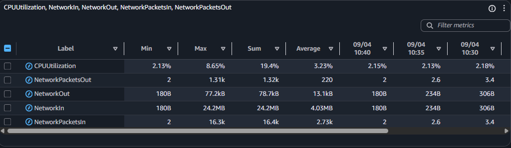

# Module 3: CloudWatch Dashboard
---

## Tasks To Be Performed:
1. Create a `dashboard` which lets you check the `CPU utilization` and
`networking` for a particular `EC2 instance`


## Overview

This task demonstrates how to create a **CloudWatch dashboard** that visualizes key performance metrics for a specific EC2 instance, including:
- `CPU Utilization`
- **Networking metrics** such as `NetworkIn`, `NetworkOut`, and `NetworkPackets`
- Developed using the AWS Console
- Multiple widget types used: `line graph`, `bar chart`, `percentage` view, and `datatable`
- Metrics filtered by `Instance ID` to ensure precision
- Screenshots included for each step, stored in the [`images/`](images) directory

## Folder Structure

- Tree view of the repository  
```bash
$ tree
.
├── README.md
└── images
    ├── 01_ec2_instance.png
    ├── 02_create_dashboard.png
    ├── 03_add_widget.png
    ├── 04_select_ec2_resource.png
    ├── 05_filter_by_ec2.png
    ├── 06_search_instance_id.png
    ├── 07_select_metrics.png
    ├── 08_line_graph.png
    ├── 09_bar_graph.png
    ├── 10_datatable_graph.png
    └── 11_percentage_graph.png
```

- [`README.md`](README.md) This file provides a comprehensive overview of the assignment, including setup instructions, key concepts, and visual references. Screenshots embedded throughout the README are sourced from the [`images/`](images) directory.

- [`images/`](images) This folder contains all visuals used to illustrate key components. Each item includes a direct link to the file in the repository:

  - [`01_ec2_instance.png`](images/01_ec2_instance.png)  
    Screenshot showing the running **EC2 instance** selected for dashboard metrics.

  - [`02_create_dashboard.png`](images/02_create_dashboard.png)  
    Screenshot showing navigation to **CloudWatch > Dashboards > Create dashboard**.

  - [`03_add_widget.png`](images/03_add_widget.png)  
    Screenshot showing widget setup: **Metrics** data source and **Line** graph type.

  - [`04_select_ec2_resource.png`](images/04_select_ec2_resource.png)  
    Screenshot of metric graph setup with **EC2 resource** selected from Browse.

  - [`05_filter_by_ec2.png`](images/05_filter_by_ec2.png)  
    Screenshot showing EC2-specific metric filtering in the Browse section.

  - [`06_search_instance_id.png`](images/06_search_instance_id.png)  
    Screenshot showing **instance ID search** to narrow down metrics for a specific EC2.

  - [`07_select_metrics.png`](images/07_select_metrics.png)  
    Screenshot showing selection of **CPUUtilization** and **networking metrics**.

  - [`08_line_graph.png`](images/08_line_graph.png)  
    Screenshot of generated **line graph** displaying selected EC2 metrics.

  - [`09_bar_graph.png`](images/09_bar_graph.png)  
    Screenshot of generated **bar graph** displaying selected EC2 metrics.

  - [`10_datatable_graph.png`](images/10_datatable_graph.png)  
    Screenshot of generated **datatable view** of EC2 metrics.

  - [`11_percentage_graph.png`](images/11_percentage_graph.png)  
    Screenshot of generated **percentage graph** for EC2 metrics.


### Step 1: Identify the EC2 Instance

Begin by selecting the EC2 instance you want to monitor.

Screenshot:  


### Step 2: Create a New Dashboard

1. Navigate to **CloudWatch > Dashboards**  
2. Click **Create dashboard**  
3. Provide a name for your dashboard
4. Choose **Add widget**

Screenshot:  


### Step 3: Add a Widget

1. Select **Metrics** as the data source  
2. Choose **Line** as the widget type  
3. Click **Next**

Screenshot:  


### Step 4: Browse and Filter Metrics

1. In the **Browse** tab, select **EC2** as the resource  

   

2. Filter metrics **per EC2 instance**  

   

3. Use the **search bar** to locate your instance by **Instance ID**  

   

4. Select relevant metrics:
   - `CPUUtilization`
   - `NetworkIn`
   - `NetworkOut`
   - `NetworkPacketsIn`
   - `NetworkPacketsOut`  

   


### Step 5: Visualize Metrics

Once metrics are selected, CloudWatch offers multiple visualization formats. Add widgets for each type to enhance readability and insight.

Screenshot: `Line Graph`


Screenshot: `Bar Graph`  


Screenshot: `Datatable View`  



Screenshot: `Percentage Graph`  


## Result

CloudWatch dashboard is now live and provides a consolidated view of EC2 performance metrics. You can monitor CPU spikes, network throughput, and packet flow in real time

---