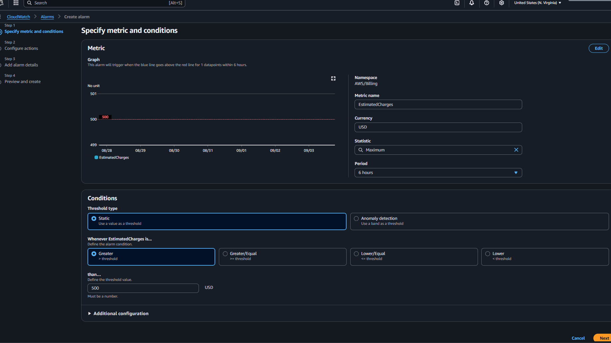
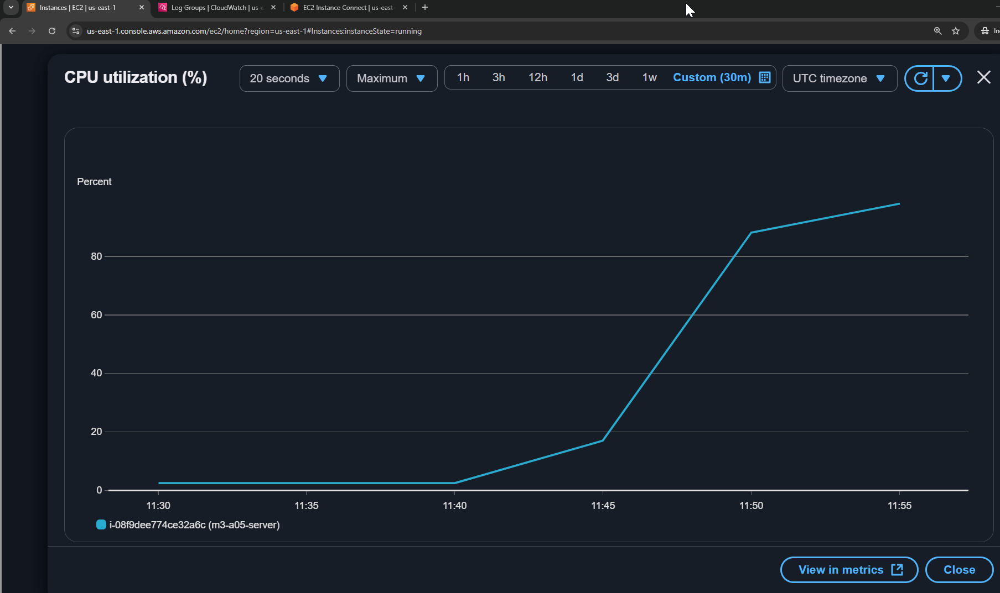

---

# 📘 Module 3: CloudWatch Alarms

---
## Tasks To Be Performed:
1. Create a `CloudWatch billing alarm` which goes off when the estimated `charges go above $500`.
2. Create a `CloudWatch alarm` which goes off to an `Alarm state` when the `CPU utilization` of an `EC2 instance goes above 65%`. Also add an `SNS topic` so that it notifies the person when the threshold is crossed.

## Overview

- Tools used: AWS Console
- Screenshots are stored in [`images/`](images) directory
- Two alarms created: Billing Alarm and EC2 CPU Utilization Alarm

---

## Folder Structure

- Tree view of the repository  

```bash
$ tree
.
├── README.md
└── images
    ├── 01-billing-alarm
    │   ├── 00_billing_alerts_enabled.png
    │   ├── 01_select_metric.png
    │   ├── 02_metric_namespace.png
    │   ├── 03_estimated_charges_metric.png
    │   ├── 04_alarm_conditions.png
    │   ├── 05_configure_actions.png
    │   ├── 06_alarm_details.png
    │   ├── 07_preview_create.png
    │   ├── 08_alarm_created.png
    │   └── 09_sns_topic_created.png
    └── 02-ec2-cpu-utilization-alarm
        ├── 01_ec2_instance.png
        ├── 02_navigate_alarm_setup.png
        ├── 03_configure_cpu_alarm.png
        ├── 04_install_stress_tool.png
        ├── 05_stress_triggered_shutdown.png
        ├── 06_cpu_utilization_spike.png
        ├── 07_ec2_alarm_status.png
        ├── 08_alarm_graph_triggered.png
        └── 09_alarm_details.png
```
- [`README.md`](README.md) This file provides a comprehensive overview of the assignment, including setup instructions, key concepts, and visual references. Screenshots embedded throughout the README are sourced from the [`images/`](images) directory.

- [`images/`](images) This folder contains all visuals used to illustrate key components. Each item includes a direct link to the file in the repository:
  - [`01-billing-alarm/`](images/01-billing-alarm) — Screenshots for the billing alarm task  
    - [`00_billing_alerts_enabled.png`](images/01-billing-alarm/00_billing_alerts_enabled.png) Screenshot showing **Billing Alert Preferences** with billing alerts enabled in the AWS Console.  
    - [`01_select_metric.png`](images/01-billing-alarm/01_select_metric.png) Screenshot of the **Specify metric and conditions** step in CloudWatch > Alarms > Create Alarm.
    - [`03_estimated_charges_metric.png`](images/01-billing-alarm/03_estimated_charges_metric.png) Screenshot showing **EstimatedCharges** metric selection by searching **billing** in the CloudWatch metric search bar.
    - [`04_alarm_conditions.png`](images/01-billing-alarm/04_alarm_conditions.png) Screenshot showing the **metric graph and threshold configuration** for the billing alarm. Captures the live state of the selected metric and its evaluation criteria.
    - [`05_configure_actions.png`](images/01-billing-alarm/05_configure_actions.png) Screenshot of the **Configure actions** step, where SNS notification settings are defined.
    - [`06_alarm_details.png`](images/01-billing-alarm/06_alarm_details.png) Screenshot of the **Add alarm details** step, where the alarm name and description are specified.
    - [`07_preview_create.png`](images/01-billing-alarm/07_preview_create.png) Screenshot of the **Preview and create** step, showing final review before alarm creation.
    - [`08_alarm_created.png`](images/01-billing-alarm/08_alarm_created.png) Screenshot confirming the billing alarm is successfully created and in the **OK** state.
    - [`09_sns_topic_created.png`](images/01-billing-alarm/09_sns_topic_created.png) Screenshot of the **SNS topic** under Amazon SNS > Topics, showing email subscription setup.
   
  - [`02-ec2-cpu-utilization-alarm/`](images/02-ec2-cpu-utilization-alarm) — Screenshots for EC2 CPU utilization alarm task
    - [`01_ec2_instance.png`](images/02-ec2-cpu-utilization-alarm/01_ec2_instance.png) Screenshot of the running EC2 instance selected for monitoring.
    - [`02_navigate_alarm_setup.png`](images/02-ec2-cpu-utilization-alarm/02_navigate_alarm_setup.png) Screenshot showing navigation to **Manage CloudWatch alarms** via EC2 > Actions > Monitor and troubleshooting.
    - [`03_configure_cpu_alarm.png`](images/02-ec2-cpu-utilization-alarm/03_configure_cpu_alarm.png) Screenshot showing alarm configuration: threshold value, alarm action, and name.
    - [`04_install_stress_tool.png`](images/02-ec2-cpu-utilization-alarm/04_install_stress_tool.png) Screenshot of terminal showing installation of the `stress` tool on the EC2 instance.
    - [`05_stress_triggered_shutdown.png`](images/02-ec2-cpu-utilization-alarm/05_stress_triggered_shutdown.png) Screenshot showing EC2 terminal where running the `stress` command led to automatic shutdown (message captured).
    - [`06_cpu_utilization_spike.png`](images/02-ec2-cpu-utilization-alarm/06_cpu_utilization_spike.png) Screenshot showing CPU utilization exceeding the 65% threshold.
    - [`07_ec2_alarm_status.png`](images/02-ec2-cpu-utilization-alarm/07_ec2_alarm_status.png) Screenshot showing EC2 instance with alarm status: “1 in Alarm”.
    - [`08_alarm_graph_triggered.png`](images/02-ec2-cpu-utilization-alarm/08_alarm_graph_triggered.png) Screenshot of CloudWatch alarm graph showing CPU utilization trend crossing the threshold.
    - [`09_alarm_details.png`](images/02-ec2-cpu-utilization-alarm/09_alarm_details.png) Detailed view of the triggered alarm configuration and current state.

---
## Task 1: CloudWatch Billing Alarm

Create a CloudWatch alarm that triggers when your **estimated monthly AWS charges exceed $500**, and sends a notification via **SNS**. This helps proactively monitor costs and avoid budget overruns.

---

## Overview

This task involves two key phases:

1. **Enable Billing Alerts** — A one-time setup to publish billing data as a CloudWatch metric  
2. **Create the Alarm** — Define the metric, threshold, and notification settings to trigger alerts

> **Note:** Billing metrics are only available in the **US East (N. Virginia)** region (`us-east-1`). All steps must be performed in that region.

---

## Step 1: Enable Billing Alerts

To allow billing data to be monitored via CloudWatch:

1. Sign in to the **AWS Management Console**  
2. Navigate to the **Billing Dashboard**  
3. In the left-hand pane, choose **Billing preferences**  
4. Under **Alert preferences**, check the box for **Receive CloudWatch Billing Alerts**  
5. Click **Save preferences**

Screenshot:  


---

## Step 2: Create the CloudWatch Alarm

1. Open the **CloudWatch Console**  
2. Ensure you're in the **US East (N. Virginia)** region  
3. In the left-hand pane, select **Alarms**  
4. Click **Create alarm**

Screenshot:  


## Step 3: Select the Billing Metric

1. On the **Specify metric and conditions** page, click **Select metric**  
2. In the search bar, enter `"Billing"` or choose the **Billing** namespace  
3. Select the **Total Estimated Charges** metric  
4. Check the box next to `EstimatedCharges` and click **Select metric**

Screenshot:  


---

## Step 4: Define Alarm Conditions

Configure the threshold that triggers the alarm:

- **Statistic**: `Maximum`  
- **Period**: `6 hours` 
- **Threshold type**: `Static`  
- **Whenever EstimatedCharges is...**: `Greater than 500`

Screenshot:  


---

## Step 5: Configure Actions

Define what happens when the alarm enters the `In alarm` state:

1. Under **Actions**, choose the alarm state trigger: `In alarm`  
2. Select an **SNS topic**:
   - Create a new topic:
     - Provide a name  
     - Enter the email address for notifications  
3. Click **Next**
4. Check email for a confirmation link to activate notifications.

Screenshot:  


---

## Step 6: Name and Create the Alarm

1. On the **Add name and description** page:
   - Name your alarm  
   - Optionally, add a description  
2. Click **Next**  
3. Review your settings on the **Preview and create** page  
4. Click **Create alarm**

Screenshots:  
  


---

## Result

The billing alarm is now active. It will remain in the **OK** state until your estimated charges **reach or exceed $500**, at which point it will transition to the **ALARM** state and send a notification to your configured SNS topic.

Screenshot:  


SNS Topic Confirmation:  


---

## Task 2: EC2 CPU Utilization Alarm

Create a CloudWatch alarm that triggers when the **CPU utilization of an EC2 instance exceeds 65%**, and sends a notification via **SNS**. This helps monitor performance spikes and enables proactive response to resource stress.

---

## Overview

This task involves:

1. Selecting the **EC2 instance** to monitor  
2. Creating a **CloudWatch alarm** for the **CPUUtilization** metric  
3. Configuring an **SNS topic** to receive notifications  
4. Simulating **high CPU usage** to test the alarm trigger  
5. Verifying **alarm state transition** and **notification delivery**

---

## Step 1: Select EC2 Instance

Choose a running EC2 instance to monitor:

Screenshot:  


---

## Step 2: Navigate to Alarm Setup

From the EC2 instance dashboard:

1. Go to **Actions > Monitor and troubleshoot > Manage CloudWatch alarms**  
2. Click **Create Alarm**

Screenshot:  


---

## Step 3: Configure CPU Alarm

On the alarm creation screen:

- **Metric**: `CPUUtilization`  
- **Threshold**: `Greater than 65%`  
- **Period**: `5 minutes` for faster detection  
- **Alarm name**: e.g., `HighCPUAlarm`  
- **Notification**: Select or create an SNS topic

Screenshot:  


---

## Step 4: Simulate High CPU Usage

To test the alarm, SSH into the EC2 instance and install the `stress` tool:

```bash
sudo yum install stress -y   # For Amazon Linux
stress --cpu 2 --timeout 120
```

Screenshot:  


Simulate high CPU usage by running the `stress` tool on the EC2 instance. When the CPU utilization crosses the 65% threshold, the configured CloudWatch alarm triggers and automatically stops the instance as part of its defined action.

Screenshot:  


---

## Step 5: Observe CPU Spike

Monitor the CloudWatch graph to confirm CPU utilization exceeds 65%:

📸 Screenshot:  


---

## Step 6: Verify Alarm Trigger

Once the threshold is breached:

- The alarm transitions to **In Alarm** state  
- EC2 dashboard shows alarm status  
- CloudWatch graph reflects the spike  
- SNS notification is sent

Screenshots:  
  
   
  

SNS topic setup is shared across both alarms. The same notification channel is reused for CPU and billing alerts.  


---

## Result

The alarm is now active and functional. Any future CPU spikes beyond 65% will trigger the alarm and notify the configured recipient via SNS.


