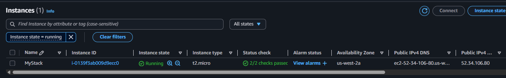
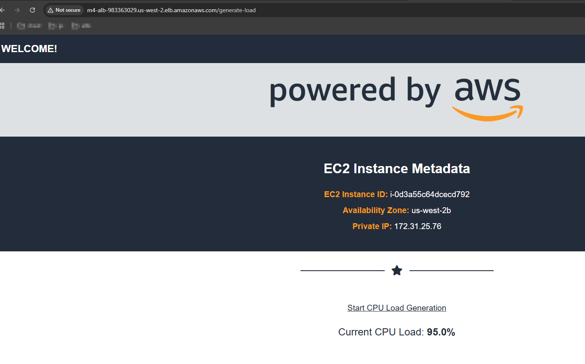
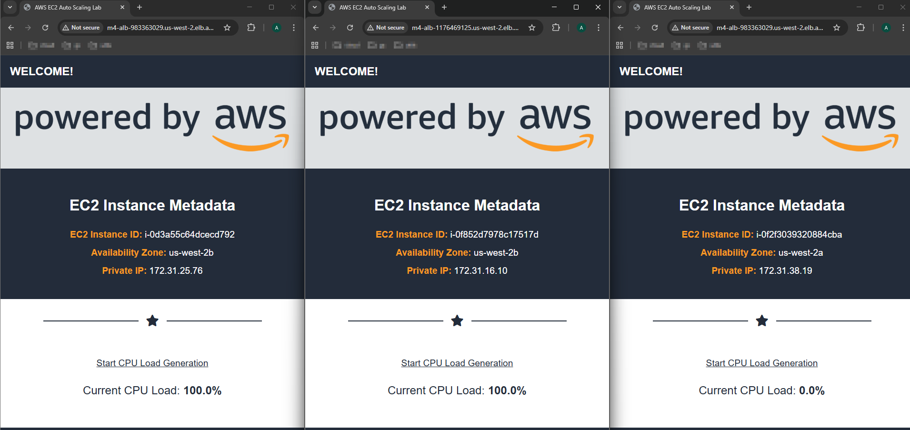

---

# Module 4: Case Study - ELB, ASG and Route53

### Problem Statement
You work for XYZ Corporation that uses on premise solutions and a limited number of systems. With the increase in requests in their application, the load also increases. So, to handle the load the corporation has to buy more systems almost on a regular basis. Realizing the need to cut down the expenses on systems, they decided to move their infrastructure to AWS

### Tasks To Be Performed:
1. Manage the scaling requirements of the company by  
    a. Deploying multiple compute resources on the cloud as soon as the `load increases` and the `CPU utulization exceeds 80%`.
    b. Remove the resources when the `CPU utilization goes under 60%`
2. Create a `load balancer` to distribute the load between compute resources
3. Route the traffic to the `company's domain`

---

### High-Level Architecture and Deployment Workflow
This section outlines the step-by-step approach implemented in this project to establish a scalable and resilient web infrastructure on AWS:

- **Create an AMI for a Web Server:**  
  Prepare an Amazon Machine Image of the web server to ensure consistent, repeatable deployments.

- **Launch Template Setup:**  
  Configure a launch template with the AMI for auto-scaling EC2 instances, enabling dynamic resource provisioning.

- **Deploy Internet-facing ALB:**  
  Create an Application Load Balancer (ALB) accessible over the internet to distribute incoming traffic.

- **Configure Target Group & Register Targets:**  
  Define a target group in the ALB and register EC2 instances as targets.

- **Set Up Listener:**  
  Attach a listener on the ALB that forwards incoming traffic to the target group.

- **Auto Scaling Group (ASG) Configuration:**  
  Create an ASG using the launch template, balancing load and scaling according to traffic.

- **Implement Step Scaling Policies:**  
  Define policies to scale out and in based on CPU utilization thresholds, for example:
  - Scale out when CPU exceeds 80%.
  - Scale in when CPU drops below 60%.

- **Monitor and Test:**  
  Create CloudWatch alarms linked to scaling policies, simulate load increases/decreases, and observe auto-scaling actions.

- **Domain Routing:**  
  Map the ALB’s DNS name (e.g., `dualstack.m4-alb-...elb.amazonaws.com`) to your company's custom domain using DNS services like Route 53 or your domain provider.

---

### Implementation and Verification Approach

This assignment leverages a combination of **AWS Command Line Interface (CLI)** and **AWS Management Console** to deliver an efficient, reproducible, and verifiable cloud infrastructure setup.

- **Configuration:**  
  The majority of AWS resources—including AMI creation, launch templates, Application Load Balancers (ALBs), Auto Scaling Groups (ASGs), scaling policies, and CloudWatch alarm configurations—are created and managed through AWS CLI commands. This approach ensures automation, repeatability, and clear documentation for each step.

- **Documentation:**  
  Each significant implementation step is accompanied by the exact CLI commands used. This fosters reproducibility and allows users to understand and replicate the infrastructure setup with precision.

- **Verification and Monitoring:**  
  The AWS Management Console is used to visually inspect and verify the deployed resources. Screenshots from the console provide clear evidence of resource states, health checks, scaling activity, and alarm statuses, enriching the documentation with intuitive verification.

- **Cleanup:**  
  To maintain a clean testing environment and avoid unnecessary costs, comprehensive cleanup commands are documented. These commands safely remove all resources created during the assignment, facilitating environment reset or reuse.

***


This assignment was solved using a combination of **AWS CLI** and the **AWS Management Console**

- **Configuration** was performed primarily through CLI commands, including the creation of resources such as AMIs, launch templates, Application Load Balancers (ALBs), Auto Scaling Groups (ASGs), and scaling policies.  
- All key steps—such as AMIs creation, launch templates creation, ALB configuration, ASG configuration, scaling policies, cloudwatch alarm configuration —are documented with corresponding CLIs for reproducibility.  
- **Verification** was conducted through the AWS Console to confirm configurations and verifications
- **Screenshots** are provided throughout to illustrate each step
- At the end of the assignment, **cleanup commands** are included to remove all created resources, ensuring the environment can be reset or reused without residual configurations.

## CLI Tools Used
<< TBD >>

### Folder structure
```bash
$ tree
.
├── EC2-Auto-Scaling-Lab.yaml
├── README.md
├── cleanup.sh
├── config.sh
├── images
│   ├── 01-default-region-vpc-subnet-clientip.png
│   ├── 02-01-cf-aws-console-create-stack-successimage.png
│   ├── 02-cf-create-stack-success.png
│   ├── 03-ec2-instance-running.png
│   ├── 04-aws-cli-ec2-running-instance.png
│   ├── 05-ec2-instance-accessed-using-public-dns.png
│   ├── 06-01-aws-cli-ami-available.png
│   ├── 06-02-aws-console-ami-available.png
│   ├── 07-01-aws-cli-security-group-for-asg.png
│   ├── 09-01-aws-console-sg-inbound-rules.png
│   ├── 09-02-aws-cli-inbound-ssh-rule.png
│   ├── 09-03-aws-console-sg-outbound-rules.png
│   ├── 10-launch-template.png
│   ├── 11-load-balancer.png
│   ├── 12-target-group.png
│   ├── 13-load-balancer-listner.png
│   ├── 14-target-group-alb-association.png
│   ├── 15-asg.png
│   ├── 16-ASG-scaling-policy.png
│   ├── 17-cloudwatch-alarms.png
│   ├── 17-cloudwatch-low-in-alarm.png
│   ├── 18-ASG-1-healthy-instance.png
│   ├── 18-EC2-1-running-instance.png
│   ├── 18-TargetGroup-1healthy-instance.png
│   ├── 18-Webhost-instance1.png
│   ├── 19-cloudwatch-high-in-alarm.png
│   ├── 19-targetGroup-2healthyinstances.png
│   ├── 19-webhost-instance2.png
│   ├── 20-EC2-3-running-instances.png
│   ├── 20-targetgroup-3healthyinstances.png
│   ├── 20-webhost-3instances.png
│   ├── 21-cloudwatch-lowCpu-inalarm.png
│   ├── 21-targetgroup-1draining-instance.png
│   ├── 22-hosted-zone.png
│   ├── 23-A-record.png
│   ├── 23-Arecord2.png
│   └── 24-ALBurl-access.png
└── target-tracking-config.json
```

- [`README.md`](README.md) Provides a step-by-step guide for creating .... << TBD >>

## Prerequisites
- Before running the commands, set the required variables `config.sh`
```bash
$ cat config.sh
# AWS CLI default region for all commands
export AWS_DEFAULT_REGION=us-west-2  # Oregon region, for sandbox/testing

# Security Group names
ASG_EC2_SG_NAME="M4-ASG-SecurityGroup"       # Security group for Auto Scaling Group instances
ALB_SG_NAME="M4-ALB-SecurityGroup"  # Security group for Application Load Balancer

# Launch template and AMI naming
LAUNCH_TEMPLATE_NAME="M4-SCALING-LAUNCH-TEMPLATE"
AMI_NAME="M4-AMI"

# Key pair details for EC2 instance access
KEY_NAME="M4-KeyPair"
PEM_FILE="${KEY_NAME}.pem"           # Private key file for SSH access

# Target Group and Load Balancer names
ASG_TARGET_GROUP="M4-ASG-TargetGroup"
ALB_NAME="M4-ALB"

# Auto Scaling Group name and scaling policy
ASG_NAME="M4-AutoScalingGroup"
ASG_SCALEOUT_POLICY_NAME="M4-ASG-Cpu-ScaleOut-Policy"
ASG_SCALEIN_POLICY_NAME="M4-ASG-Cpu-ScaleIn-Policy"

# CloudFormation Stack name
CF_STACK_NAME="M4-CF-Stack"

# Cloudwatch alarms Names
# CPU>80%
CLOUDWATCH_HIGH_CPU_ALARM="$ASG_NAME-HighCPUAlarm"
# CPU<60%
CLOUDWATCH_LOW_CPU_ALARM="$ASG_NAME-LowCPUAlarm"

$ 
```

```bash
# Load the variables
source config.sh
```

## Environment Setup and Configuration
This section details how to initialize the AWS environment with region-specific settings, such as the default VPC, subnet IDs, and the client's public IP address. These configurations are essential prerequisites for subsequent deployment steps.

### 1. Load Default VPC
Retrieve the default VPC ID for your AWS account in the configured region:
```bash
VPC_ID=$(aws ec2 describe-vpcs --filters "Name=isDefault,Values=true" --query "Vpcs[0].VpcId" --output text)
echo "Default VPC ID: $VPC_ID"
```

### 2. Obtain Subnet IDs
Fetch all subnet IDs associated with this VPC:
```bash
SUBNET_IDS=$(aws ec2 describe-subnets --filters "Name=vpc-id,Values=$VPC_ID" --query "Subnets[].SubnetId" --output text)
echo "All subnet IDs: $SUBNET_IDS"
```

### 3. Select Primary Subnet
Select the first subnet to be used in configurations such as CloudFormation:
```bash
SUBNET_ID=$(echo $SUBNET_IDS | awk '{print $1}')
echo "Primary Subnet ID: $SUBNET_ID"
```

### 4. Format Subnet IDs for Auto Scaling
Convert the list of subnet IDs from space-separated to comma-separated format for use in auto-scaling configurations:
```bash
VPC_SUBNETS=$(echo $SUBNET_IDS | tr ' ' ',')
echo "Subnets for ASG (comma-separated): $VPC_SUBNETS"
```

### 5. Capture Client Public IP
Identify the current public IP address of the client (to restrict access policies):
```bash
MY_IP="$(curl -s https://checkip.amazonaws.com)/32"
echo "Client's Public IP: $MY_IP"
```

### 6. Create Key Pair
Generate an SSH key pair for secure access:
```bash
aws ec2 create-key-pair --key-name $KEY_NAME --query 'KeyMaterial' --output text > $PEM_FILE
chmod 400 $PEM_FILE
echo "Key pair created and saved to $PEM_FILE"
```


## Security Group Creation and Configuration

This section describes the setup of two key security groups with appropriate inbound rules to secure your AWS resources:

### 1) ALB Security Group  
Allows public inbound HTTP traffic from the internet to the Application Load Balancer.

```bash
# Create the ALB security group
ALB_SG_ID=$(aws ec2 create-security-group \
  --group-name $ALB_SG_NAME \
  --description "Security group for Application Load Balancer" \
  --vpc-id $VPC_ID \
  --query GroupId \
  --output text)

echo "Created ALB Security Group with ID: $ALB_SG_ID"

# Allow inbound HTTP traffic from anywhere on port 80
aws ec2 authorize-security-group-ingress \
  --group-id $ALB_SG_ID \
  --protocol tcp \
  --port 80 \
  --cidr 0.0.0.0/0

echo "Ingress rules added to ALB security group."
```

***

### 2) EC2 / Auto Scaling Group (ASG) Security Group  
Allows inbound HTTP traffic **only from the ALB security group**, and SSH access restricted to the client’s IP address for management purposes.

```bash
# Create the EC2/ASG security group
ASG_EC2_SG_ID=$(aws ec2 create-security-group \
  --group-name $ASG_EC2_SG_NAME \
  --description "Security group for Auto Scaling group instances" \
  --vpc-id $VPC_ID \
  --query GroupId \
  --output text)

echo "Created EC2/ASG Security Group with ID: $ASG_EC2_SG_ID"

# Allow HTTP (port 80) traffic only from ALB security group
aws ec2 authorize-security-group-ingress \
  --group-id $ASG_EC2_SG_ID \
  --protocol tcp \
  --port 80 \
  --source-group $ALB_SG_ID

echo "Added HTTP ingress rule allowing traffic from ALB SG."

# Allow SSH (port 22) access from the client’s IP address only
aws ec2 authorize-security-group-ingress \
  --group-id $ASG_EC2_SG_ID \
  --protocol tcp \
  --port 22 \
  --cidr $MY_IP

echo "Added SSH ingress rule allowing access from client IP: $MY_IP"
```

## Create an AMI for a Web Server

This step involves using the `EC2-Auto-Scaling-Lab.yaml` CloudFormation template to launch a Linux EC2 instance preconfigured with a web server and necessary tools. The instance setup allows generating CPU load for testing and verification purposes. Once the instance is accessible via a web browser and verified, an Amazon Machine Image (AMI) is created from it. This AMI will later be used in the Auto Scaling Group (ASG) to ensure consistent instance deployment.

### Deploy the CloudFormation Stack

```bash
aws cloudformation create-stack \
  --stack-name $CF_STACK_NAME \
  --template-body file://EC2-Auto-Scaling-Lab.yaml \
  --parameters ParameterKey=MyVPC,ParameterValue=$VPC_ID ParameterKey=PublicSubnet,ParameterValue=$SUBNET_ID ParameterKey=MyIP,ParameterValue=$MY_IP \
  --capabilities CAPABILITY_NAMED_IAM
```

*Wait for stack creation to complete before proceeding.*


### Verify EC2 Instance Launch

- Confirm the EC2 instance launched by the stack is in the running state via the AWS Console or CLI.  


- Access the instance using its public DNS in a web browser to verify the web service is active.  


### Create a Custom AMI from the Running Instance

```bash
# Get the Instance ID of the running EC2 instance
INSTANCE_ID=$(aws ec2 describe-instances --filters "Name=instance-state-name,Values=running" --query "Reservations[0].Instances[0].InstanceId" --output text)
echo "Instance ID: $INSTANCE_ID"

# Create an AMI from the instance without rebooting
AMI_ID=$(aws ec2 create-image --instance-id $INSTANCE_ID --name $AMI_NAME --description "AMI created from CLI for ASG" --no-reboot --query 'ImageId' --output text)
echo "Created AMI ID: $AMI_ID"
```

*AMI availability confirmation:*  


After confirming AMI creation, delete the CloudFormation stack to remove temporary resources such as the EC2 instance and associated networking components.

```bash
aws cloudformation delete-stack --stack-name $CF_STACK_NAME
```
### Create the Launch Template for an EC2 Auto Scaling Group.
<!--
A Launch Template is a feature of EC2 Auto Scaling that allows a way to templatize your launch requests. 
It enables you to store launch parameters so that you do not have to specify them every time you launch an instance. 
For example, 
  a specific Amazon Machine Image, 
  instance type, 
  storage, 
  networking
For each Launch Template, you can create one or more numbered Launch Template Versions. Each version can have different launch parameters.
-->
```bash
aws ec2 create-launch-template \
  --launch-template-name $LAUNCH_TEMPLATE_NAME \
  --version-description "v1" \
  --launch-template-data "{
    \"ImageId\":\"$AMI_ID\",
    \"InstanceType\":\"t2.micro\",
    \"KeyName\":\"$KEY_NAME\",
    \"SecurityGroupIds\":[\"$ASG_EC2_SG_ID\"],
    \"Monitoring\": { \"Enabled\": true }
  }"
```


###  Create an Internet-facing Application Load Balancer (ALB)
```bash
ALB_ARN=$(aws elbv2 create-load-balancer \
  --name $ALB_NAME \
  --subnets $SUBNET_IDS \
  --security-groups $ALB_SG_ID \
  --scheme internet-facing \
  --type application \
  --query "LoadBalancers[0].LoadBalancerArn" \
  --output text)
```


<!--
You will first create a target group that will be used for your load balancer. Target groups route requests to individual registered targets, such as EC2 instances, using the protocol and port number that you specify. You can register a target with multiple target groups. You can configure health checks on a per target group basis. Health checks are performed on all targets registered to a target group that is specified in a listener rule for your load balancer.
-->

### Create a target group  
```bash
TARGET_GROUP_ARN=$(aws elbv2 create-target-group \
  --name $ASG_TARGET_GROUP \
  --protocol HTTP \
  --port 80 \
  --target-type instance \
  --vpc-id $VPC_ID \
  --health-check-protocol HTTP \
  --health-check-path /health \
  --health-check-interval-seconds 30 \
  --health-check-timeout-seconds 5 \
  --healthy-threshold-count 5 \
  --unhealthy-threshold-count 2 \
  --matcher HttpCode=200 \
  --query "TargetGroups[0].TargetGroupArn" \
  --output text)
```


### Create a Listener on the ALB forwarding traffic to your Target Group

This step maps the ALB’s listener on port 80 to forward requests to your target group.
```bash
LISTENER_ARN=$(aws elbv2 create-listener \
  --load-balancer-arn $ALB_ARN \
  --protocol HTTP \
  --port 80 \
  --default-actions Type=forward,TargetGroupArn=$TARGET_GROUP_ARN \
  --query 'Listeners[0].ListenerArn' \
  --output text)
```


<!--
You have created a Launch Template, which defines the parameters of the instances launched. Now we will create an Auto Scaling Group so that you can define how many EC2 instances should be launched and where to launch them.
-->
### Create an Auto Scaling Group and attach the launch template
```bash
aws autoscaling create-auto-scaling-group \
  --auto-scaling-group-name $ASG_NAME \
  --launch-template LaunchTemplateName=$LAUNCH_TEMPLATE_NAME,Version=1 \
  --min-size 1 \
  --max-size 3 \
  --desired-capacity 1 \
  --vpc-zone-identifier $VPC_SUBNETS \
  --target-group-arns $TARGET_GROUP_ARN \
  --health-check-type ELB \
  --health-check-grace-period 120 \
  --tags Key=Name,Value=MyAutoScalingInstance,PropagateAtLaunch=true
```


```bash
# Scale out policy
SCALE_OUT_POLICY_ARN=$(aws autoscaling put-scaling-policy \
  --auto-scaling-group-name $ASG_NAME \
  --policy-name $ASG_SCALEOUT_POLICY_NAME \
  --policy-type StepScaling \
  --adjustment-type ChangeInCapacity \
  --step-adjustments MetricIntervalLowerBound=0,ScalingAdjustment=1 \
  --query PolicyARN --output text)

# Scale in policy
SCALE_IN_POLICY_ARN=$(aws autoscaling put-scaling-policy \
  --auto-scaling-group-name $ASG_NAME \
  --policy-name $ASG_SCALEIN_POLICY_NAME \
  --policy-type StepScaling \
  --adjustment-type ChangeInCapacity \
  --step-adjustments MetricIntervalUpperBound=0,ScalingAdjustment=-1 \
  --query PolicyARN --output text)
```


```bash
# High CPU alarm (>80%)
aws cloudwatch put-metric-alarm --alarm-name $CLOUDWATCH_HIGH_CPU_ALARM \
  --metric-name CPUUtilization --namespace AWS/EC2 --statistic Average --period 60 --threshold 80 \
  --comparison-operator GreaterThanThreshold --evaluation-periods 2 \
  --dimensions Name=AutoScalingGroupName,Value=$ASG_NAME \
  --alarm-actions $SCALE_OUT_POLICY_ARN

# Low CPU alarm (<60%)
aws cloudwatch put-metric-alarm --alarm-name $CLOUDWATCH_LOW_CPU_ALARM \
  --metric-name CPUUtilization --namespace AWS/EC2 --statistic Average --period 60 --threshold 60 \
  --comparison-operator LessThanThreshold --evaluation-periods 2 \
  --dimensions Name=AutoScalingGroupName,Value=$ASG_NAME \
  --alarm-actions $SCALE_IN_POLICY_ARN
```


# First EC2 instance started by ASG


### ASG Spawns first EC2 instance
Target group showing one healthy instance


EC2 console showing running instance


First EC2 instance accessible from the web through the ALB


At the bottom of the page click on the Start CPU Load Generation link. Once the CPU load goes above 80% for a sustained period the Auto Scaling policy will begin spinning up the instances specified in the launch template to meet demand.

CLoudwatch showing detection of CPU high load alarm


### ASG Spawns second EC2 instance
Second instance spawned, Target group shows 2 healthy instances 


Second EC2 instance accessible from the web through the ALB


Generate CPU load on the second instance by clicking on the Start CPU Load Generation link.

### ASG Spawns third EC2 instance
Target group showing three running instances


EC2 console showing three running instances


Three EC2 instance accessible from the web through the ALB


### Now stop loading the CPU, wait for sometime for the CPU load to reduce
CLoudwatch showing detection of CPU low load alarm


Target group showing one host in draining state


### Route the traffic to the `company's domain`
Register the domain and configure the domain in route53 hosted zone


Set the A record


To avoid unnecessary cost and for academic purposes, I have used the ALB’s public DNS name directly (e.g., `dualstack.m4-alb-...elb.amazonaws.com`). In a production setup, this would be mapped to a company-owned domain via Route 53 or an external registrar


### Cleanup section
```bash
# Delete cloudwatch alarms
aws cloudwatch delete-alarms --alarm-names \
  $CLOUDWATCH_HIGH_CPU_ALARM \
  $CLOUDWATCH_LOW_CPU_ALARM

# Delete Auto Scaling Scaling Policy & Auto Scaling Group
aws autoscaling delete-policy --auto-scaling-group-name $ASG_NAME --policy-name $ASG_SCALEOUT_POLICY_NAME
aws autoscaling delete-policy --auto-scaling-group-name $ASG_NAME --policy-name $ASG_SCALEIN_POLICY_NAME
aws autoscaling delete-auto-scaling-group --auto-scaling-group-name $ASG_NAME --force-delete

# Delete Listener, Load Balancer & target group
aws elbv2 delete-listener --listener-arn $LISTENER_ARN
aws elbv2 delete-load-balancer --load-balancer-arn $ALB_ARN
aws elbv2 delete-target-group --target-group-arn $TARGET_GROUP_ARN

# Delete Launch Template
aws ec2 delete-launch-template --launch-template-name $LAUNCH_TEMPLATE_NAME

# Deregister/Delete AMI and Associated Snapshot if any
aws ec2 deregister-image --image-id $AMI_ID

# Delete CloudFormation Stack
aws cloudformation delete-stack --stack-name $CF_STACK_NAME

# Delete Security Group
aws ec2 delete-security-group --group-id $ASG_EC2_SG_ID
aws ec2 delete-security-group --group-id $ALB_SG_ID

# Delete Key Pair
aws ec2 delete-key-pair --key-name $KEY_NAME
rm -rf $PEM_FILE
```