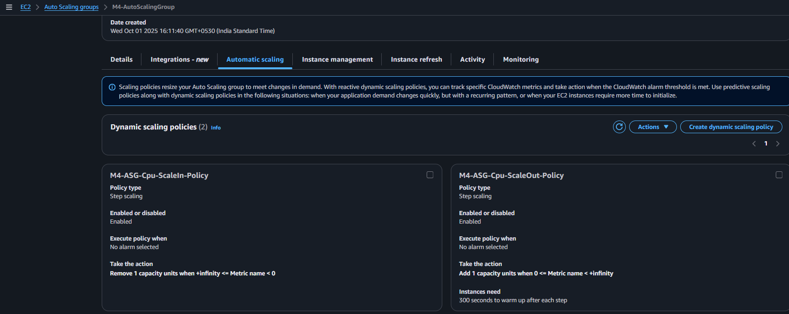
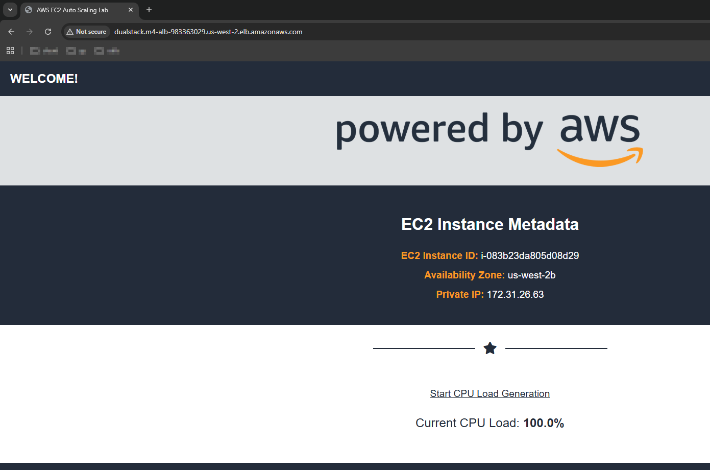

---

# Module 4: Case Study - ELB, ASG and Route53

### Problem Statement
You work for XYZ Corporation that uses on premise solutions and a limited number of systems. With the increase in requests in their application, the load also increases. So, to handle the load the corporation has to buy more systems almost on a regular basis. Realizing the need to cut down the expenses on systems, they decided to move their infrastructure to AWS

### Tasks To Be Performed:
1. Manage the scaling requirements of the company by  
    a. Deploying multiple compute resources on the cloud as soon as the `load increases` and the `CPU utulization exceeds 80%`.
    b. Remove the resources when the `CPU utilization goes under 60%`
2. Create a `load balancer` to distribute the load between compute resources
3. Route the traffic to the `company's domain`

---

### High-Level Architecture and Deployment Workflow
This section outlines the step-by-step approach implemented in this project to establish a scalable and resilient web infrastructure on AWS:

- **Create an AMI for a Web Server:**  
  Prepare an Amazon Machine Image of the web server to ensure consistent, repeatable deployments.

- **Launch Template Setup:**  
  Configure a launch template with the AMI for auto-scaling EC2 instances, enabling dynamic resource provisioning.

- **Deploy Internet-facing ALB:**  
  Create an Application Load Balancer (ALB) accessible over the internet to distribute incoming traffic.

- **Configure Target Group & Register Targets:**  
  Define a target group in the ALB and register EC2 instances as targets.

- **Set Up Listener:**  
  Attach a listener on the ALB that forwards incoming traffic to the target group.

- **Auto Scaling Group (ASG) Configuration:**  
  Create an ASG using the launch template, balancing load and scaling according to traffic.

- **Implement Step Scaling Policies:**  
  Define policies to scale out and in based on CPU utilization thresholds, for example:
  - Scale out when CPU exceeds 80%.
  - Scale in when CPU drops below 60%.

- **Monitor and Test:**  
  Create CloudWatch alarms linked to scaling policies, simulate load increases/decreases, and observe auto-scaling actions.

- **Domain Routing:**  
  Map the ALB’s DNS name (e.g., `dualstack.m4-alb-...elb.amazonaws.com`) to your company's custom domain using DNS services like Route 53 or your domain provider.

---

### Implementation and Verification Approach

This assignment was completed using a combination of the **AWS Command Line Interface (CLI)** and the **AWS Management Console**, ensuring both automation and visual validation.

- **Configuration** was primarily executed via CLI commands, covering the creation of key resources such as:
  - Amazon Machine Images (AMIs)
  - Launch Templates
  - Application Load Balancers (ALBs)
  - Auto Scaling Groups (ASGs)
  - Scaling Policies and CloudWatch Alarms

- All major steps—including AMI creation, launch template setup, ALB and ASG configuration, scaling policy definition, and alarm setup—are thoroughly documented with corresponding CLI commands to ensure reproducibility.

- **Verification** was performed through the AWS Console to visually confirm resource creation, configuration accuracy, and operational behavior.

- **Screenshots** are included throughout the report to illustrate each step and provide visual evidence of successful implementation.

- To maintain a clean environment, **cleanup commands** are provided at the end of the assignment. These ensure that all created resources can be safely removed, allowing the setup to be reset or reused without residual configurations.

---

### Project Repository File Overview

This section outlines the key files and folders included in the GitHub repository. Each artifact plays a specific role in implementing, validating, or documenting the AWS auto-scaling and load balancing solution. Filenames are structured for clarity and execution order, and screenshots provide visual confirmation of each step.

```bash
$ tree
.
├── EC2-Auto-Scaling-Lab.yaml
├── README.md
├── config.sh
├── images
│   ├── 01-stack-created.png
│   ├── 01-ec2-instance-running.png
│   ├── 05-ec2-access-public-dns.png
│   ├── 06-ami-available.png
│   ├── 10-launch-template-config.png
│   ├── 11-alb-created.png
│   ├── 12-target-group-config.png
│   ├── 13-alb-listener-config.png
│   ├── 14-alb-target-group-linked.png
│   ├── 15-asg-config.png
│   ├── 16-asg-scaling-policy.png
│   ├── 17-cloudwatch-alarms-overview.png
│   ├── 17-cloudwatch-low-alarm.png
│   ├── 18-asg-1-healthy.png
│   ├── 18-ec2-1-running.png
│   ├── 18-target-group-1-healthy.png
│   ├── 18-webhost-instance1.png
│   ├── 19-cloudwatch-high-alarm.png
│   ├── 19-target-group-2-healthy.png
│   ├── 19-webhost-instance2.png
│   ├── 20-ec2-3-running.png
│   ├── 20-target-group-3-healthy.png
│   ├── 20-webhost-3instances.png
│   ├── 21-cloudwatch-scale-in-alarm.png
│   ├── 21-target-group-draining.png
│   ├── 22-route53-hosted-zone.png
│   ├── 23-route53-a-record.png
│   └── 24-alb-url-access.png
```

| Filename | Description |
|----------|-------------|
| [`README.md`](README.md) | Step-by-step guide for deploying a scalable AWS architecture using EC2, Auto Scaling Groups, ALB, and Route 53. Includes CLI commands, screenshots, and cleanup instructions. |
| [`EC2-Auto-Scaling-Lab.yaml`](EC2-Auto-Scaling-Lab.yaml) | CloudFormation template used to provision the initial EC2 instance and supporting resources. |
| [`config.sh`](config.sh) | Environment configuration script that defines required variables such as VPC ID, subnet IDs, security group ID, and AMI ID. These values must be customized to match your AWS setup before executing any dependent CLI commands or templates. |
| [`images/`](images/) | Contains screenshots documenting each step of the implementation and verification process. Filenames are named for clarity and execution order. |

### Screenshot Files in `images/` Folder

| Filename | Description |
|----------|-------------|
| [`01-stack-created.png`](images/01-stack-created.png) | CloudFormation stack successfully created |
| [`01-ec2-instance-running.png`](images/01-ec2-instance-running.png) | EC2 instance launched and running |
| [`05-ec2-access-public-dns.png`](images/05-ec2-access-public-dns.png) | Accessing EC2 via public DNS |
| [`06-ami-available.png`](images/06-ami-available.png) | Custom AMI visible in AWS Console |
| [`10-launch-template-config.png`](images/10-launch-template-config.png) | Launch Template configuration |
| [`11-alb-created.png`](images/11-alb-created.png) | Application Load Balancer setup |
| [`12-target-group-config.png`](images/12-target-group-config.png) | Target Group configuration |
| [`13-alb-listener-config.png`](images/13-alb-listener-config.png) | Listener setup for ALB |
| [`14-alb-target-group-linked.png`](images/14-alb-target-group-linked.png) | ALB linked to Target Group |
| [`15-asg-config.png`](images/15-asg-config.png) | Auto Scaling Group configuration |
| [`16-asg-scaling-policy.png`](images/16-asg-scaling-policy.png) | Scaling policy setup |
| [`17-cloudwatch-alarms-overview.png`](images/17-cloudwatch-alarms-overview.png) | CloudWatch alarms overview |
| [`17-cloudwatch-low-alarm.png`](images/17-cloudwatch-low-alarm.png) | Low CPU alarm triggered |
| [`18-asg-1-healthy.png`](images/18-asg-1-healthy.png) | ASG with one healthy instance |
| [`18-ec2-1-running.png`](images/18-ec2-1-running.png) | One EC2 instance running |
| [`18-target-group-1-healthy.png`](images/18-target-group-1-healthy.png) | Target Group with one healthy instance |
| [`18-webhost-instance1.png`](images/18-webhost-instance1.png) | Web page served by first instance |
| [`19-cloudwatch-high-alarm.png`](images/19-cloudwatch-high-alarm.png) | High CPU alarm triggered |
| [`19-target-group-2-healthy.png`](images/19-target-group-2-healthy.png) | Target Group with two healthy instances |
| [`19-webhost-instance2.png`](images/19-webhost-instance2.png) | Web page served by second instance |
| [`20-ec2-3-running.png`](images/20-ec2-3-running.png) | Three EC2 instances running |
| [`20-target-group-3-healthy.png`](images/20-target-group-3-healthy.png) | Target Group with three healthy instances |
| [`20-webhost-3instances.png`](images/20-webhost-3instances.png) | Web pages served by all three instances |
| [`21-cloudwatch-scale-in-alarm.png`](images/21-cloudwatch-scale-in-alarm.png) | Scale-in alarm triggered |
| [`21-target-group-draining.png`](images/21-target-group-draining.png) | Instance draining during scale-in |
| [`22-route53-hosted-zone.png`](images/22-route53-hosted-zone.png) | Hosted zone setup in Route 53 |
| [`23-route53-a-record.png`](images/23-route53-a-record.png) | A record pointing domain to ALB |
| [`24-alb-url-access.png`](images/24-alb-url-access.png) | Application accessed via ALB DNS URL |

## Prerequisites

Before running any commands, ensure the required environment variables are defined in [`config.sh`](config.sh). These variables customize your AWS setup and are sourced before execution.

### Sample `config.sh`

```bash
# AWS CLI default region
export AWS_DEFAULT_REGION=us-west-2  # Oregon region, for sandbox/testing

# Security Group names
ASG_EC2_SG_NAME="M4-ASG-SecurityGroup"       # For Auto Scaling Group instances
ALB_SG_NAME="M4-ALB-SecurityGroup"           # For Application Load Balancer

# Launch template and AMI naming
LAUNCH_TEMPLATE_NAME="M4-SCALING-LAUNCH-TEMPLATE"
AMI_NAME="M4-AMI"

# EC2 key pair details
KEY_NAME="M4-KeyPair"
PEM_FILE="${KEY_NAME}.pem"                   # Private key for SSH access

# Target Group and Load Balancer
ASG_TARGET_GROUP="M4-ASG-TargetGroup"
ALB_NAME="M4-ALB"

# Auto Scaling Group and scaling policies
ASG_NAME="M4-AutoScalingGroup"
ASG_SCALEOUT_POLICY_NAME="M4-ASG-Cpu-ScaleOut-Policy"
ASG_SCALEIN_POLICY_NAME="M4-ASG-Cpu-ScaleIn-Policy"

# CloudFormation stack
CF_STACK_NAME="M4-CF-Stack"

# CloudWatch alarms
CLOUDWATCH_HIGH_CPU_ALARM="$ASG_NAME-HighCPUAlarm"  # CPU > 80%
CLOUDWATCH_LOW_CPU_ALARM="$ASG_NAME-LowCPUAlarm"    # CPU < 60%
```

### Load the Variables

```bash
source config.sh
```


## Environment Setup and Configuration
This section details how to initialize the AWS environment with region-specific settings, such as the default VPC, subnet IDs, and the client's public IP address. These configurations are essential prerequisites for subsequent deployment steps.

### 1. Load Default VPC
Retrieve the default VPC ID for your AWS account in the configured region:
```bash
VPC_ID=$(aws ec2 describe-vpcs --filters "Name=isDefault,Values=true" --query "Vpcs[0].VpcId" --output text)
echo "Default VPC ID: $VPC_ID"
```

### 2. Obtain Subnet IDs
Fetch all subnet IDs associated with this VPC:
```bash
SUBNET_IDS=$(aws ec2 describe-subnets --filters "Name=vpc-id,Values=$VPC_ID" --query "Subnets[].SubnetId" --output text)
echo "All subnet IDs: $SUBNET_IDS"
```

### 3. Select Primary Subnet
Select the first subnet to be used in configurations such as CloudFormation:
```bash
SUBNET_ID=$(echo $SUBNET_IDS | awk '{print $1}')
echo "Primary Subnet ID: $SUBNET_ID"
```

### 4. Format Subnet IDs for Auto Scaling
Convert the list of subnet IDs from space-separated to comma-separated format for use in auto-scaling configurations:
```bash
VPC_SUBNETS=$(echo $SUBNET_IDS | tr ' ' ',')
echo "Subnets for ASG (comma-separated): $VPC_SUBNETS"
```

### 5. Capture Client Public IP
Identify the current public IP address of the client (to restrict access policies):
```bash
MY_IP="$(curl -s https://checkip.amazonaws.com)/32"
echo "Client's Public IP: $MY_IP"
```

### 6. Create Key Pair
Generate an SSH key pair for secure access:
```bash
aws ec2 create-key-pair --key-name $KEY_NAME --query 'KeyMaterial' --output text > $PEM_FILE
chmod 400 $PEM_FILE
echo "Key pair created and saved to $PEM_FILE"
```


## Security Group Creation and Configuration

This section describes the setup of two key security groups with appropriate inbound rules to secure your AWS resources:

### 1) ALB Security Group  
Allows public inbound HTTP traffic from the internet to the Application Load Balancer.

```bash
# Create the ALB security group
ALB_SG_ID=$(aws ec2 create-security-group \
  --group-name $ALB_SG_NAME \
  --description "Security group for Application Load Balancer" \
  --vpc-id $VPC_ID \
  --query GroupId \
  --output text)

echo "Created ALB Security Group with ID: $ALB_SG_ID"

# Allow inbound HTTP traffic from anywhere on port 80
aws ec2 authorize-security-group-ingress \
  --group-id $ALB_SG_ID \
  --protocol tcp \
  --port 80 \
  --cidr 0.0.0.0/0

echo "Ingress rules added to ALB security group."
```

***

### 2) EC2 / Auto Scaling Group (ASG) Security Group  
Allows inbound HTTP traffic **only from the ALB security group**, and SSH access restricted to the client’s IP address for management purposes.

```bash
# Create the EC2/ASG security group
ASG_EC2_SG_ID=$(aws ec2 create-security-group \
  --group-name $ASG_EC2_SG_NAME \
  --description "Security group for Auto Scaling group instances" \
  --vpc-id $VPC_ID \
  --query GroupId \
  --output text)

echo "Created EC2/ASG Security Group with ID: $ASG_EC2_SG_ID"

# Allow HTTP (port 80) traffic only from ALB security group
aws ec2 authorize-security-group-ingress \
  --group-id $ASG_EC2_SG_ID \
  --protocol tcp \
  --port 80 \
  --source-group $ALB_SG_ID

echo "Added HTTP ingress rule allowing traffic from ALB SG."

# Allow SSH (port 22) access from the client’s IP address only
aws ec2 authorize-security-group-ingress \
  --group-id $ASG_EC2_SG_ID \
  --protocol tcp \
  --port 22 \
  --cidr $MY_IP

echo "Added SSH ingress rule allowing access from client IP: $MY_IP"
```

## Create an AMI for a Web Server

This step involves using the `EC2-Auto-Scaling-Lab.yaml` CloudFormation template to launch a Linux EC2 instance preconfigured with a web server and necessary tools. The instance setup allows generating CPU load for testing and verification purposes. Once the instance is accessible via a web browser and verified, an Amazon Machine Image (AMI) is created from it. This AMI will later be used in the Auto Scaling Group (ASG) to ensure consistent instance deployment.

### Deploy the CloudFormation Stack

```bash
aws cloudformation create-stack \
  --stack-name $CF_STACK_NAME \
  --template-body file://EC2-Auto-Scaling-Lab.yaml \
  --parameters ParameterKey=MyVPC,ParameterValue=$VPC_ID ParameterKey=PublicSubnet,ParameterValue=$SUBNET_ID ParameterKey=MyIP,ParameterValue=$MY_IP \
  --capabilities CAPABILITY_NAMED_IAM
```

*AWS Console: Wait for stack creation to complete before proceeding.*


*AWS Console: EC2 instance launched by the stack is in the running state.*  


*Screenshot: Client-Side Browser Accessing the Instance Web Service*


### Create a Custom AMI from the Running Instance

```bash
# Get the Instance ID of the running EC2 instance
INSTANCE_ID=$(aws ec2 describe-instances --filters "Name=instance-state-name,Values=running" --query "Reservations[0].Instances[0].InstanceId" --output text)
echo "Instance ID: $INSTANCE_ID"

# Create an AMI from the instance without rebooting
AMI_ID=$(aws ec2 create-image --instance-id $INSTANCE_ID --name $AMI_NAME --description "AMI created from CLI for ASG" --no-reboot --query 'ImageId' --output text)
echo "Created AMI ID: $AMI_ID"
```

*AWS console: AMI availability confirmation:*


After confirming AMI creation, delete the CloudFormation stack to remove temporary resources such as the EC2 instance and associated networking components.

```bash
aws cloudformation delete-stack --stack-name $CF_STACK_NAME
```
### Create the Launch Template for an EC2 Auto Scaling Group.
<!--
A Launch Template is a feature of EC2 Auto Scaling that allows a way to templatize your launch requests. 
It enables you to store launch parameters so that you do not have to specify them every time you launch an instance. 
For example, 
  a specific Amazon Machine Image, 
  instance type, 
  storage, 
  networking
For each Launch Template, you can create one or more numbered Launch Template Versions. Each version can have different launch parameters.
-->
```bash
aws ec2 create-launch-template \
  --launch-template-name $LAUNCH_TEMPLATE_NAME \
  --version-description "v1" \
  --launch-template-data "{
    \"ImageId\":\"$AMI_ID\",
    \"InstanceType\":\"t2.micro\",
    \"KeyName\":\"$KEY_NAME\",
    \"SecurityGroupIds\":[\"$ASG_EC2_SG_ID\"],
    \"Monitoring\": { \"Enabled\": true }
  }"
```

*AWS Console: Launch Template Created:*  


###  Create an Internet-facing Application Load Balancer (ALB)
```bash
ALB_ARN=$(aws elbv2 create-load-balancer \
  --name $ALB_NAME \
  --subnets $SUBNET_IDS \
  --security-groups $ALB_SG_ID \
  --scheme internet-facing \
  --type application \
  --query "LoadBalancers[0].LoadBalancerArn" \
  --output text)
```

*AWS Console: Load Balancer Created:*  


<!--
You will first create a target group that will be used for your load balancer. Target groups route requests to individual registered targets, such as EC2 instances, using the protocol and port number that you specify. You can register a target with multiple target groups. You can configure health checks on a per target group basis. Health checks are performed on all targets registered to a target group that is specified in a listener rule for your load balancer.
-->

### Create a target group  
```bash
TARGET_GROUP_ARN=$(aws elbv2 create-target-group \
  --name $ASG_TARGET_GROUP \
  --protocol HTTP \
  --port 80 \
  --target-type instance \
  --vpc-id $VPC_ID \
  --health-check-protocol HTTP \
  --health-check-path /health \
  --health-check-interval-seconds 30 \
  --health-check-timeout-seconds 5 \
  --healthy-threshold-count 5 \
  --unhealthy-threshold-count 2 \
  --matcher HttpCode=200 \
  --query "TargetGroups[0].TargetGroupArn" \
  --output text)
```

*AWS Console: Target Group Created:*  


### Create a Listener on the ALB forwarding traffic to your Target Group

This step maps the ALB’s listener on port 80 to forward requests to your target group.
```bash
LISTENER_ARN=$(aws elbv2 create-listener \
  --load-balancer-arn $ALB_ARN \
  --protocol HTTP \
  --port 80 \
  --default-actions Type=forward,TargetGroupArn=$TARGET_GROUP_ARN \
  --query 'Listeners[0].ListenerArn' \
  --output text)
```
*AWS Console: Load balancer listener with associated target group:*  


*AWS Console: Target group associated with Load balancer:*  


<!--
You have created a Launch Template, which defines the parameters of the instances launched. Now we will create an Auto Scaling Group so that you can define how many EC2 instances should be launched and where to launch them.
-->
### Create an Auto Scaling Group and attach the launch template
```bash
aws autoscaling create-auto-scaling-group \
  --auto-scaling-group-name $ASG_NAME \
  --launch-template LaunchTemplateName=$LAUNCH_TEMPLATE_NAME,Version=1 \
  --min-size 1 \
  --max-size 3 \
  --desired-capacity 1 \
  --vpc-zone-identifier $VPC_SUBNETS \
  --target-group-arns $TARGET_GROUP_ARN \
  --health-check-type ELB \
  --health-check-grace-period 120 \
  --tags Key=Name,Value=MyAutoScalingInstance,PropagateAtLaunch=true
```

*AWS Console: Auto Scaling Group associated with Launch template:*  


### Define Auto Scaling Policies for Dynamic Scaling
To enable elastic scaling in response to load, define scaling policies that adjust the number of instances based on CPU utilization.

```bash
# Scale-out policy: Increase capacity by 1 when threshold exceeded
SCALE_OUT_POLICY_ARN=$(aws autoscaling put-scaling-policy \
  --auto-scaling-group-name $ASG_NAME \
  --policy-name $ASG_SCALEOUT_POLICY_NAME \
  --policy-type StepScaling \
  --adjustment-type ChangeInCapacity \
  --step-adjustments MetricIntervalLowerBound=0,ScalingAdjustment=1 \
  --query PolicyARN --output text)

# Scale-in policy: Decrease capacity by 1 when load is low
SCALE_IN_POLICY_ARN=$(aws autoscaling put-scaling-policy \
  --auto-scaling-group-name $ASG_NAME \
  --policy-name $ASG_SCALEIN_POLICY_NAME \
  --policy-type StepScaling \
  --adjustment-type ChangeInCapacity \
  --step-adjustments MetricIntervalUpperBound=0,ScalingAdjustment=-1 \
  --query PolicyARN --output text)
```
*AWS Console: Scaling policies attached to the ASG, visualizing scaling behavior triggers*



### Set Up CloudWatch Alarms for Dynamic Scaling

Create CloudWatch alarms to monitor Auto Scaling Group's average CPU utilization and dynamically trigger scaling actions

```bash
# High CPU Alarm: Triggers the scale-out policy when CPU utilization exceeds 80% for 2 consecutive minutes
aws cloudwatch put-metric-alarm --alarm-name $CLOUDWATCH_HIGH_CPU_ALARM \
  --metric-name CPUUtilization --namespace AWS/EC2 --statistic Average --period 60 --threshold 80 \
  --comparison-operator GreaterThanThreshold --evaluation-periods 2 \
  --dimensions Name=AutoScalingGroupName,Value=$ASG_NAME \
  --alarm-actions $SCALE_OUT_POLICY_ARN

# Low CPU Alarm: Triggers the scale-in policy when CPU utilization falls below 60% for 2 consecutive minutes
aws cloudwatch put-metric-alarm --alarm-name $CLOUDWATCH_LOW_CPU_ALARM \
  --metric-name CPUUtilization --namespace AWS/EC2 --statistic Average --period 60 --threshold 60 \
  --comparison-operator LessThanThreshold --evaluation-periods 2 \
  --dimensions Name=AutoScalingGroupName,Value=$ASG_NAME \
  --alarm-actions $SCALE_IN_POLICY_ARN
```

*AWS Console: View of CloudWatch Alarms monitoring scaling conditions*


Auto Scaling Group automatically launches the first EC2 instance according to the desired capacity and scaling policies.

*AWS Console: Confirmation of a healthy instance availability in ASG*


The Target Group reflects one healthy EC2 instance registered by the ASG, confirming successful integration between the ASG and Application Load Balancer.

*AWS Console: Target group confirmation of the newly started healthy instance*


*AWS Console: EC2 console view of the running instance*


Verify the instance's web service is publicly accessible through the ALB, confirming correct networking and load balancing configuration.

*Screenshot: Client-Side Browser Accessing the Instance Web Service*


At the bottom of the page click on the Start CPU Load Generation link. Once the CPU load goes above 80% for a sustained period the Auto Scaling policy will begin spinning up the instances specified in the launch template to meet demand.

CloudWatch continuously monitors CPU utilization and detects when the threshold exceeds 80%, transitioning the alarm state to IN ALARM. This event initiates the scaling action.

*AWS Console: CloudWatch Detection of High CPU Load Alarm*


Following the alarm trigger, the ASG launches a second EC2 instance. The ALB target group now displays two healthy instances, confirming successful scaling.

*AWS Console: Target Group with Two Healthy Instances*


The new instance is also accessible through the ALB, ensuring continuous availability and load distribution.

*Screenshot: Client Web Access to Second Instance*


Generate CPU load on the second instance by clicking on the Start CPU Load Generation link. As the CPU load continues to increase beyond the scaling threshold, the Auto Scaling Group (ASG) launches a third EC2 instance to handle the additional demand.

The Target Group now shows three healthy instances, confirming the successful registration and health of all instances behind the Application Load Balancer.

*AWS Console: Target Group with Three Healthy Instances*


EC2 console lists three running instances, reflecting the current scaled-out state of the infrastructure.

*AWS Console: EC2 Console Showing Three Running Instances*


All the three EC2 instances are accessible from the web through the ALB, demonstrating successful load distribution and redundancy.

*Screenshot: Client Web Access to all Three Instances*


Stop the CPU Load and Observe Scale-In Behavior

After stopping the CPU load generation on the instance, allow some time for the CPU utilization to decrease. As the demand reduces, CloudWatch detects the drop in CPU usage and triggers the low CPU alarm.

*AWS Console: CloudWatch Low CPU Alarm in Alarm State*


Following the low CPU alarm, the Auto Scaling Group initiates scale-in by terminating surplus instances. The Target Group shows one instance in the draining state, indicating it is gracefully being deregistered to complete any in-flight requests before termination.

*AWS Console: Target Group Showing One Draining Instance*


### Route Traffic to the Company’s Domain

To route user traffic to a company-owned domain, register your domain and create a hosted zone in Amazon Route 53.

Create a Hosted Zone: Set up a hosted zone in Route 53 matching your registered domain name to manage DNS records.

*AWS Console: Route 53 Hosted Zone*


Create an A record (or Alias record) pointing to your Application Load Balancer (ALB), ensuring that requests to your domain are routed correctly.

*AWS Console: Route53 `A Record` Setup*


To avoid extra costs and simplify testing during this academic assignment, the ALB’s public DNS name (e.g., dualstack.m4-alb-983363029.us-west-2.elb.amazonaws.com) is used directly for access and testing.

In a production environment, this DNS name should be mapped to a company-owned custom domain either via Route 53 or through an external DNS registrar.

*Screenshot: Client Web Access to ALB via Public DNS*




### Cleanup section
```bash
# Delete cloudwatch alarms
aws cloudwatch delete-alarms --alarm-names \
  $CLOUDWATCH_HIGH_CPU_ALARM \
  $CLOUDWATCH_LOW_CPU_ALARM

# Delete Auto Scaling Scaling Policy & Auto Scaling Group
aws autoscaling delete-policy --auto-scaling-group-name $ASG_NAME --policy-name $ASG_SCALEOUT_POLICY_NAME
aws autoscaling delete-policy --auto-scaling-group-name $ASG_NAME --policy-name $ASG_SCALEIN_POLICY_NAME
aws autoscaling delete-auto-scaling-group --auto-scaling-group-name $ASG_NAME --force-delete

# Delete Listener, Load Balancer & target group
aws elbv2 delete-listener --listener-arn $LISTENER_ARN
aws elbv2 delete-load-balancer --load-balancer-arn $ALB_ARN
aws elbv2 delete-target-group --target-group-arn $TARGET_GROUP_ARN

# Delete Launch Template
aws ec2 delete-launch-template --launch-template-name $LAUNCH_TEMPLATE_NAME

# Deregister/Delete AMI and Associated Snapshot if any
aws ec2 deregister-image --image-id $AMI_ID

# Delete CloudFormation Stack
aws cloudformation delete-stack --stack-name $CF_STACK_NAME

# Delete Security Group
aws ec2 delete-security-group --group-id $ASG_EC2_SG_ID
aws ec2 delete-security-group --group-id $ALB_SG_ID

# Delete Key Pair
aws ec2 delete-key-pair --key-name $KEY_NAME
rm -rf $PEM_FILE
```
