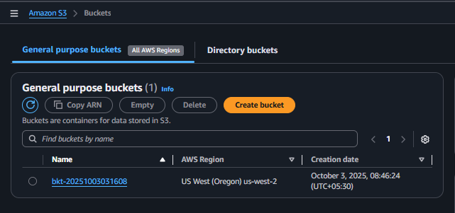
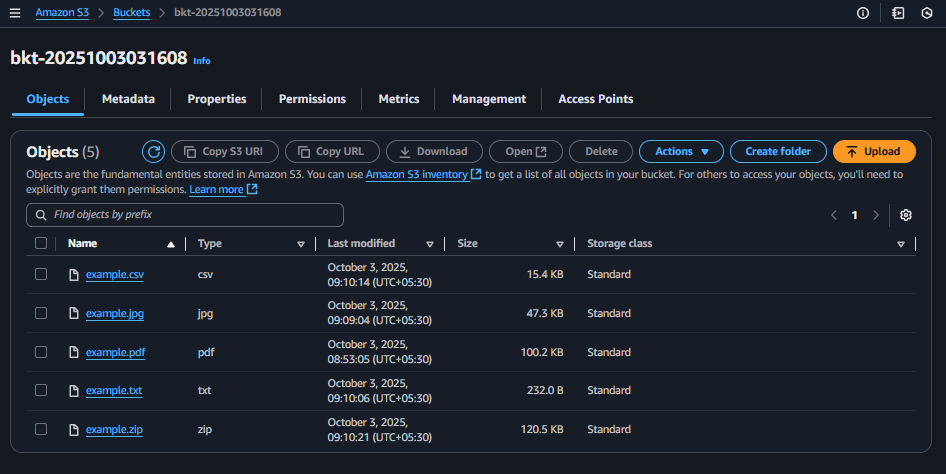

## Module 6: S3 Bucket Creation

### Problem Statement
You work for XYZ Corporation. Their application requires a storage service that can store files and publicly share them if required. Implement S3 for the same.

### Tasks To Be Performed
1. Create an S3 Bucket for file storage.  
2. Upload 5 objects with different file extensions.

### Prequisite
```bash
# Set AWS region
export AWS_DEFAULT_REGION=us-west-2 # Oregon, for sandbox/testing
```

### Project Repository File Overview

```bash
$ tree
.
├── README.md
├── example.csv
├── example.jpg
├── example.pdf
├── example.txt
├── example.zip
└── images
    ├── 01-bucket-created.png
    └── 02-objects-uploaded.png
```

| Filename | Description |
|----------|-------------|
| [`README.md`](README.md) | Documentation outlining the S3 bucket creation, object uploads, and validation steps. Includes screenshots and sample files for testing. |
| [`example.csv`](example.csv) | Sample CSV file uploaded to the S3 bucket for demonstration. |
| [`example.jpg`](example.jpg) | Sample image file used to validate object upload and access. |
| [`example.pdf`](example.pdf) | Sample PDF file included for multi-format object testing. |
| [`example.txt`](example.txt) | Plain text file used to verify basic object storage. |
| [`example.zip`](example.zip) | Compressed archive uploaded to test binary object handling. |
| [`images/`](images/) | Contains screenshots documenting bucket creation and object upload steps. Filenames are numbered for clarity and execution order. |

### Screenshot Files in `images/` Folder

| Filename | Description |
|----------|-------------|
| [`01-bucket-created.png`](images/01-bucket-created.png) | S3 bucket successfully created in the AWS Console |
| [`02-objects-uploaded.png`](images/02-objects-uploaded.png) | Multiple objects uploaded and visible in the bucket listing |


```bash
# Generate a unique bucket name
bkt_name=bkt-$(date +%Y%m%d%H%M%S)
```

```bash
echo $bkt_name
# output:
bkt-20250830140412
```


### Create S3 bucket
```bash
aws s3api create-bucket --region $AWS_DEFAULT_REGION --bucket $bkt_name \
    --create-bucket-configuration LocationConstraint=$AWS_DEFAULT_REGION
```
```bash
# output:
{
    "Location": "http://bkt-20250830140412.s3.amazonaws.com/"
}
```
*AWS Console: S3 bucket created*



```bash
# List buckets
aws s3api list-buckets --query "Buckets[].Name"
```
```bash
# output:
[
    "bkt-20250830140412"
]
```

---

### Upload local objects to S3

Upload  `example.pdf`
```bash
aws s3api put-object --bucket $bkt_name --key example.pdf --body example.pdf
```

Upload  `example.jpg`
```bash
aws s3api put-object --bucket $bkt_name --key example.jpg --body example.jpg
```

Upload `example.txt`
```bash
aws s3api put-object --bucket $bkt_name --key example.txt --body example.txt
```

Upload `example.csv`
```bash
aws s3api put-object --bucket $bkt_name --key example.csv --body example.csv
```

Upload `example.zip`
```bash
aws s3api put-object --bucket $bkt_name --key example.zip --body example.zip
```

### From AWS Console, Verify five objects uploaded to S3 bucket


### From AWS CLI, Verify five objects uploaded to S3 bucket

```bash
aws s3 ls s3://$bkt_name/
```
```bash
# output:
2025-08-30 09:24:32      15799 example.csv
2025-08-30 09:23:08      48396 example.jpg
2025-08-30 09:22:07     102602 example.pdf
2025-08-30 09:24:04        232 example.txt
2025-08-30 09:24:50     123422 example.zip
```
<!--
# Cleanup
aws s3api delete-object --bucket $bkt_name --key example.pdf
aws s3api delete-object --bucket $bkt_name --key example.txt
aws s3api delete-object --bucket $bkt_name --key example.jpg
aws s3api delete-object --bucket $bkt_name --key example.csv
aws s3api delete-object --bucket $bkt_name --key example.zip
-->
