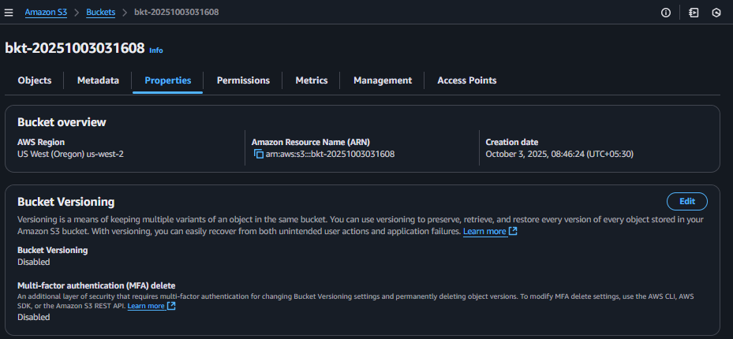
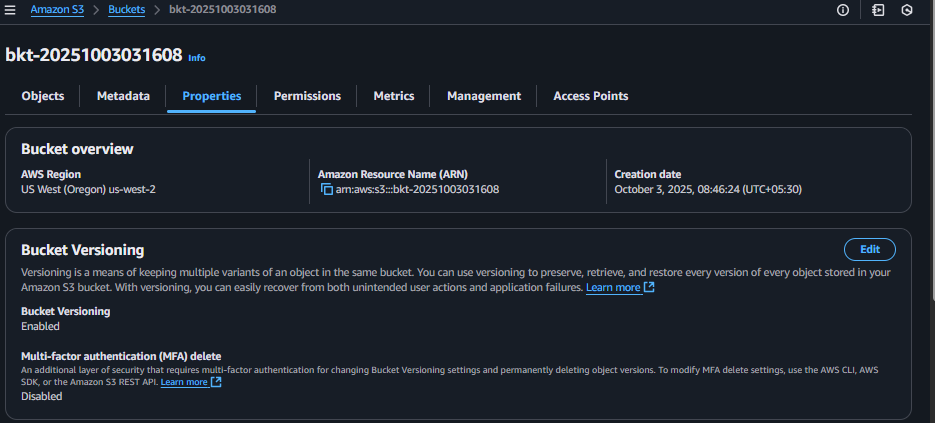
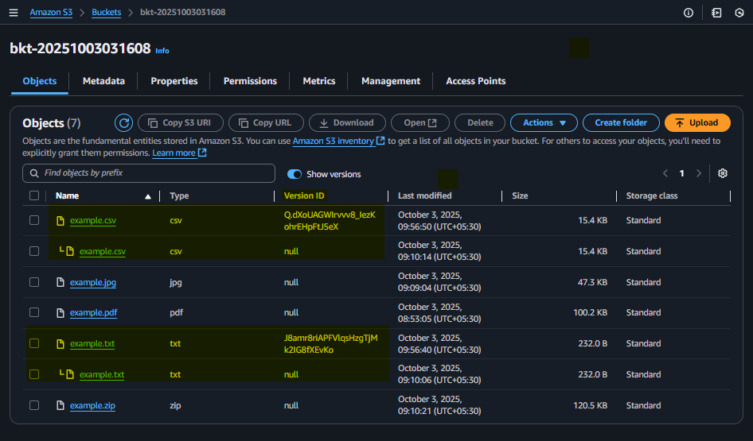

## Module 6: S3 Bucket Versioning

### Problem Statement
You work for XYZ Corporation. Their application requires a storage service that can store files and publicly share them if required. Implement S3 for the same.

### Tasks To Be Performed
1. Enable versioning for the bucket created in task 1
2. Re-upload any 2 files already uploaded to verify if versioning works


---
### Prequisite
```bash
# Set AWS region
export AWS_DEFAULT_REGION=us-west-2 # Oregon, for sandbox/testing
```
Create bucket and upload files as described here [`README.md`](../m6-a01-s3-bkt-create/README.md) 

### Project Repository File Overview
```bash
$ tree
.
├── README.md
└── images
    ├── 01-default-s3-bucket-versioning-disabled.png
    ├── 02-s3-bucket-versioning-enabled.png
    └── 03-objects-with-version.png
```
| Filename | Description |
|----------|-------------|
| [`README.md`](README.md) | Documentation explaining how to enable versioning on an S3 bucket, verify object versions, and observe versioning behavior through the AWS Console. Includes screenshots and validation steps. |
| [`images/`](images/) | Contains screenshots that visually demonstrate the versioning workflow — from default state to enabled versioning and object version tracking. Filenames are numbered for clarity and execution order. |

### Screenshot Files in `images/` Folder

| Filename | Description |
|----------|-------------|
| [`01-default-s3-bucket-versioning-disabled.png`](images/01-default-s3-bucket-versioning-disabled.png) | S3 bucket with versioning disabled by default |
| [`02-s3-bucket-versioning-enabled.png`](images/02-s3-bucket-versioning-enabled.png) | Versioning successfully enabled on the S3 bucket |
| [`03-objects-with-version.png`](images/03-objects-with-version.png) | Uploaded objects showing version IDs in the AWS Console |


*AWS Console: S3 bucket versioning disabled by default*




### Enable versioning on bucket
```bash
aws s3api put-bucket-versioning --bucket $bkt_name --versioning-configuration Status=Enabled
```
*AWS Console: S3 bucket versioning enabled*


---

### Re-upload any 2 files already uploaded to verify if versioning works

```bash
aws s3api put-object --bucket $bkt_name --key example.txt --body ../m6-a01-s3-bkt-create/example.txt
```
```bash
aws s3api put-object --bucket $bkt_name --key example.csv --body ../m6-a01-s3-bkt-create/example.csv
```
*AWS Console: Versioning enabled for `example.txt` and `example.csv`*



<!--
# Cleanup
aws s3api delete-object --bucket $bkt_name --key example.pdf
aws s3api delete-object --bucket $bkt_name --key example.txt
aws s3api delete-object --bucket $bkt_name --key example.jpg
aws s3api delete-object --bucket $bkt_name --key example.csv
aws s3api delete-object --bucket $bkt_name --key example.zip
-->
