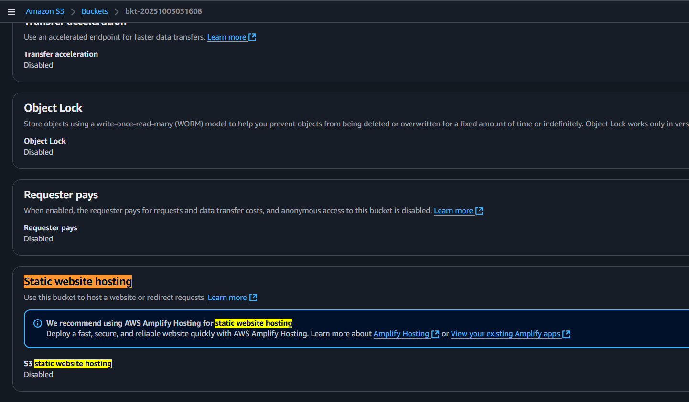
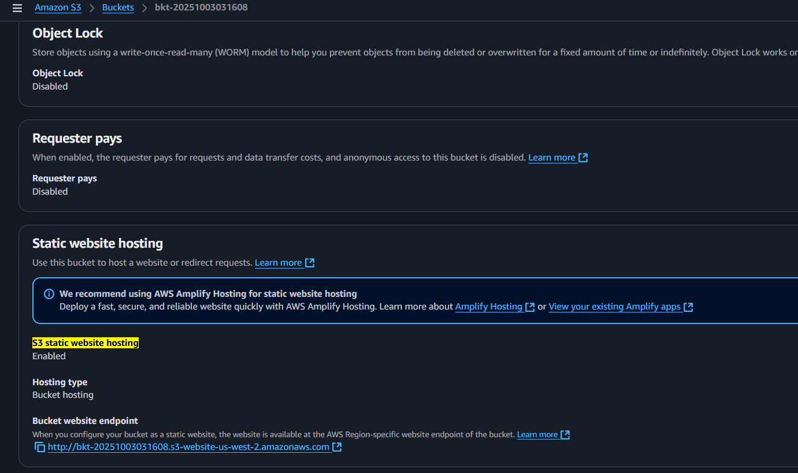
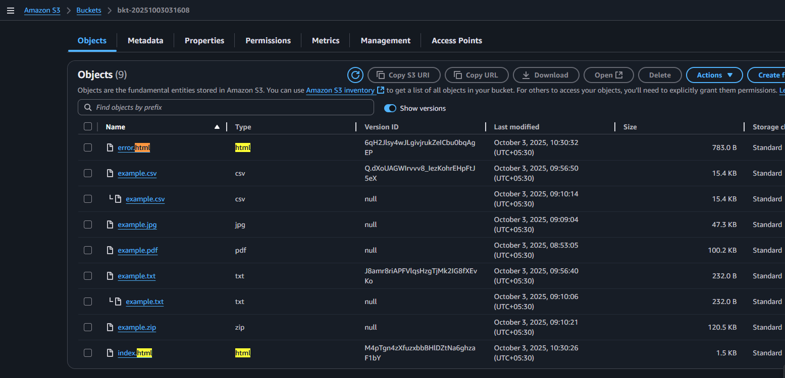
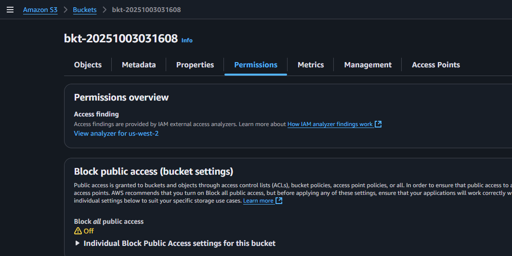
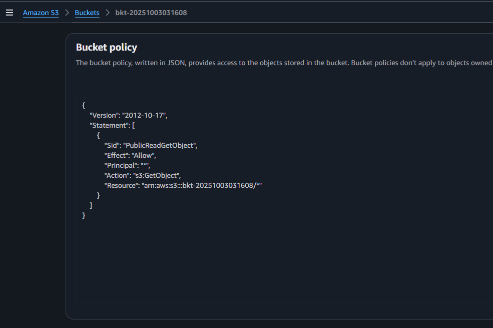
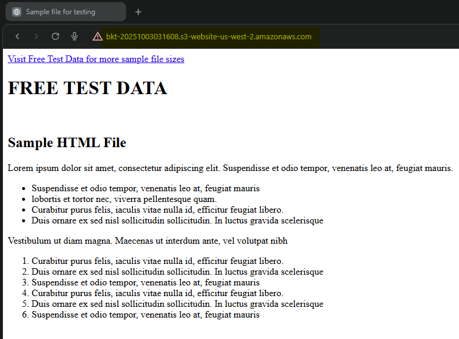
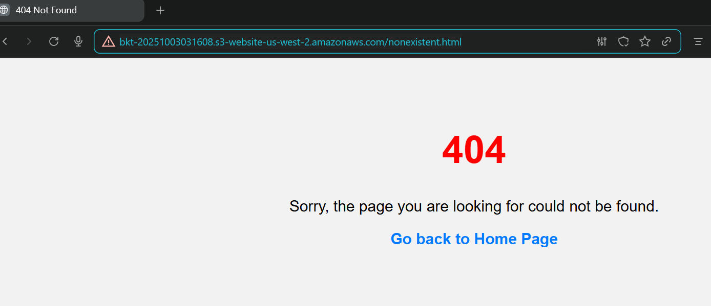
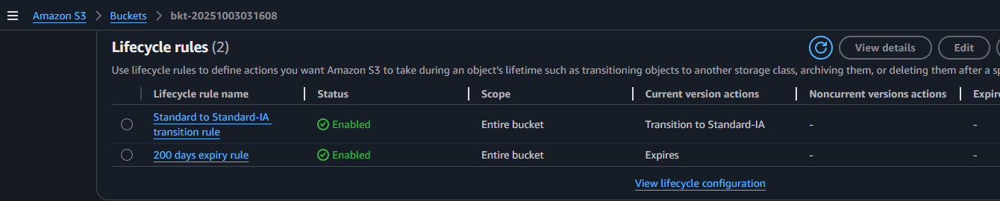
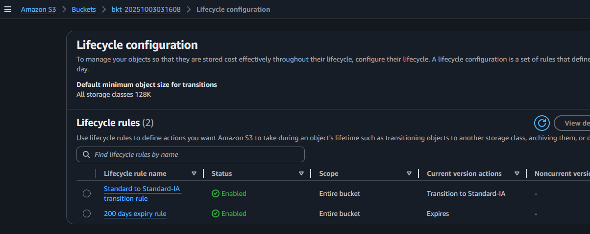

## Module 6: S3 Website Hosting

### Problem Statement
You work for XYZ Corporation. Their application requires a storage service that
can store files and publicly share them if required. Implement S3 for the same.

### Tasks To Be Performed
1. Use the created bucket in the previous task to host static websites, upload an index.html file and error.html page.
2. Add a lifecycle rule for the bucket:
    a. Transition from Standard to Standard-IA in 60 days
    b. Expiration in 200 days


---

### Prequisite
```bash
# Set AWS region
export AWS_DEFAULT_REGION=us-west-2 # Oregon, for sandbox/testing
```
Create bucket and upload files as described here  - [`README.md`](../m6-a01-s3-bkt-create/README.md)  
Enable versioning for the bucket as described here  - [`README.md`](../m6-a02-s3-bkt-version/README.md) 

### Project Repository File Overview
This section summarizes the key files included in the project repository. Each file serves a specific purpose in configuring, hosting, and validating a static website on Amazon S3. The structure is organized for clarity, with configuration templates, HTML files, policy definitions, and screenshots grouped for easy reference.

```bash
$ tree
.
├── README.md
├── block-public-access.json
├── delete_s3_objects.py
├── error.html
├── images
│   ├── 01-static-website-hosting-disabled.png
│   ├── 02-static-website-hosting-enabled.png
│   ├── 03-website-files-uploaded.png
│   ├── 04-block-public-access-disabled.png
│   ├── 05-bucket-policy.png
│   ├── 06-webclient-access.png
│   ├── 07-access-error.png
│   ├── 08-lifecycle-rules.png
│   └── 09-lifecycle-config.png
├── index.html
├── lifecycle.json
├── public-read-policy.json
```

### Project Repository File Overview

| Filename | Description |
|----------|-------------|
| [`README.md`](README.md) | Documentation outlining the S3 static website setup, bucket policies, lifecycle rules, and access control. Includes AWS CLI commands, screenshots, and cleanup instructions. |
| [`block-public-access.json`](block-public-access.json) | JSON configuration to disable S3 bucket public access settings. |
| [`public-read-policy.json`](public-read-policy.json) | Bucket policy granting public read access to objects — used for static website hosting. |
| [`index.html`](index.html) | Default landing page for the S3-hosted static website. |
| [`error.html`](error.html) | Custom error page displayed when access is denied or a resource is missing. |
| [`lifecycle.json`](lifecycle.json) | JSON configuration defining lifecycle rules for automatic object transitions or expiration. |
| [`delete_s3_objects.py`](delete_s3_objects.py) | Python script to delete objects from an S3 bucket — useful for cleanup |
| [`images/`](images/) | Contains screenshots documenting each step of the S3 website setup and policy configuration. Filenames are numbered for clarity and execution order. |

### Screenshot Files in `images/` Folder

| Filename | Description |
|----------|-------------|
| [`01-static-website-hosting-disabled.png`](images/01-static-website-hosting-disabled.png) | S3 bucket with static website hosting initially disabled |
| [`02-static-website-hosting-enabled.png`](images/02-static-website-hosting-enabled.png) | Static website hosting enabled in S3 bucket properties |
| [`03-website-files-uploaded.png`](images/03-website-files-uploaded.png) | `index.html` and `error.html` files uploaded to the S3 bucket |
| [`04-block-public-access-disabled.png`](images/04-block-public-access-disabled.png) | Block Public Access settings disabled to allow web access |
| [`05-bucket-policy.png`](images/05-bucket-policy.png) | Bucket policy granting public read access to website files |
| [`06-webclient-access.png`](images/06-webclient-access.png) | Website successfully accessed via public S3 endpoint |
| [`07-access-error.png`](images/07-access-error.png) | Custom error page displayed when accessing restricted content |
| [`08-lifecycle-rules.png`](images/08-lifecycle-rules.png) | Lifecycle rules configured for object expiration and transition |
| [`09-lifecycle-config.png`](images/09-lifecycle-config.png) | JSON configuration for lifecycle rules applied to the bucket |


## Static Website Hosting on S3 Bucket

*AWS Console: Static hosting disabled by default*



Use AWS CLI to enable Static Website Hosting on S3 Bucket
```bash
aws s3 website s3://$bkt_name/ --index-document index.html --error-document error.html
```

*AWS Console: Static hosting enabled*



## Upload Website Files

```bash
aws s3 cp index.html s3://$bkt_name/index.html
```
```bash
aws s3 cp error.html s3://$bkt_name/error.html
```

*AWS Console: Website files `index.html` and `error.html` uploaded to S3 bucket*



---


By default, new buckets have public access blocked to protect your data. The [`JSON configuration`](block-public-access.json) shown below disables all four Block Public Access settings for the specified bucket, allowing ACLs and bucket policies to define the access.

### `block-public-access.json`

```json
{
  "BlockPublicAcls": false,
  "IgnorePublicAcls": false,
  "BlockPublicPolicy": false,
  "RestrictPublicBuckets": false
}
```

### Apply the Settings

```bash
aws s3api put-public-access-block --bucket $bkt_name --public-access-block-configuration file://block-public-access.json
```

*AWS Console: S3 bucket public access enabled*



## Make Objects Publicly Readable
The [`JSON configuration`](public-read-policy.json) below defines a bucket policy that grants the `s3:GetObject` permission to all users `(Principal: "*")` to allow public read access to the objects within the bucket. This policy enables anyone on the internet to retrieve objects from the bucket, making it suitable for publicly available content such as static websites or shared files.

### `public-read-policy.json`

```json
{
  "Version": "2012-10-17",
  "Statement": [
    {
      "Sid": "PublicReadGetObject",
      "Effect": "Allow",
      "Principal": "*",
      "Action": "s3:GetObject",
      "Resource": "arn:aws:s3:::<bkt_name>/*"
    }
  ]
}
```

Replace Placeholder `<bkt-name>` with the actual bucket name
```bash
sed "s/<bkt_name>/$bkt_name/g" public-read-policy.json > tmp-policy.json
```

Check the updated bucket name
```bash
cat tmp-policy.json
```

Output:
```json
{
  "Version": "2012-10-17",
  "Statement": [
    {
      "Sid": "PublicReadGetObject",
      "Effect": "Allow",
      "Principal": "*",
      "Action": "s3:GetObject",
      "Resource": "arn:aws:s3:::bkt-20250830140412/*"
    }
  ]
}
```

Apply the policy on the bucket
```bash
aws s3api put-bucket-policy --bucket $bkt_name --policy file://tmp-policy.json
```

*AWS Console: S3 bucket shows the configured polcy*



---

## Verify Website Configuration

```bash
aws s3api get-bucket-website --bucket $bkt_name
```

Output:

```json
{
  "IndexDocument": {
    "Suffix": "index.html"
  },
  "ErrorDocument": {
    "Key": "error.html"
  }
}
```

---


### Test Website Access from a Web Browser and Verify `index.html` is Returned
Open a web browser and navigate to the website URL. Verify that the default landing page `index.html` loads successfully, confirming proper web server and load balancer configuration.

*Screenshot: Client-Side Web Browser Access to the Website*



### Test Website Returns `error.html` for Non-Existent Pages
Access a non-existent page on the website to test the custom error handling. The server should return the configured `error.html` page, demonstrating correct error response setup for invalid URLs.

*Screenshot: Client-Side Web Browser Displaying Error Page*



---

## Lifecycle Configuration

The [`JSON configuration`](lifecycle.json) below defines two rules to manages storage and retention of objects in the bucket:  
1. Transition Rule: Move Objects to Standard-Infrequent Access (STANDARD_IA) Storage Class after 60 Days  
2. Expiration Rule: Delete Objects after 200 Days  

### `lifecycle.json`
```json
{
    "Rules": [
        {
            "ID": "Standard to Standard-IA transition rule",
            "Filter": {},
            "Status": "Enabled",
            "Transitions": [
                {
                    "Days": 60,
                    "StorageClass": "STANDARD_IA"
                }
            ]
        },
        {
            "Expiration": {
                "Days": 200
            },
            "ID": "200 days expiry rule",
            "Filter": {},
            "Status": "Enabled"
        }
    ]
}
```

### Apply Lifecycle Rules

```bash
aws s3api put-bucket-lifecycle-configuration --bucket $bkt_name --lifecycle-configuration file://lifecycle.json
```

*AWS Console: Lifecycle rules*




*AWS Console: Lifecycle configuration*



## Cleanup Steps

### Delete All Object Versions

```bash
python3 delete_s3_objects.py $bkt_name
```

Output:

```bash
Deleting all object versions and delete markers from bucket: bkt-20250830140412
Deleted 13 objects/versions in this batch
Deletion of all object versions and delete markers completed.
```

### Remove Lifecycle Rules

```bash
aws s3api delete-bucket-lifecycle --bucket $bkt_name
```

### Delete Bucket Policy

```bash
aws s3api delete-bucket-policy --bucket $bkt_name
```

### Remove Website Hosting Configuration

```bash
aws s3api delete-bucket-website --bucket $bkt_name
```

### Delete the Bucket

```bash
aws s3api delete-bucket --bucket $bkt_name
```
