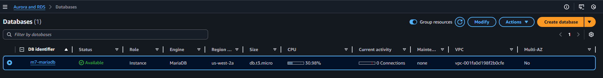
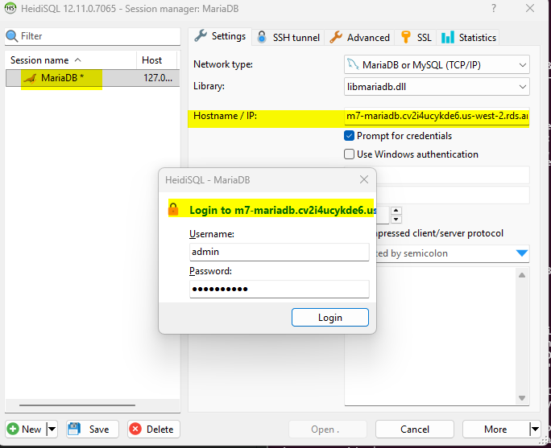
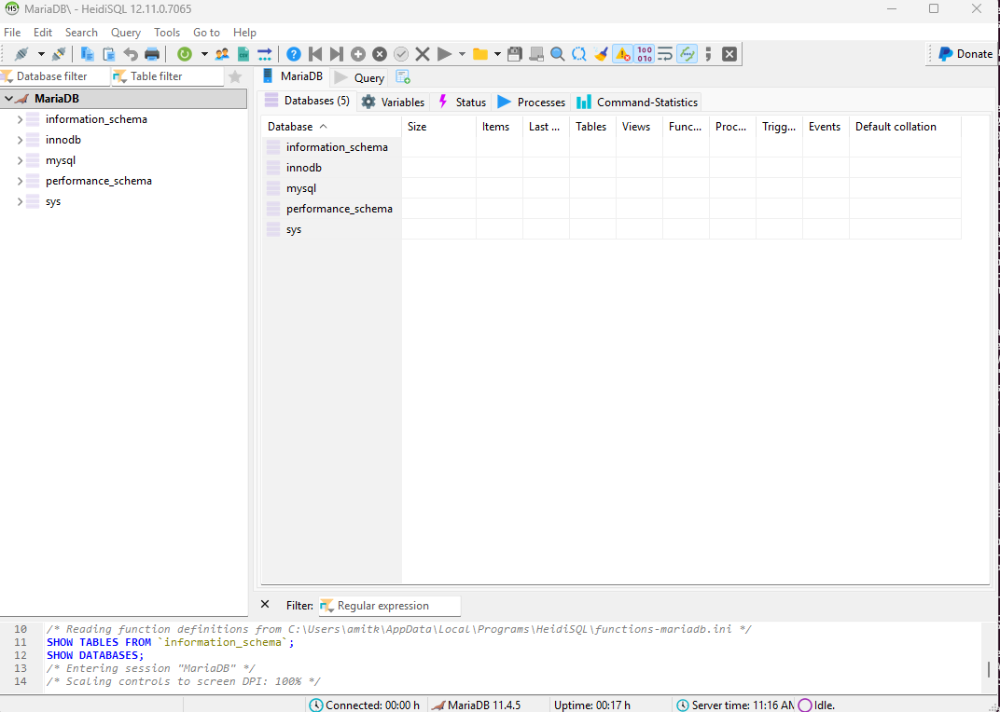
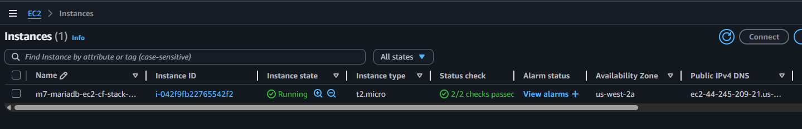
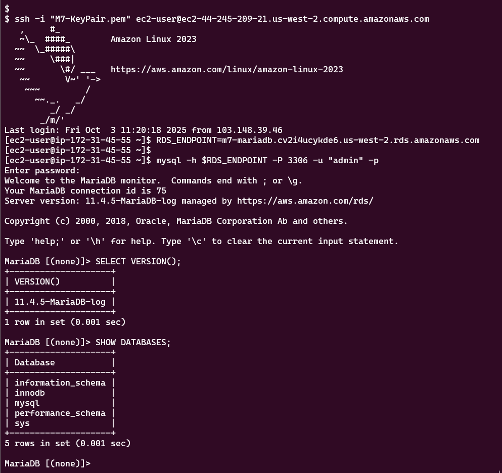

## Module 7: MariaDB

### Problem Statement
You work for XYZ Corporation. Their application requires a SQL service that can store data which can be retrieved if required. Implement a suitable RDS engine for the same.  

While migrating, you are asked to perform the following tasks:  
1. Create a MariaDB Engine based RDS Database.
2. Connect to the DB using the following ways:
  a. SQL Client for Windows
  b. Linux based EC2 Instance


---
### Prequisite
```bash
# Set AWS region
export AWS_DEFAULT_REGION=us-west-2 # Oregon, for sandbox/testing
```
### Project Repository File Overview

| Filename             | Description                                                                 |
|----------------------|-----------------------------------------------------------------------------|
| `README.md`          |  Step-by-step guide for provisioning a MariaDB RDS instance and connecting to it using SQL clients from both Windows and an EC2 Linux instance. Includes AWS CLI commands, screenshots, and cleanup instructions. |
| `ec2-instance.yaml`  | CloudFormation template to provision an Amazon Linux EC2 instance with MariaDB client |
| `images/`            | Folder containing screenshots that document key steps and validation        |


### Screenshot Files in `images/` Folder

| Screenshot Filename                                | Description                                                                 |
|----------------------------------------------------|-----------------------------------------------------------------------------|
| `01-mariadb-created.png`                           | Confirmation of successful MariaDB RDS instance creation                    |
| `02-windows-mariadb-client-connect-auth.png`       | Authentication prompt from Windows MariaDB client                          |
| `03-windows-mariadb-client-connect-success.png`    | Successful connection to RDS MariaDB from Windows client                           |
| `04-ec2-linux-instance.png`                        | EC2 instance launched, showing instance details         |
| `05-mariadb-connected-from-ec2-linux-instance.png` | Terminal view of successful MariaDB connection from EC2 Linux          |

### Prerequisities


Before running any commands, ensure the required environment variables are defined. These variables customize your AWS setup.
```bash
# RDS configuration
MARIADB_INST_ID="m7-mariadb"
MARIADB_MASTER_USERNAME="admin"
MARIADB_MASTER_PASSWORD="xxxxxxxxx"
MARIADB_SG_NAME="m7-mariadb-security-group"

# EC2 key pair, private key for SSH access
KEY_NAME="M7-KeyPair" 
PEM_FILE="${KEY_NAME}.pem"                   

# Cloud formation stack name
CF_STACK_NAME="m7-mariadb-ec2-cf-stack"
```

Retrieve the default VPC ID for the AWS account in the configured region. This VPC will host both the RDS and EC2 resources.

```bash
VPC_ID=$(aws ec2 describe-vpcs --filters "Name=isDefault,Values=true" --query "Vpcs[0].VpcId" --output text)
```

Identify a subnet within the default VPC to launch the EC2 instance.
```bash
SUBNET_ID=$(aws ec2 describe-subnets --filters "Name=vpc-id,Values=$VPC_ID" --query "Subnets[0].SubnetId" --output text)
```

Generate an SSH key pair for secure access to the EC2 instance.
```bash
aws ec2 create-key-pair --key-name $KEY_NAME --query 'KeyMaterial' --output text > $PEM_FILE
chmod 400 $PEM_FILE
```

Identify client's current public IP address to restrict SSH access to the EC2 instance.
```bash
MY_IP="$(curl -s https://checkip.amazonaws.com)/32"
```

Ceate a security group to allow inbound traffic to the RDS MariaDB instance on port 3306
```bash
# Create the security group
MARIADB_SG_ID=$(aws ec2 create-security-group \
  --group-name $MARIADB_SG_NAME \
  --description "Security group for MariaDB RDS instance to allow inbound traffic on port 3306" \
  --vpc-id $VPC_ID \
  --query GroupId \
  --output text)
```

Allow inbound traffic to the RDS instance.  
```bash
aws ec2 authorize-security-group-ingress \
  --group-id $MARIADB_SG_ID \
  --protocol tcp \
  --port 3306 \
  --cidr 0.0.0.0/0
```

### Create a MariaDB RDS Instance
Provision a managed MariaDB database instance using AWS RDS. This command sets up a lightweight, publicly accessible database.
```bash
aws rds create-db-instance \
  --db-instance-identifier $MARIADB_INST_ID \
  --db-instance-class db.t3.micro \
  --engine mariadb \
  --master-username $MARIADB_MASTER_USERNAME \
  --master-user-password $MARIADB_MASTER_PASSWORD \
  --allocated-storage 20 \
  --publicly-accessible \
  --backup-retention-period 1 \
  --vpc-security-group-ids $MARIADB_SG_ID

```

Ensure the RDS instance is fully provisioned before attempting to connect. This command blocks execution until the instance status is `available`.
```bash
aws rds wait db-instance-available --db-instance-identifier $MARIADB_INST_ID
```

*AWS Console: MariaDB instance created*



Once the instance is ready, extract the endpoint address to use in SQL clients: 
```bash
RDS_ENDPOINT=$(aws rds describe-db-instances \
  --db-instance-identifier $MARIADB_INST_ID \
  --query "DBInstances[0].Endpoint.Address" \
  --output text)

echo "Connect using endpoint: $RDS_ENDPOINT"
```


### Connect to MariaDB from SQL Client on Windows

Download and install a SQL client for Windows, such as [HeidiSQL](https://www.heidisql.com/downloads/installers/HeidiSQL_12.11.0.7065_Setup.exe).

Launch the application and enter the RDS connection and authentication credentials.

*Screenshot: SQL client connected to RDS MariaDB endpoint and prompting for authentication*




*Screenshot: Post-authentication view showing default MariaDB internals*




### Create the EC2 linux instance

This EC2 instance is provisioned using an AWS CloudFormation (CF) template to automate and standardize the deployment of a Linux-based client environment. The template, located at [`ec2-instance.yaml`](ec2-instance.yaml), launches an **Amazon Linux 2023** EC2 instance within a user-specified **VPC** and **subnet**, secured by a custom **security group** that restricts SSH access to the client’s public IP.

Upon launch, the instance automatically installs the `mariadb-client` package via a **user data script**, enabling immediate CLI-based connectivity to the MariaDB RDS database.

```bash
aws cloudformation create-stack \
  --stack-name $CF_STACK_NAME \
  --template-body file://ec2-instance.yaml \
  --parameters \
    ParameterKey=KeyName,ParameterValue=$KEY_NAME \
    ParameterKey=MyVPC,ParameterValue=$VPC_ID \
    ParameterKey=PublicSubnet,ParameterValue=$SUBNET_ID \
    ParameterKey=MyIP,ParameterValue=$MY_IP \
  --capabilities CAPABILITY_NAMED_IAM
```

After launching the EC2 stack, wait for completion:
```bash
aws cloudformation wait stack-create-complete --stack-name $CF_STACK_NAME
```
*AWS Console: Showing the EC2 instance launched via CloudFormation*



### SSH to the EC2 instance and Connect to MariaDB

After the EC2 instance is provisioned, use SSH to access it and connect to the MariaDB RDS instance using the CLI.  

SSH into EC instance
```bash
ssh -i $PEM_FILE ec2-user@ec2-44-245-209-21.us-west-2.compute.amazonaws.com
```
Connect to MariaDB
```bash
mysql -h $RDS_ENDPOINT -P 3306 -u $MARIADB_MASTER_USERNAME -p
```
- Enter the password when prompted: `xxxxxxxx`
- On successful login, run basic SQL queries to validate connectivity:

```sql
SELECT VERSION();
SHOW DATABASES;
```

*Screenshot: Terminal view showing successful MariaDB connection from EC2 instance*



### Cleanup

Delete the MariaDB RDS Instance (No Snapshot)  
```bash
aws rds delete-db-instance --db-instance-identifier $MARIADB_INST_ID --skip-final-snapshot
```
Wait for RDS Deletion to Complete  
```bash
aws rds wait db-instance-deleted --db-instance-identifier $MARIADB_INST_ID
```
Delete the RDS Security Group  
```bash
aws ec2 delete-security-group --group-id $MARIADB_SG_ID
```
Delete the EC2 CloudFormation Stack 
```bash
aws cloudformation delete-stack --stack-name $CF_STACK_NAME
```
Delete EC2 Key Pair  
```bash
aws ec2 delete-key-pair --key-name M7-KeyPair
rm -f M7-KeyPair.pem
```
