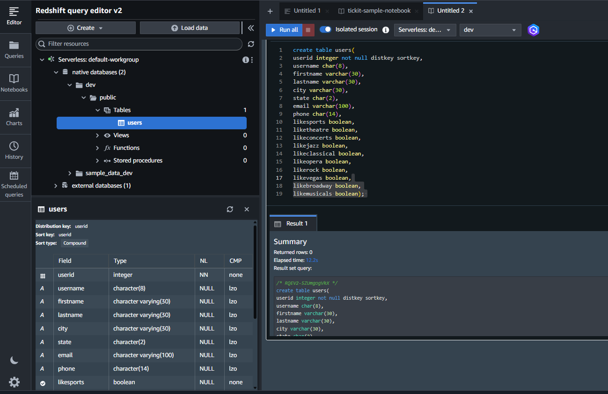
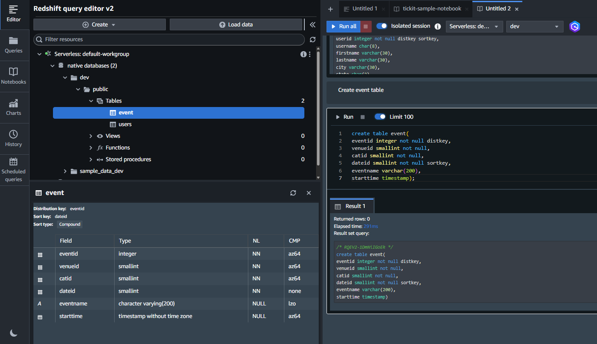
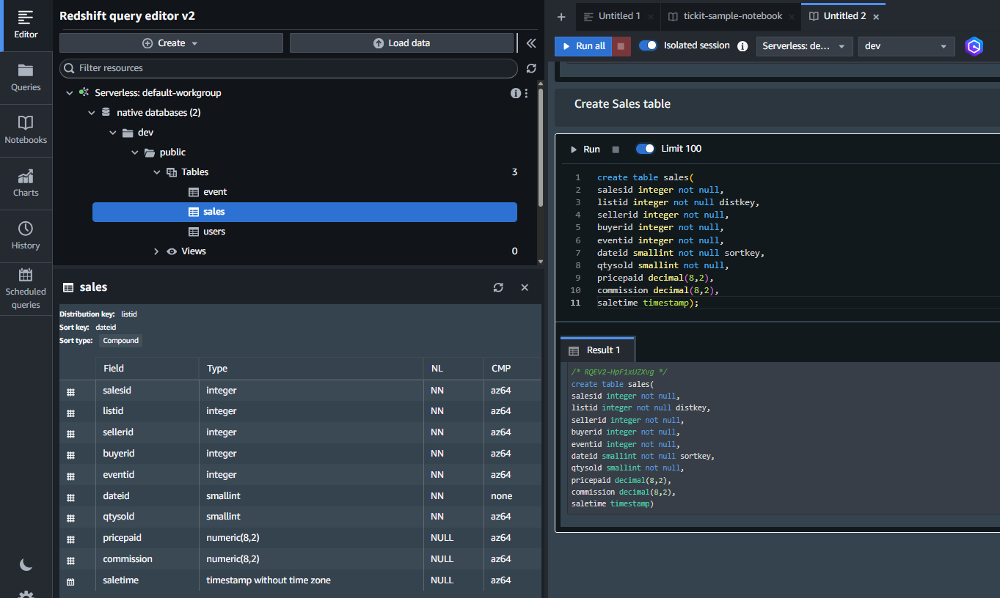

## Module 7: Redshift

### Problem Statement
You work for XYZ Corporation. Their application requires a database service that can store data which can be retrieved if required. Implement suitable service for the same.  
While migrating, you are asked to perform the following tasks:  
1. Create a Redshift data warehouse.  
2. Using the query editor:  
    a. Load some data  
    b. Query the data  

### Solution Overview

This solution leverages Amazon Redshift Serverless, configured via the AWS Console and verified through Query Editor v2.   
Reference guide: [AWS Get Started with Amazon Redshift Serverless.](https://docs.aws.amazon.com/redshift/latest/gsg/new-user-serverless.html)

### Key tasks completed:
- Provisioned Redshift Serverless with default namespace and workgroup
- Loaded sample data via Query Editor v2
- Executed built-in queries from sample notebooks
- Loaded external datasets from Amazon S3 using IAM role
- Explored and validated ingested data with custom SQL queries
- Cleaned up resources post-execution

### Project Repository

This repository contains all components required to provision and manage a Redshift resources:

```bash
$ tree
.
├── README.md
├── exported-query-editor-v2-notebook.ipynb
├── images
│   ├── 01-01-redshift-serverless-default-settings.png
│   ├── 01-02-redshift-serverless-default-namespace.png
│   ├── 01-03-redshift-serverless-default-workgroup.png
│   ├── 01-04-redshift-serverless-creating.png
│   ├── 01-05-redshift-serverless-completed.png
│   ├── 02-serverless-dashboard.png
│   ├── 03-default-workgroup-available.png
│   ├── 04-default-namespace-available.png
│   ├── 05-new-browser-tab-with-query-editor.png
│   ├── 06-authentication-to-use-to-connect-to-the-workgroup.png
│   ├── 07-authentication-done-connected-to-the-workgroup.png
│   ├── 08-select-sample-dev-database-and-open-notebook.png
│   ├── 09-create-sample-database.png
│   ├── 10-sample-dev-data-loaded.png
│   ├── 11-rullall-query-success-for-sales-per-event.png
│   ├── 12-rullall-query-success-for-total-qty-per-buyer.png
│   ├── 13-namespace-configuration-default-namespace-security-encryption.png
│   ├── 14-namespace-configuration-default-namespace-security-encryption-manage-iam-role.png
│   ├── 15-namespace-configuration-default-namespace-security-encryption-manage-iam-role-create-iam-role-as-default.png
│   ├── 16-namespace-configuration-default-namespace-security-encryption-manage-iam-role-create-iam-role-as-default-success.png
│   ├── 17-namespace-configuration-default-namespace-sucssessfully-updated-attached-iam-role.png
│   ├── 18-query-editor-v2-add-new-sql-notebook-switch-to-dev-database.png
│   ├── 19-dev-database-shows-zero-tables.png
│   ├── 20-dev-database-users-table-created.png
│   ├── 21-dev-database-event-table-created.png
│   ├── 22-dev-database-sales-table-created.png
│   ├── 23-dev-database-users-table-large-dataset-loaded-from-s3-using-copy-cmd.png
│   ├── 24-dev-database-event-table-large-dataset-loaded-from-s3-using-copy-cmd.png
│   ├── 25-dev-database-sales-table-large-dataset-loaded-from-s3-using-copy-cmd.png
│   ├── 26-query-find-top10-buyers-by-qty.png
│   ├── 27-query-find-events-in--99.9-percentile-in-terms-of-all-time-gross-sales.png
│   ├── 28-cleanup-all-three-tables.png
│   ├── 29-cleanup-delete-default-workgroup.png
│   └── 30-cleanup-delete-default-workgroup-with-associated-default-namespace.png
└── tickit-sample-notebook.ipynb

```

| Filename | Description |  
|----------|-------------|  
| [`README.md`](./README.md) | Overview and execution steps |
| [`exported-query-editor-v2-notebook.ipynb`](./exported-query-editor-v2-notebook.ipynb) | Saved notebook from Query Editor v2 with SQL + markdown |
| [`tickit-sample-notebook.ipynb`](./tickit-sample-notebook.ipynb) | Sample notebook provided by AWS for Redshift demo |

## Screenshot Files in `images/` Folder

| Filename | Description |
|---------|-------------|
| [`01-01-redshift-serverless-default-settings.png`](./images/01-01-redshift-serverless-default-settings.png) | Default settings selected |
| [`01-02-redshift-serverless-default-namespace.png`](./images/01-02-redshift-serverless-default-namespace.png) | Namespace configuration |
| [`01-03-redshift-serverless-default-workgroup.png`](./images/01-03-redshift-serverless-default-workgroup.png) | Workgroup configuration |
| [`01-04-redshift-serverless-creating.png`](./images/01-04-redshift-serverless-creating.png) | Serverless creation in progress |
| [`01-05-redshift-serverless-completed.png`](./images/01-05-redshift-serverless-completed.png) | Serverless creation completed |
| [`02-serverless-dashboard.png`](./images/02-serverless-dashboard.png) | Serverless dashboard showing workgroup and namespace are available. |
| [`03-default-workgroup-available.png`](./images/03-default-workgroup-available.png) | Workgroup configuration view |
| [`04-default-namespace-available.png`](./images/04-default-namespace-available.png) | Namespace configuration view |
| [`05-new-browser-tab-with-query-editor.png`](./images/05-new-browser-tab-with-query-editor.png) | Query Editor v2 launched |
| [`06-authentication-to-use-to-connect-to-the-workgroup.png`](./images/06-authentication-to-use-to-connect-to-the-workgroup.png) | Federated user authentication to establish the connection |
| [`07-authentication-done-connected-to-the-workgroup.png`](./images/07-authentication-done-connected-to-the-workgroup.png) | default workgroup displays sample schemas with built-in datasets |
| [`08-select-sample-dev-database-and-open-notebook.png`](./images/08-select-sample-dev-database-and-open-notebook.png) | Open sample notebook for the `tickit` database. |
| [`09-create-sample-database.png`](./images/09-create-sample-database.png) | Creating sample database |
| [`10-sample-dev-data-loaded.png`](./images/10-sample-dev-data-loaded.png) | Sample data loaded |
| [`11-rullall-query-success-for-sales-per-event.png`](./images/11-rullall-query-success-for-sales-per-event.png) | Query: sales per event |
| [`12-rullall-query-success-for-total-qty-per-buyer.png`](./images/12-rullall-query-success-for-total-qty-per-buyer.png) | Query: total quantity per buyer |
| [`13-namespace-configuration-default-namespace-security-encryption.png`](./images/13-namespace-configuration-default-namespace-security-encryption.png) | Namespace security settings |
| [`14-namespace-configuration-default-namespace-security-encryption-manage-iam-role.png`](./images/14-namespace-configuration-default-namespace-security-encryption-manage-iam-role.png) | IAM role management |
| [`15-namespace-configuration-default-namespace-security-encryption-manage-iam-role-create-iam-role-as-default.png`](./images/15-namespace-configuration-default-namespace-security-encryption-manage-iam-role-create-iam-role-as-default.png) | Creating IAM role |
| [`16-namespace-configuration-default-namespace-security-encryption-manage-iam-role-create-iam-role-as-default-success.png`](./images/16-namespace-configuration-default-namespace-security-encryption-manage-iam-role-create-iam-role-as-default-success.png) | IAM role creation success |
| [`17-namespace-configuration-default-namespace-sucssessfully-updated-attached-iam-role.png`](./images/17-namespace-configuration-default-namespace-sucssessfully-updated-attached-iam-role.png) | IAM role attached to namespace |
| [`18-query-editor-v2-add-new-sql-notebook-switch-to-dev-database.png`](./images/18-query-editor-v2-add-new-sql-notebook-switch-to-dev-database.png) | New SQL notebook created |
| [`19-dev-database-shows-zero-tables.png`](./images/19-dev-database-shows-zero-tables.png) | Empty database view |
| [`20-dev-database-users-table-created.png`](./images/20-dev-database-users-table-created.png) | `users` table created |
| [`21-dev-database-event-table-created.png`](./images/21-dev-database-event-table-created.png) | `event` table created |
| [`22-dev-database-sales-table-created.png`](./images/22-dev-database-sales-table-created.png) | `sales` table created |
| [`23-dev-database-users-table-large-dataset-loaded-from-s3-using-copy-cmd.png`](./images/23-dev-database-users-table-large-dataset-loaded-from-s3-using-copy-cmd.png) | `users` table loaded from S3 |
| [`24-dev-database-event-table-large-dataset-loaded-from-s3-using-copy-cmd.png`](./images/24-dev-database-event-table-large-dataset-loaded-from-s3-using-copy-cmd.png) | `event` table loaded from S3 |
| [`25-dev-database-sales-table-large-dataset-loaded-from-s3-using-copy-cmd.png`](./images/25-dev-database-sales-table-large-dataset-loaded-from-s3-using-copy-cmd.png) | `sales` table loaded from S3 |
| [`26-query-find-top10-buyers-by-qty.png`](./images/26-query-find-top10-buyers-by-qty.png) | Query: top 10 buyers |
| [`27-query-find-events-in--99.9-percentile-in-terms-of-all-time-gross-sales.png`](./images/27-query-find-events-in--99.9-percentile-in-terms-of-all-time-gross-sales.png) | Query: 99.9 percentile events |
| [`28-cleanup-all-three-tables.png`](./images/28-cleanup-all-three-tables.png) | Dropping all tables |
| [`29-cleanup-delete-default-workgroup.png`](./images/29-cleanup-delete-default-workgroup.png) | Deleting workgroup |
| [`30-cleanup-delete-default-workgroup-with-associated-default-namespace.png`](./images/30-cleanup-delete-default-workgroup-with-associated-default-namespace.png) | Deleting namespace |

### Redshift Serverless Setup
Setup serverless data warehouse and create database with default settings 


Namespace associated with default settings  


Workgroup associated with default settings    


Confirm and save the configuration to initiate serverless provisioning

Serverless creation in progress  


Serverless creation completed  


Following setup completion, the dashboard indicates that both the default workgroup and namespace have been provisioned and are ready for use.  

Serverless dashboard with workgroup and namespace are available.  


Workgroup configuration view.  


Namespace configuration view.  


### Load sample data with Query Editor v2

Once data warehouse is configured, launch Query Editor v2 to initiate sample data loading and begin querying. The Query Editor v2 interface enables secure connectivity between client system and the provisioned Redshift Serverless workspace.  

Query Editor v2 launched in new browser tab  


Proceed to connect to the default workgroup in Query Editor v2 by selecting it from the tree-view panel, and use Federated user authentication to establish the connection.  


With the connection established, the default workgroup displays sample schemas tied to built-in datasets, which can be accessed through sample notebooks.  


Open the sample notebook for the `tickit` database.  


When loading data for the first time, Query Editor v2 automatically prompts you to create a sample database  

  

Sample data gets loaded successfully in the `tickit` database.  

  


### Run Sample Queries
The notebook in Query Editor v2 is preloaded with built-in SQL queries. Click `Run` to execute query and explore result.  

*SQL Query: Sales Per Event*
```sql
SET search_path to tickit;
SELECT eventname, total_price
FROM  (SELECT eventid, total_price, ntile(1000) over(order by total_price desc) as percentile
       FROM (SELECT eventid, sum(pricepaid) total_price
             FROM   tickit.sales
             GROUP BY eventid)) Q, tickit.event E
       WHERE Q.eventid = E.eventid
       AND percentile = 1
ORDER BY total_price desc;
```

Query Result

 

*SQL Query: Total Quantity Per Buyer*

```sql
SELECT firstname, lastname, total_quantity 
FROM   (SELECT buyerid, sum(qtysold) total_quantity
        FROM  tickit.sales
        GROUP BY buyerid
        ORDER BY total_quantity desc limit 10) Q, tickit.users
WHERE Q.buyerid = userid
ORDER BY Q.total_quantity desc;
```

Query Result

  


### External Data Load from S3
To enable Amazon Redshift Serverless to load data from Amazon S3, an IAM role must be created and attached to the namespace. This is done via:
**Redshift Serverless → Namespace configuration → `default-namespace` → Security and encryption → Manage IAM roles → Create IAM Role → Create default IAM role**

  


During role creation, the following selections are made:

- **Access type for S3 bucket**: `Full access`  
  This grants the IAM role permission to read from and write to S3 buckets, ensuring seamless data loading via the `COPY` command or sample notebooks.

- **S3 bucket access scope**: `Any S3 Bucket`  
  This allows the role to interact with any bucket in the account, removing the need to specify individual bucket names during setup or query execution.  

  


  


  

These settings ensure that Redshift Serverless can access sample datasets and external files stored in S3 without additional configuration, streamlining the data ingestion process.

#### Load sample data from Amazon S3

To begin loading external data into Amazon Redshift Serverless:  
- Open Query Editor v2 and click the Add (+) button and select Notebook to create a new SQL notebook.  
- Switch to the `dev` database. This is the target database where sample tables will be created.  


Verify that no tables exist initially. The `dev` database starts empty, ready for table creation.  


### Create Tables in the `dev` Database

Use the following SQL commands in the notebook to define the required tables: `users`, `event`, and `sales`.


#### Create `users` Table

```sql
create table users(
  userid integer not null distkey sortkey,
  username char(8),
  firstname varchar(30),
  lastname varchar(30),
  city varchar(30),
  state char(2),
  email varchar(100),
  phone char(14),
  likesports boolean,
  liketheatre boolean,
  likeconcerts boolean,
  likejazz boolean,
  likeclassical boolean,
  likeopera boolean,
  likerock boolean,
  likevegas boolean,
  likebroadway boolean,
  likemusicals boolean);
```

*Users table created*  



#### Create `event` Table

```sql
create table event(
  eventid integer not null distkey,
  venueid smallint not null,
  catid smallint not null,
  dateid smallint not null sortkey,
  eventname varchar(200),
  starttime timestamp);
```

*Event table created*  



#### Create `sales` Table

```sql
create table sales(
  salesid integer not null,
  listid integer not null distkey,
  sellerid integer not null,
  buyerid integer not null,
  eventid integer not null,
  dateid smallint not null sortkey,
  qtysold smallint not null,
  pricepaid decimal(8,2),
  commission decimal(8,2),
  saletime timestamp);
```

*Sales table created*  




### Load Data using `COPY` Command

With the `users`, `event`, and `sales` tables created in the `dev` database, populate them using the `COPY` command in Query Editor v2. This command efficiently loads large datasets from Amazon S3 into Amazon Redshift.

### Load Sample Data from Public S3 Bucket

Amazon provides sample datasets in a public S3 bucket. Run the following SQL commands in the  notebook to load data into each table:

#### Load `users` Table

```sql
COPY users 
FROM 's3://redshift-downloads/tickit/allusers_pipe.txt' 
DELIMITER '|' 
TIMEFORMAT 'YYYY-MM-DD HH:MI:SS'
IGNOREHEADER 1 
REGION 'us-east-1'
IAM_ROLE default;
```


#### Load `event` Table

```sql
COPY event
FROM 's3://redshift-downloads/tickit/allevents_pipe.txt' 
DELIMITER '|' 
TIMEFORMAT 'YYYY-MM-DD HH:MI:SS'
IGNOREHEADER 1 
REGION 'us-east-1'
IAM_ROLE default;
```  


#### Load `sales` Table

```sql
COPY sales
FROM 's3://redshift-downloads/tickit/sales_tab.txt' 
DELIMITER '\t' 
TIMEFORMAT 'MM/DD/YYYY HH:MI:SS'
IGNOREHEADER 1 
REGION 'us-east-1'
IAM_ROLE default;
```

  

Once executed, the tables get populated and ready for querying.

### Explore Sample Data with SQL Queries

After successfully loading data into the `users`, `event`, and `sales` tables, you can begin querying the dataset to uncover insights. Create a new SQL cell in your notebook and run example queries using the `SELECT` command.

### Example Queries

**Query: Find top 10 buyers by quantity.**

```sql
SELECT firstname, lastname, total_quantity 
FROM   (SELECT buyerid, sum(qtysold) total_quantity
        FROM  sales
        GROUP BY buyerid
        ORDER BY total_quantity desc limit 10) Q, users
WHERE Q.buyerid = userid
ORDER BY Q.total_quantity desc;
```  
*Query result*  

  


**Query: Find events in the 99.9 percentile in terms of all time gross sales.**

```sql
SELECT eventname, total_price 
FROM  (SELECT eventid, total_price, ntile(1000) over(order by total_price desc) as percentile 
       FROM (SELECT eventid, sum(pricepaid) total_price
             FROM   sales
             GROUP BY eventid)) Q, event E
WHERE Q.eventid = E.eventid
AND percentile = 1
ORDER BY total_price desc;
```
*Query result*  


These queries help validate the data load and offer a starting point for deeper analysis. 

## Cleanup

#### Dropped all sample tables:  
```sql
DROP TABLE IF EXISTS users;
DROP TABLE IF EXISTS sales;
DROP TABLE IF EXISTS event;
```


#### Delete Redshift Serverless workgroup:


#### Delete associated namespace:
