## Module 8: CloudFormation

### Problem Statement
You work for XYZ Corporation. Your team is asked to deploy similar architecture multiple times for testing, development, and production purposes. Implement CloudFormation for the tasks assigned to you below.

Tasks To Be Performed:  
1. Use the template from CloudFormation task 1.  
2. Add Notification to the CloudFormation stack using SNS so that you get a notification via mail for every step of the stack creation process.


### Solution Overview

To fulfill the requirements, this solution adopts the following approach:

- Modularized the infrastructure into two CloudFormation templates:
  - `sns.yaml` provisions an SNS topic and subscribes an email address.
  - `ec2.yaml` provisions an EC2 instance with Apache and security group.
- Used `--notification-arns` in the EC2 stack creation CLI to link lifecycle events to the SNS topic.
- Ensured the email subscription was confirmed before launching the EC2 stack to receive real-time notifications.
- Verified delivery of stack events such as `CREATE_IN_PROGRESS`, `CREATE_COMPLETE`, and `DELETE_COMPLETE` via email.
- Documented the entire flow with screenshots and CLI commands for reproducibility.


### Project Repository Structure

The repository is organized to support the solution approach by providing detailed documentation of configuration steps using AWS CloudFormation templates, along with a collection of screenshots that illustrate the key stages — SNS setup, EC2 provisioning, notification delivery, and stack cleanup.

```bash
$ tree
.
├── README.md
├── ec2.yaml
├── images
│   ├── 01-subscription-email.png
│   ├── 02-cloud-formation-sns-stack-creation-success-detailed-view.png
│   ├── 02-cloud-formation-sns-stack-creation-success.png
│   ├── 02-sns-topic-with-email-subscription-confirmed.png
│   ├── 03-both-stack-view.png
│   ├── 03-cloud-formation-ec2-stack-creation-success-detailed-view.png
│   ├── 05-ec2-instance-running.png
│   ├── 06-ec2-stack-create-in-progress-notification-email.png
│   ├── 07-ec2-security-group-create-in-progress-notification-email.png
│   ├── 08-ec2-security-group-create-complete-notification-email.png
│   ├── 09-ec2-instance-create-in-progress-notification-email.png
│   ├── 10-ec2-instance-create-complete-notification-email.png
│   ├── 12-ec2-stack-create-complete-notification-email.png
│   ├── 13-ec2-stack-delete-in-progress-notification-email.png
│   ├── 14-ec2-instance-delete-in-progress-notification-email.png
│   ├── 15-ec2-instance-delete-complete-notification-email.png
│   ├── 16-ec2-security-group-delete-in-progress-notification-email.png
│   ├── 17-ec2-security-group-delete-complete-notification-email.png
│   ├── 18-ec2-stack-delete-complete-notification-email.png
├── sns.yaml
```

| Filename | Description |
|----------|-------------|
| [`README.md`](README.md) | Step-by-step guide for provisioning an EC2 instance with lifecycle notifications via SNS. Includes AWS CLI commands, screenshots, and cleanup instructions. |
| [`ec2.yaml`](ec2.yaml) | CloudFormation template to provision an Amazon Linux EC2 instance with security group, and lifecycle notification linkage to SNS. |
| [`sns.yaml`](sns.yaml) | CloudFormation template to provision an SNS topic and subscribe an email address for stack event notifications. |
| [`images/`](images/) | Folder containing screenshots that document key steps and validation |

### Screenshot Files in `images/` Folder

| Screenshot Filename | Description |
|---------------------|-------------|
| [01-subscription-email.png](images/01-subscription-email.png) | Email received from AWS SNS to confirm subscription |
| [02-cloud-formation-sns-stack-creation-success.png](images/02-cloud-formation-sns-stack-creation-success.png) | SNS stack creation success in CloudFormation console |
| [02-cloud-formation-sns-stack-creation-success-detailed-view.png](images/02-cloud-formation-sns-stack-creation-success-detailed-view.png) | Detailed view of SNS stack resources and outputs |
| [02-sns-topic-with-email-subscription-confirmed.png](images/02-sns-topic-with-email-subscription-confirmed.png) | SNS topic showing confirmed email subscription |
| [03-both-stack-view.png](images/03-both-stack-view.png) | CloudFormation console showing both stacks deployed |
| [03-cloud-formation-ec2-stack-creation-success-detailed-view.png](images/03-cloud-formation-ec2-stack-creation-success-detailed-view.png) | Detailed view of EC2 stack resources and outputs |
| [05-ec2-instance-running.png](images/05-ec2-instance-running.png) | EC2 instance running and accessible via public IP |
| [06-ec2-stack-create-in-progress-notification-email.png](images/06-ec2-stack-create-in-progress-notification-email.png) | Email notification for EC2 stack creation start |
| [07-ec2-security-group-create-in-progress-notification-email.png](images/07-ec2-security-group-create-in-progress-notification-email.png) | Email notification for security group creation start |
| [08-ec2-security-group-create-complete-notification-email.png](images/08-ec2-security-group-create-complete-notification-email.png) | Email notification for security group creation complete |
| [09-ec2-instance-create-in-progress-notification-email.png](images/09-ec2-instance-create-in-progress-notification-email.png) | Email notification for EC2 instance creation start |
| [10-ec2-instance-create-complete-notification-email.png](images/10-ec2-instance-create-complete-notification-email.png) | Email notification for EC2 instance creation complete |
| [12-ec2-stack-create-complete-notification-email.png](images/12-ec2-stack-create-complete-notification-email.png) | Email notification for EC2 stack creation complete |
| [13-ec2-stack-delete-in-progress-notification-email.png](images/13-ec2-stack-delete-in-progress-notification-email.png) | Email notification for EC2 stack deletion start |
| [14-ec2-instance-delete-in-progress-notification-email.png](images/14-ec2-instance-delete-in-progress-notification-email.png) | Email notification for EC2 instance deletion start |
| [15-ec2-instance-delete-complete-notification-email.png](images/15-ec2-instance-delete-complete-notification-email.png) | Email notification for EC2 instance deletion complete |
| [16-ec2-security-group-delete-in-progress-notification-email.png](images/16-ec2-security-group-delete-in-progress-notification-email.png) | Email notification for security group deletion start |
| [17-ec2-security-group-delete-complete-notification-email.png](images/17-ec2-security-group-delete-complete-notification-email.png) | Email notification for security group deletion complete |
| [18-ec2-stack-delete-complete-notification-email.png](images/18-ec2-stack-delete-complete-notification-email.png) | Email notification for EC2 stack deletion complete |

## Prerequisites

Before running any commands, ensure the required environment variables are defined. These variables customize your local AWS setup.

```bash
# Set AWS region
export AWS_DEFAULT_REGION=us-west-2 # Oregon, for sandbox/testing
```

```bash
SNS_STACK_NAME="SNS-STACK"
EC2_STACK_NAME="EC2-STACK"
EMAIL="youremail@mail.com"

# EC2 key pair, private key for SSH access
KEY_NAME="M8-KeyPair" 
PEM_FILE="${KEY_NAME}.pem"
```
### Retrieve VPC and Subnet Info

Get the default VPC ID for the AWS account in the configured region. This VPC will host the EC2 instance.

```bash
VPC_ID=$(aws ec2 describe-vpcs \
  --filters "Name=isDefault,Values=true" \
  --query "Vpcs[0].VpcId" --output text)
```

Identify a subnet within the default VPC to launch the EC2 instance.

```bash
SUBNET_ID=$(aws ec2 describe-subnets \
  --filters "Name=vpc-id,Values=$VPC_ID" \
  --query "Subnets[0].SubnetId" --output text)
```

### Generate SSH Key Pair

Create a key pair for secure access to the EC2 instance.

```bash
aws ec2 create-key-pair \
  --key-name $KEY_NAME \
  --query 'KeyMaterial' --output text > $PEM_FILE
chmod 400 $PEM_FILE
```
### Identify Client’s Public IP

Restrict SSH access to your IP only.

```bash
MY_IP="$(curl -s https://checkip.amazonaws.com)/32"
```

## Deploy the SNS Stack (`sns.yaml`)

Creates the SNS topic and subscribes your email for notifications.

```bash
aws cloudformation create-stack \
  --stack-name $SNS_STACK_NAME \
  --template-body file://sns.yaml \
  --parameters \
    ParameterKey=NotificationEmail,ParameterValue=$EMAIL
```


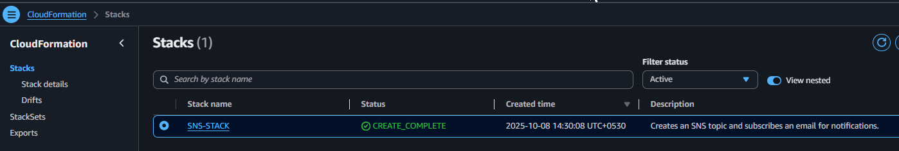  
*SNS stack creation success in CloudFormation console.*


 
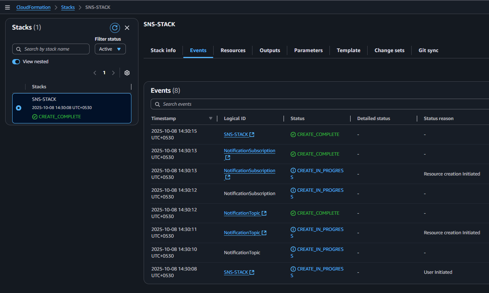  
*Detailed view of SNS stack resources and outputs.*


 
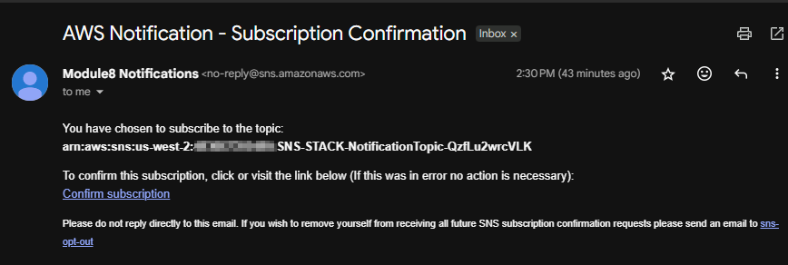  
*Email received from AWS SNS to confirm subscription.*


 
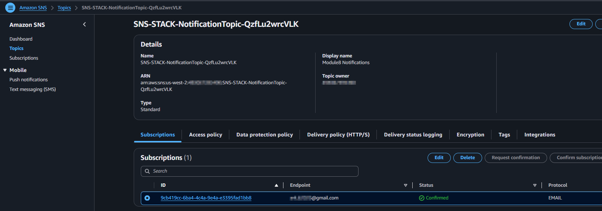  
*SNS topic showing confirmed email subscription.*

### Fetch the Exported SNS Topic ARN

```bash
SNS_TOPIC_ARN=$(aws cloudformation describe-stacks \
  --stack-name $SNS_STACK_NAME \
  --query "Stacks[0].Outputs[?OutputKey=='SnsTopicArn'].OutputValue" \
  --output text)
```

## Deploy the EC2 Stack (`ec2.yaml`) with Lifecycle Notifications

```bash
aws cloudformation create-stack \
  --stack-name $EC2_STACK_NAME \
  --template-body file://ec2.yaml \
  --notification-arns "$SNS_TOPIC_ARN" \
  --capabilities CAPABILITY_NAMED_IAM \
  --parameters \
    ParameterKey=KeyName,ParameterValue=$KEY_NAME \
    ParameterKey=MyVPC,ParameterValue=$VPC_ID \
    ParameterKey=PublicSubnet,ParameterValue=$SUBNET_ID \
    ParameterKey=MyIP,ParameterValue=$MY_IP
```
 
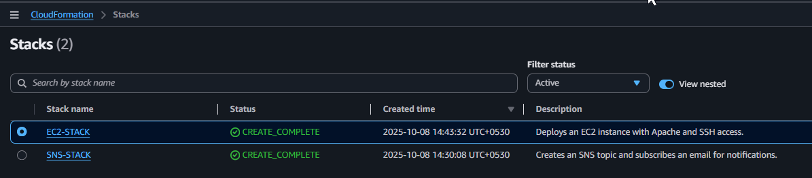  
*CloudFormation console showing both stacks deployed.*

 
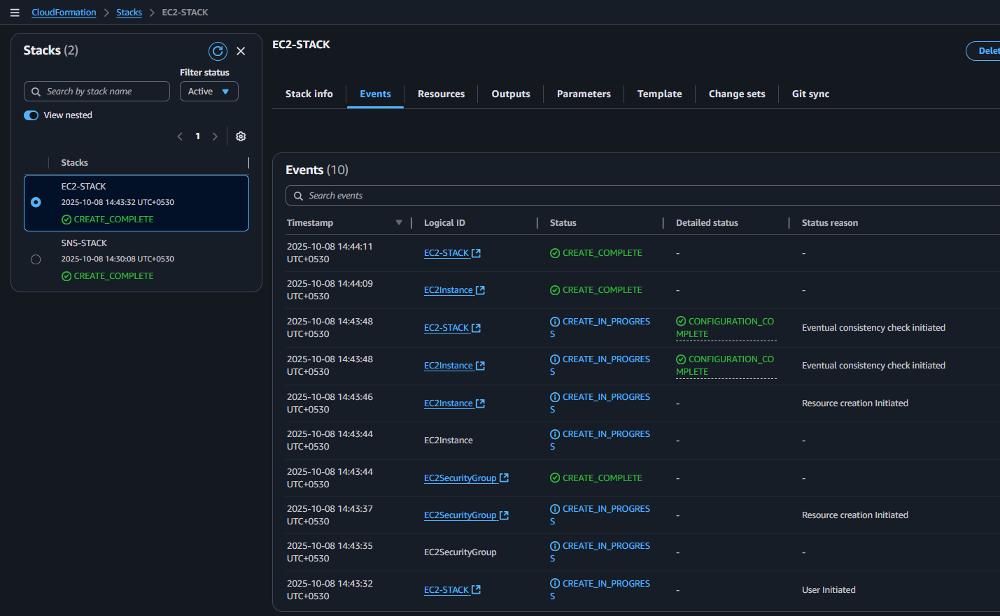  
*Detailed view of EC2 stack resources and outputs.*

 
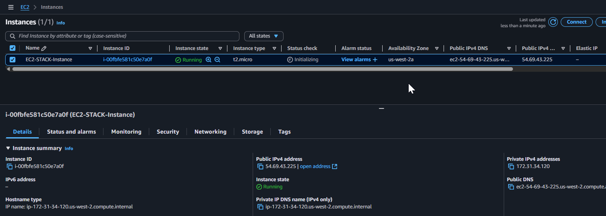  
*EC2 instance running and accessible via public IP.*

### Lifecycle Notification Emails

| Screenshot | Description |
|------------|-------------|
| 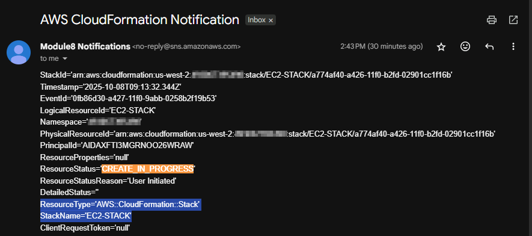 | EC2 stack creation started |
| 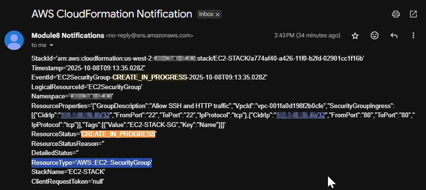 | Security group creation started |
| 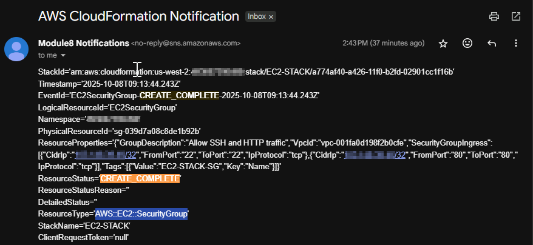 | Security group creation completed |
| 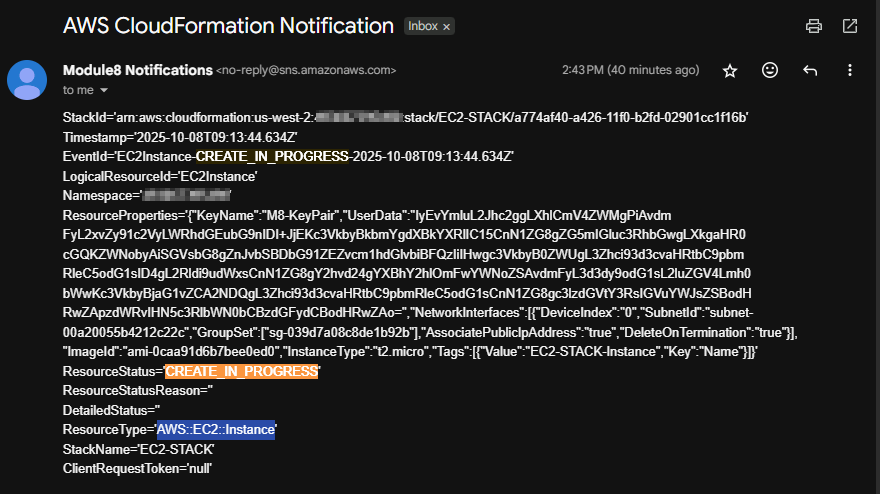 | EC2 instance creation started |
| 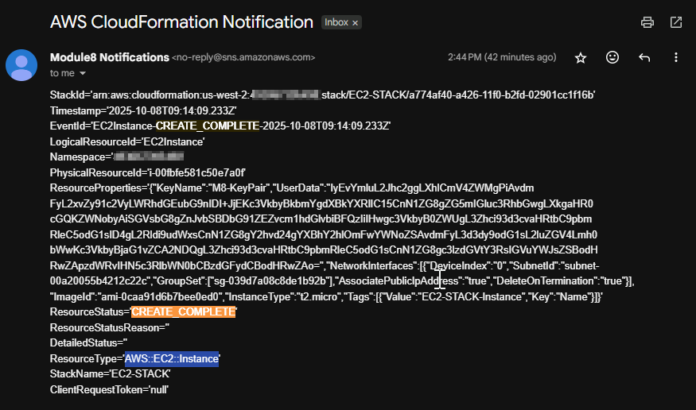 | EC2 instance creation completed |
| 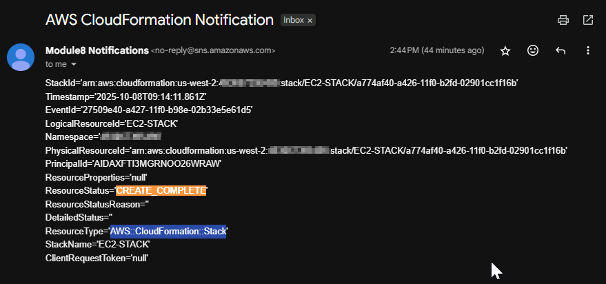 | EC2 stack creation completed |


## Cleanup

To delete the EC2 stack:

```bash
aws cloudformation delete-stack --stack-name $EC2_STACK_NAME
```

**Deletion Notifications**:
| Screenshot | Description |
|------------|-------------|
| 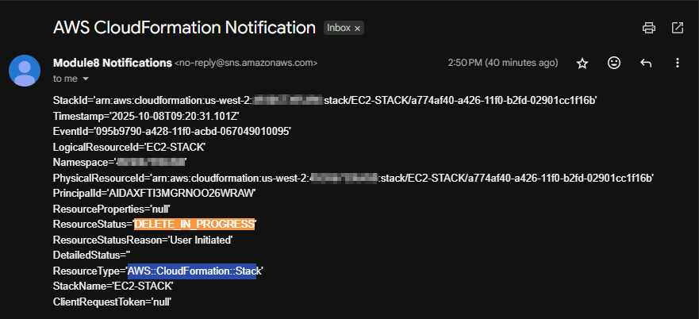 | Stack Delete In Progress |
| 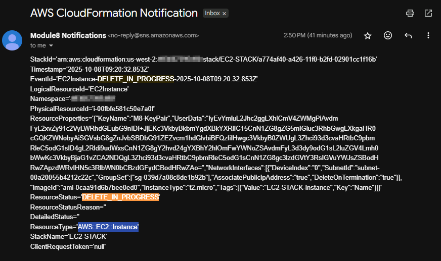 | Instance Delete In Progress |
| 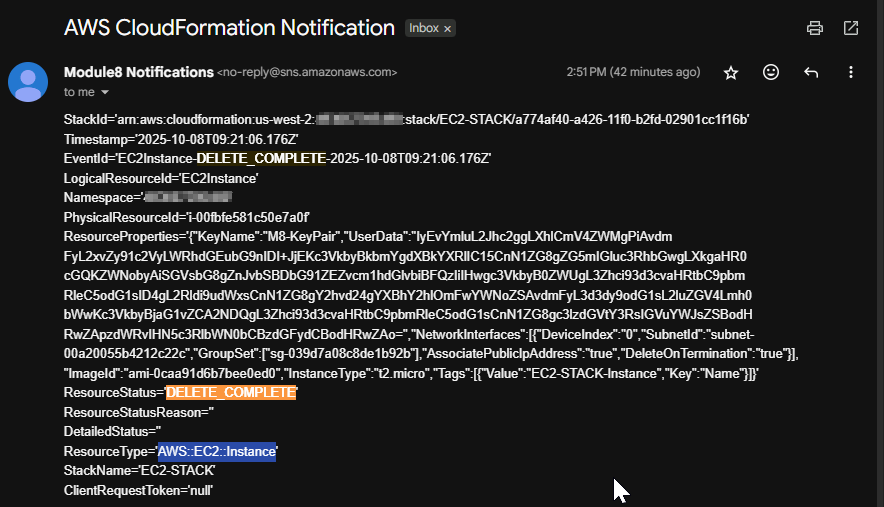 | Instance Delete Complete |
| 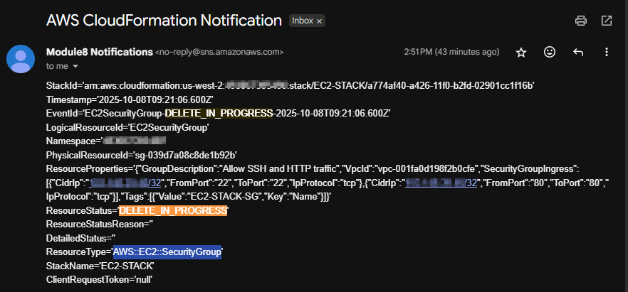 | SG Delete In Progress |
| 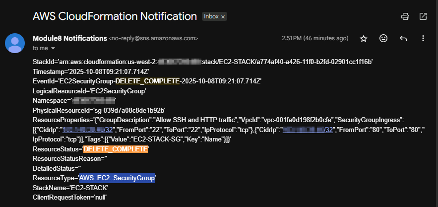 | SG Delete Complete |
| 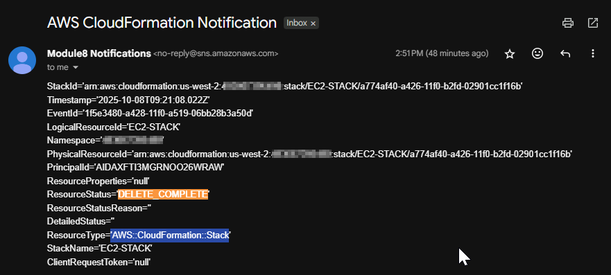 | Stack Delete Complete |

To delete the SNS stack:

```bash
aws cloudformation delete-stack --stack-name $SNS_STACK_NAME
```

---

