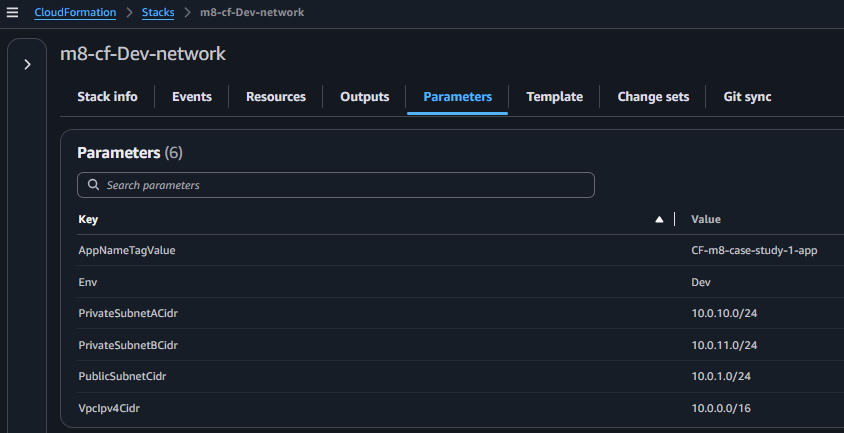
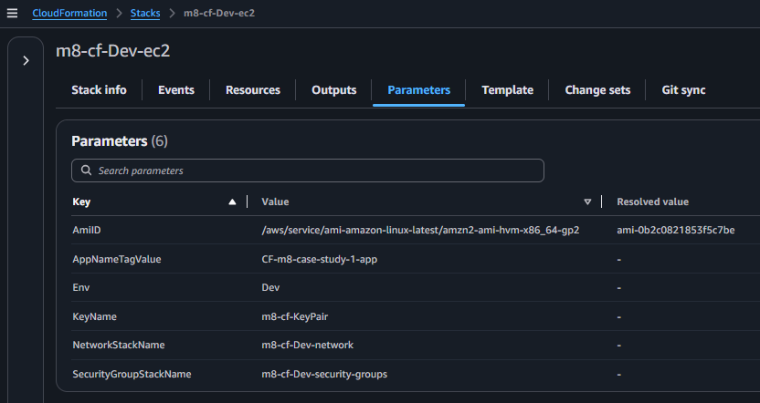

## Module 8: Case Study 1 - Multi-Tier-Architecture

### Problem Statement
You work for XYZ Corporation. Your corporation wants to launch a new web-based application. The development team has prepared the code but it is not tested yet. The development team needs the system admins to build a web server to test the code but the system admins are not available.  

Tasks To Be Performed:  
1. Web tier: Launch an instance in a public subnet and that instance should allow HTTP and SSH from the internet.  
2. Application tier: Launch an instance in a private subnet of the web tier and it should allow only SSH from the public subnet of Web Tier-3.  
3. DB tier: Launch an RDS MYSQL instance in a private subnet and it should allow connection on port 3306 only from the private subnet of Application Tier-4.  
4. Setup a Route 53 hosted zone and direct traffic to the EC2 instance.  

You have been also asked to propose a solution so that:  
1. Development team can test their code without having to involve the system admins and can invest their time in testing the code rather than provisioning, configuring and updating the resources needed to test the
code.  
2. Make sure when the development team deletes the stack, RDS DB instances should not be deleted.  

### Solution Overview

To fulfill the requirements, this solution adopts a modular, multi-tier infrastructure deployment using `AWS CloudFormation`. The solution includes provisioning of `networking` `security groups` `EC2 instances` `Route 53 hosted zone`, and an `RDS database`. All resources were tagged, parameterized, and validated across stacks.

### Project Repository Structure

The repository is organized to support the solution approach by providing detailed documentation of configuration steps using `AWS CloudFormation templates` along with a collection of screenshots that illustrate the key stages — from stack creation to validation and final stack cleanup.

```bash
$ tree
.
├── README.md
├── db.yaml
├── ec2.yaml
├── env.sh
├── hosted-zone.yaml
├── images
│   ├── 00-5-cf-stacks-view.png
│   ├── 01-vpc-stack-create-complete-events.png
│   ├── 01-vpc-stack-create-complete-outputs.png
│   ├── 01-vpc-stack-create-complete-parameters.png
│   ├── 01-vpc-stack-create-complete-resources.png
│   ├── 02-cf-stack-security-groups-create-complete-events.png
│   ├── 02-cf-stack-security-groups-create-complete-outputs.png
│   ├── 02-cf-stack-security-groups-create-complete-parameters.png
│   ├── 02-cf-stack-security-groups-create-complete-resources.png
│   ├── 03-cf-stack-ec2-create-complete-events.png
│   ├── 03-cf-stack-ec2-create-complete-outputs.png
│   ├── 03-cf-stack-ec2-create-complete-parameters.png
│   ├── 03-cf-stack-ec2-create-complete-resources.png
│   ├── 04-cf-stack-hosted-zone-create-complete-events.png
│   ├── 04-cf-stack-hosted-zone-create-complete-outputs.png
│   ├── 04-cf-stack-hosted-zone-create-complete-parameters.png
│   ├── 04-cf-stack-hosted-zone-create-complete-resources.png
│   ├── 05-cf-stack-db-create-complete-events.png
│   ├── 05-cf-stack-db-create-complete-outputs.png
│   ├── 05-cf-stack-db-create-complete-parameters.png
│   ├── 05-cf-stack-db-create-complete-resources.png
│   ├── db
│   │   ├── 01-db-created.png
│   │   └── 01-db-details.png
│   ├── ec2
│   │   ├── 01-ec2-instances.png
│   │   └── 02-ec2-security-groups.png
│   ├── route53
│   │   ├── 01-hosted-zone-records.png
│   │   └── 01-hosted-zone.png
│   ├── vpc
│   │   ├── 01-vpc-igw.png
│   │   ├── 01-vpc-natgw.png
│   │   ├── 01-vpc-route-tables.png
│   │   ├── 01-vpc-subnets.png
│   │   └── 01-vpc.png
│   ├── xx-app-server-ssh-acccess-from-web-server.png
│   ├── xx-db-access-from-app-server.png
│   ├── xx-web-server-ssh-acccess-from-internet.png
│   ├── yy-access-webserver-via-hosted-zene-using-curl.png
│   └── zz-webbrowser-access-to-website-from-internet.png
│   └── zz-db-stack-deletion-skipped-due-to-retain-policy.png
├── security-groups.yaml
└── vpc.yaml
```

| Filename | Description |
|----------|-------------|
| [`README.md`](README.md) | Step-by-step guide for provisioning, testing, and tearing down the infrastructure |
| [`db.yaml`](db.yaml) | CloudFormation template for provisioning the RDS MySQL database |
| [`ec2.yaml`](ec2.yaml) | Template for launching Web and App Tier EC2 instances |
| [`env.sh`](env.sh) | Environment variable definitions used across deployment scripts |
| [`hosted-zone.yaml`](hosted-zone.yaml) | Template for creating a private Route 53 hosted zone and internal DNS records |
| [`security-groups.yaml`](security-groups.yaml) | Template for defining security groups for each tier |
| [`vpc.yaml`](vpc.yaml) | Template for provisioning the VPC, subnets, route tables, IGW, and NAT gateway |

### Screenshot Files in `images/` Folder

| Screenshot Filename | Description |
|---------------------|-------------|
| [00-5-cf-stacks-view.png](images/00-5-cf-stacks-view.png) | Overview of all deployed CloudFormation stacks |
| [01-vpc-stack-create-complete-events.png](images/01-vpc-stack-create-complete-events.png) | VPC stack creation events |
| [01-vpc-stack-create-complete-outputs.png](images/01-vpc-stack-create-complete-outputs.png) | VPC stack outputs (e.g., VPC ID, subnet IDs) |
| [01-vpc-stack-create-complete-parameters.png](images/01-vpc-stack-create-complete-parameters.png) | Parameters used during VPC stack deployment |
| [01-vpc-stack-create-complete-resources.png](images/01-vpc-stack-create-complete-resources.png) | Resources provisioned by the VPC stack |
| [02-cf-stack-security-groups-create-complete-events.png](images/02-cf-stack-security-groups-create-complete-events.png) | Security Groups stack creation events |
| [02-cf-stack-security-groups-create-complete-outputs.png](images/02-cf-stack-security-groups-create-complete-outputs.png) | Security Groups stack outputs |
| [02-cf-stack-security-groups-create-complete-parameters.png](images/02-cf-stack-security-groups-create-complete-parameters.png) | Parameters used during SG stack deployment |
| [02-cf-stack-security-groups-create-complete-resources.png](images/02-cf-stack-security-groups-create-complete-resources.png) | Resources provisioned by the SG stack |
| [03-cf-stack-ec2-create-complete-events.png](images/03-cf-stack-ec2-create-complete-events.png) | EC2 stack creation events |
| [03-cf-stack-ec2-create-complete-outputs.png](images/03-cf-stack-ec2-create-complete-outputs.png) | EC2 stack outputs (e.g., public/private IPs) |
| [03-cf-stack-ec2-create-complete-parameters.png](images/03-cf-stack-ec2-create-complete-parameters.png) | Parameters used during EC2 stack deployment |
| [03-cf-stack-ec2-create-complete-resources.png](images/03-cf-stack-ec2-create-complete-resources.png) | Resources provisioned by the EC2 stack |
| [04-cf-stack-hosted-zone-create-complete-events.png](images/04-cf-stack-hosted-zone-create-complete-events.png) | Hosted Zone stack creation events |
| [04-cf-stack-hosted-zone-create-complete-outputs.png](images/04-cf-stack-hosted-zone-create-complete-outputs.png) | Hosted Zone stack outputs |
| [04-cf-stack-hosted-zone-create-complete-parameters.png](images/04-cf-stack-hosted-zone-create-complete-parameters.png) | Parameters used during Hosted Zone stack deployment |
| [04-cf-stack-hosted-zone-create-complete-resources.png](images/04-cf-stack-hosted-zone-create-complete-resources.png) | Resources provisioned by the Hosted Zone stack |
| [05-cf-stack-db-create-complete-events.png](images/05-cf-stack-db-create-complete-events.png) | Database stack creation events |
| [05-cf-stack-db-create-complete-outputs.png](images/05-cf-stack-db-create-complete-outputs.png) | Database stack outputs |
| [05-cf-stack-db-create-complete-parameters.png](images/05-cf-stack-db-create-complete-parameters.png) | Parameters used during DB stack deployment |
| [05-cf-stack-db-create-complete-resources.png](images/05-cf-stack-db-create-complete-resources.png) | Resources provisioned by the DB stack |
| [db/01-db-created.png](images/db/01-db-created.png) | RDS instance successfully created |
| [db/01-db-details.png](images/db/01-db-details.png) | RDS instance configuration and endpoint |
| [ec2/01-ec2-instances.png](images/ec2/01-ec2-instances.png) | EC2 instances launched in Web and App tiers |
| [ec2/02-ec2-security-groups.png](images/ec2/02-ec2-security-groups.png) | Security group associations for EC2 instances |
| [route53/01-hosted-zone.png](images/route53/01-hosted-zone.png) | Private hosted zone created in Route 53 |
| [route53/01-hosted-zone-records.png](images/route53/01-hosted-zone-records.png) | DNS records created in the hosted zone |
| [vpc/01-vpc.png](images/vpc/01-vpc.png) | VPC created with CIDR block |
| [vpc/01-vpc-subnets.png](images/vpc/01-vpc-subnets.png) | Public and private subnets created |
| [vpc/01-vpc-route-tables.png](images/vpc/01-vpc-route-tables.png) | Route tables and associations |
| [vpc/01-vpc-igw.png](images/vpc/01-vpc-igw.png) | Internet Gateway attached to VPC |
| [vpc/01-vpc-natgw.png](images/vpc/01-vpc-natgw.png) | NAT Gateway for private subnet access |
| [xx-web-server-ssh-acccess-from-internet.png](images/xx-web-server-ssh-acccess-from-internet.png) | SSH access to Web Tier from the internet |
| [xx-app-server-ssh-acccess-from-web-server.png](images/xx-app-server-ssh-acccess-from-web-server.png) | SSH access to App Tier from Web Tier |
| [xx-db-access-from-app-server.png](images/xx-db-access-from-app-server.png) | MySQL access to RDS from App Tier |
| [yy-access-webserver-via-hosted-zene-using-curl.png](images/yy-access-webserver-via-hosted-zene-using-curl.png) | Internal DNS resolution using curl |
| [zz-webbrowser-access-to-website-from-internet.png](images/zz-webbrowser-access-to-website-from-internet.png) | Public access to Web Tier via browser |
| [zz-db-stack-deletion-skipped-due-to-retain-policy.png](images/zz-db-stack-deletion-skipped-due-to-retain-policy.png) | CloudFormation stack deletion event showing `DELETE_SKIPPED` for the RDS DB instance due to `DeletionPolicy: Retain`, confirming the instance was preserved as expected |
---

## Prerequisites

Before running any commands, setup local execution environment.

```bash
# Set AWS region
export AWS_DEFAULT_REGION=us-west-2 # Oregon, for sandbox/testing
```

Override the the defaults defined in [`env.sh`](env.sh).

```bash
cat env.sh
```
**Defaults**
```bash
# Core naming prefix
STK_PREFIX="m8-cf"

# Environment context
ENV="Dev"

# Application name for tagging
APP_NAME="CF-m8-case-study-1-app"

# EC2 key pair, private key for SSH access
KEY_NAME="${STK_PREFIX}-KeyPair"
PEM_FILE="${KEY_NAME}.pem"

# CIDR blocks (optional overrides)
VPC_CIDR="10.0.0.0/16"
PUB_SUBNET_CIDR="10.0.1.0/24"
PRIV_SUBNET_CIDR="10.0.10.0/24"


# Network and stack names (derived)
NETWORK_STACK_NAME="${STK_PREFIX}-${ENV}-network"
SG_STACK_NAME="${STK_PREFIX}-${ENV}-security-groups"
EC2_STACK_NAME="${STK_PREFIX}-${ENV}-ec2"
DB_STACK_NAME="${STK_PREFIX}-${ENV}-db"

HOSTED_ZONE_DOMAIN=module8-domain.com
DB_PASSWORD="StrongPass123"

```
Load the environment variables

```bash
source env.sh
```


### 1. Deploy the **VPC (Network) Stack**  using [`vpc.yaml`](vpc.yaml)
This stack provisions an Amazon VPC with public and private subnets across two AZs. Includes Internet Gateway and a single NAT Gateway for outbound internet access from private subnets.

```bash
aws cloudformation deploy --template-file vpc.yaml \
  --stack-name "${STK_PREFIX}-${ENV}-network" \
  --parameter-overrides \
    AppNameTagValue="${APP_NAME}" \
    Env="${ENV}" \
    VpcIpv4Cidr="${VPC_CIDR}" \
    PublicSubnetIpv4Cidr="${PUB_SUBNET_CIDR}" \
    PrivateSubnetIpv4Cidr="${PRIV_SUBNET_CIDR}" \
  --capabilities CAPABILITY_NAMED_IAM
```
### 2. Deploy the **Security Groups Stack** using [`security-groups.yaml`](security-groups.yaml) 
This stack provisions an Security groups for the Web Tier, Application Tier and Database Tier.
- Web Tier Security Group
    Allow HTTP (port 80) from anywhere (for web access).
    Allow SSH (port 22) from anywhere (for remote access).
- Application Tier Security Group
    Allow SSH (port 22) only from the Web Tier.
- Database Tier Security Group Allow
    Allow MySQL (port 3306) only from the Application Tier.

```bash
aws cloudformation deploy --template-file security-groups.yaml \
  --stack-name "${STK_PREFIX}-${ENV}-security-groups" \
  --parameter-overrides \
    AppNameTagValue="${APP_NAME}" \
    Env="${ENV}" \
    NetworkStackName="${STK_PREFIX}-${ENV}-network" \
  --capabilities CAPABILITY_NAMED_IAM
```

### 3. Deploy the **EC2 Stack** using [`ec2.yaml`](ec2.yaml) 
This stack provisions EC2 instances in Web Tier and Application Tier
- a Webserver instance in Web Tier
- a Appserver instance in Application Tier

```bash
aws cloudformation deploy --template-file ec2.yaml \
  --stack-name "${STK_PREFIX}-${ENV}-ec2" \
  --parameter-overrides \
    AppNameTagValue="${APP_NAME}" \
    Env="${ENV}" \
    KeyName="${KEY_NAME}" \
    NetworkStackName="${STK_PREFIX}-${ENV}-network" \
    SecurityGroupStackName="${STK_PREFIX}-${ENV}-security-groups" \
  --capabilities CAPABILITY_NAMED_IAM
```

###  4. Deploy the **Hosted Zone Stack** using [`hosted-zone.yaml`](hosted-zone.yaml)
This stack provisions a private Route 53 hosted zone scoped to VPC. It adds internal A record for Web Tier

```bash
aws cloudformation deploy --stack-name "${STK_PREFIX}-${ENV}-hosted-zone" \
  --template-file hosted-zone.yaml \
  --capabilities CAPABILITY_NAMED_IAM \
  --parameter-overrides \
    NetworkStackName="${STK_PREFIX}-${ENV}-network" \
    EC2InstanceStackName="${STK_PREFIX}-${ENV}-ec2" \
    HostedZoneName="${HOSTED_ZONE_DOMAIN}" \
    AppNameTagValue="${APP_NAME}" \
    Env="${ENV}"
```
### 5. Deploy the **Database Stack** using [db.yaml](db.yaml)

This stack provisions an RDS MySQL instance in the DB Tier, accessible only from the Application Tier private subnet.

```bash
aws cloudformation deploy --template-file db.yaml \
  --stack-name "${STK_PREFIX}-${ENV}-db" \
  --parameter-overrides \
    AppNameTagValue="${APP_NAME}" \
    Env="${ENV}" \
    NetworkStackName="${STK_PREFIX}-${ENV}-network" \
    SecurityGroupStackName="${STK_PREFIX}-${ENV}-security-groups" \
    DBUsername="${DB_USER}" \
    DBPassword="${DB_PASSWORD}" \
    DBInstanceClass="db.t3.micro" \
    DBAllocatedStorage="20" \
  --capabilities CAPABILITY_NAMED_IAM
```

### Screenshots: 

**Deployed CloudFormation stacks**: `Network` `security-groups`, `ec2` `hosted-zone` and `database`


---

**Network stack details:**  

- `Events` view

    

- `Resources` view

    

- `Outputs` view

    

- `Parameters` view

    


- VPC with CIDR block
    
    

- Public and private subnets in VPC
 
    

- Route tables and associations

    

- Internet Gateway attached to VPC
    
    

- NAT Gateway for private subnet access
    
    

---

**Security Group stack details:**  

- `Events` view

    

- `Resources` view

    

- `Outputs` view

    

- `Parameters` view

    

---

**EC2 stack details:**  

- `Events` view

    

- `Resources` view

    

- `Outputs` view

    

- `Parameters` view

    

- EC2 instances launched in Web and App tiers
    

- Security group associations for EC2 instances

    

---

**Route 53 Hosted Zone stack details:**  

- `Events` view

    

- `Resources` view

    

- `Outputs` view

    

- `Parameters` view

    

- Route 53 view of hosted zone

    

---

**Database stack details:**  

- `Events` view

    

- `Resources` view

    

- `Outputs` view

    

- `Parameters` view

    


- RDS instance successfully created
    
    

- RDS instance configuration and endpoint
    
    

---


**SSH access to Web Tier instance**  (*Refer EC2 stack [`outputs`](images/03-cf-stack-ec2-create-complete-outputs.png) to get Web tier instance IP address*)  
```bash
WEB_SERVER_IP="35.92.220.209"
```

```bash
# Start the SSH agent
eval "$(ssh-agent -s)"

# Add private key  
ssh-add $PEM_FILE

# Verify the key was added  
ssh-add -l

# Connect
ssh -A ec2-user@$WEB_SERVER_IP
```  
*Connected to Web tier instance*  


**HTTP access to Web Tier instance**  (*Refer EC2 stack [`outputs`](images/03-cf-stack-ec2-create-complete-outputs.png) to get Website URL*)  
    


---

**SSH Access to App Tier instance** (*Refer EC2 stack [`outputs`](images/03-cf-stack-ec2-create-complete-outputs.png) to get App tier instance IP address*)  

- SSH into the Web Tier EC2 instance *(as in the previous step)*
- From the Web Tier, initiate SSH connection to the App Tier instance.

```bash
APP_SERVER_IP="10.0.10.170"
```

```bash
ssh ec2-user@$APP_SERVER_IP
```

*Connected to App tier instance*  


---

**Database Access from App Tier instance** *(Refer DB stack [`outputs`](images/05-cf-stack-db-create-complete-outputs.png) to get RDS endpoint)*  

- SSH into the App Tier EC2 instance *(as in the previous step)*
- From the App Tier, initiate mysql connection to the database.

```bash
DBUSER=admin
RDS_ENDPOINT=cf-m8-case-study-1-app-dev-rds.cv2i4ucykde6.us-west-2.rds.amazonaws.com
```

```bash
mysql -h $RDS_ENDPOINT -P 3306 -u $DBUSER -p
```

*Connected to Database instance*  


---

**Route 53 Hosted Zone Resolution to Web Tier** (*Refer Hosted Zone stack [`outputs`](images/04-cf-stack-hosted-zone-create-complete-outputs.png) to retrieve the DNS record name.*)  

The following command demonstrates successful internal DNS resolution using the private Route 53 hosted zone. The `curl -i` output confirms that the DNS record `web.module8-domain.com` correctly resolves to the Web Tier EC2 instance. The response includes both HTTP headers and HTML content, verifying that the web server is active and serving requests as expected.  

```bash
curl -i http://web.module8-domain.com
```

*Route 53 DNS resolution and HTTP response*  


---

**Verification of RDS Instance Retention on Stack Deletion**: *(`DeletionPolicy: Retain` applied to the RDS resource)*

To validate the requirement — *“Make sure when the development team deletes the stack, RDS DB instances should not be deleted”* — a controlled stack deletion was initiated using the following commands:

```bash
aws cloudformation delete-stack --stack-name "${STK_PREFIX}-${ENV}-db"
aws cloudformation wait stack-delete-complete --stack-name "${STK_PREFIX}-${ENV}-db"
```

The deletion process failed as expected due to the `DeletionPolicy: Retain` set on the `AWS::RDS::DBInstance` resource. In the CloudFormation console, the `RDSInstance` resource showed a `DELETE_SKIPPED` status, indicating that it was intentionally preserved. As a result, the deletion of the `DBSubnetGroup` failed because it remained in use by the retained database instance.  

  

This behavior confirms that the RDS instance was successfully retained, and the stack deletion was blocked to prevent the removal of dependent resources — thereby meeting the requirement.

---
### Cleanup
#### **Delete the RDS Resources**
```bash
aws rds delete-db-instance \
  --db-instance-identifier "cf-m8-case-study-1-app-dev-rds" \
  --skip-final-snapshot

aws rds wait db-instance-deleted \
  --db-instance-identifier "cf-m8-case-study-1-app-dev-rds"

aws rds delete-db-subnet-group \
  --db-subnet-group-name "m8-cf-dev-db-dbsubnetgroup-lxwxa7fs0vej"

aws cloudformation delete-stack --stack-name "${STK_PREFIX}-${ENV}-db"
aws cloudformation wait stack-delete-complete --stack-name "${STK_PREFIX}-${ENV}-db"

```

#### **Delete the Hosted Zone Stack**
```bash
aws cloudformation delete-stack --stack-name "${STK_PREFIX}-${ENV}-hosted-zone"
aws cloudformation wait stack-delete-complete --stack-name "${STK_PREFIX}-${ENV}-hosted-zone"
```

#### **Delete the EC2 Stack**
```bash
aws cloudformation delete-stack --stack-name "${STK_PREFIX}-${ENV}-ec2"
aws cloudformation wait stack-delete-complete --stack-name "${STK_PREFIX}-${ENV}-ec2"
```

#### **Delete the Security Groups Stack**
```bash
aws cloudformation delete-stack --stack-name "${STK_PREFIX}-${ENV}-security-groups"
aws cloudformation wait stack-delete-complete --stack-name "${STK_PREFIX}-${ENV}-security-groups"
```

#### **Delete the Network Stack**
```bash
aws cloudformation delete-stack --stack-name "${STK_PREFIX}-${ENV}-network"
aws cloudformation wait stack-delete-complete --stack-name "${STK_PREFIX}-${ENV}-network"
```
---
