## Module 8: SQS And SES

You work for XYZ Corporation. Your team is asked to deploy similar architecture multiple times for testing, development, and production purposes. Implement CloudFormation for the tasks assigned to you below.  
Tasks To Be Performed:  
1. Create a FIFO SQS queue and test by sending messages.  
2. Register your mail in SES and send a test mail to yourself.  

### Solution Overview

The solution uses modular CloudFormation templates to provision SQS and SES resources independently. Infrastructure is deployed, validated, and cleaned up using CLI commands and documented workflows.

### Project Repository Structure

The repository is organized to support a modular, reproducible solution for integrating Amazon SQS and SES using AWS CloudFormation. It includes:


```bash
$ tree
.
├── README.md
├── images
│   ├── ses
│   │   ├── 01-ses-stack-creation-complete.png
│   │   ├── 02-ses-stack-stack-info.png
│   │   ├── 03-ses-stack-events.png
│   │   ├── 04-ses-stack-resources.png
│   │   ├── 05-ses-stack-outputs.png
│   │   ├── 06-ses-stack-parameters.png
│   │   ├── 07-ses-identities-email-verification-pending.png
│   │   ├── 08-verification-email-received-in-inbox.png
│   │   ├── 09-ses-identities-email-verification-done.png
│   │   └── 10-ses-test-email-received.png
│   └── sqs
│       ├── 01-sqs-cloudformation-stack-creation-complete.png
│       ├── 01-sqs-queue-created.png
│       ├── 03-sqs-cloudformation-stack-info.png
│       ├── 04-sqs-cloudformation-stack-events.png
│       ├── 05-sqs-cloudformation-stack-resources.png
│       ├── 06-sqs-cloudformation-stack-outputs.png
│       ├── 07-sqs-cloudformation-stack-parameters.png
│       ├── 08-sqs-10-messages-received.png
│       ├── 09-sqs-messages-order-check-message1-content.png
│       ├── 09-sqs-messages-order-check-message10-content.png
│       ├── 09-sqs-messages-order-check-message2-content.png
│       ├── 09-sqs-messages-order-check-message3-content.png
│       └── 09-sqs-messages-order-from-sqs-reveive-message-cli.png
├── send_sqs_messages.sh
├── ses-email-stack.yaml
├── sqs-fifo-stack.yaml
```

| Filename                          | Description                                                                 |
|----------------------------------|-----------------------------------------------------------------------------|
| [`README.md`](README.md)         | Step-by-step guide for provisioning SQS and SES stacks. Includes AWS CLI commands, screenshots, and cleanup instructions. |
| [`sqs-fifo-stack.yaml`](sqs-fifo-stack.yaml) | Provisions the SQS FIFO queue with deduplication and ordering guarantees. |
| [`ses-email-stack.yaml`](ses-email-stack.yaml) | Creates and verifies the SES email identity.                              |
| [`send_sqs_messages.sh`](send_sqs_messages.sh) | Injects multiple test messages into the SQS FIFO queue for validation.    |

#### **SQS Screenshots (`images/sqs/`)**

| Filename | Description |
|----------|-------------|
| [`01-sqs-cloudformation-stack-creation-complete.png`](images/sqs/01-sqs-cloudformation-stack-creation-complete.png) | Confirmation of successful SQS stack creation |
| [`01-sqs-queue-created.png`](images/sqs/01-sqs-queue-created.png) | SQS console showing the FIFO queue |
| [`03-sqs-cloudformation-stack-info.png`](images/sqs/03-sqs-cloudformation-stack-info.png) | Stack metadata and configuration |
| [`04-sqs-cloudformation-stack-events.png`](images/sqs/04-sqs-cloudformation-stack-events.png) | Event log for SQS stack provisioning |
| [`05-sqs-cloudformation-stack-resources.png`](images/sqs/05-sqs-cloudformation-stack-resources.png) | Resources created by the SQS stack |
| [`06-sqs-cloudformation-stack-outputs.png`](images/sqs/06-sqs-cloudformation-stack-outputs.png) | Output values from the SQS stack |
| [`07-sqs-cloudformation-stack-parameters.png`](images/sqs/07-sqs-cloudformation-stack-parameters.png) | Parameters used during SQS stack deployment |
| [`08-sqs-10-messages-received.png`](images/sqs/08-sqs-10-messages-received.png) | Screenshot showing 10 messages received in the queue |
| [`09-sqs-messages-order-check-message1-content.png`](images/sqs/09-sqs-messages-order-check-message1-content.png) | Message 1 content for order validation |
| [`09-sqs-messages-order-check-message2-content.png`](images/sqs/09-sqs-messages-order-check-message2-content.png) | Message 2 content for order validation |
| [`09-sqs-messages-order-check-message3-content.png`](images/sqs/09-sqs-messages-order-check-message3-content.png) | Message 3 content for order validation |
| [`09-sqs-messages-order-check-message10-content.png`](images/sqs/09-sqs-messages-order-check-message10-content.png) | Message 10 content for order validation |
| [`09-sqs-messages-order-from-sqs-reveive-message-cli.png`](images/sqs/09-sqs-messages-order-from-sqs-reveive-message-cli.png) | CLI output showing ordered message retrieval |


#### **SES Screenshots (`images/ses/`)**

| Filename | Description |
|----------|-------------|
| [`01-ses-stack-creation-complete.png`](images/ses/01-ses-stack-creation-complete.png) | CloudFormation stack creation confirmation for SES resources |
| [`02-ses-stack-stack-info.png`](images/ses/02-ses-stack-stack-info.png) | Stack details including name, status, and creation time |
| [`03-ses-stack-events.png`](images/ses/03-ses-stack-events.png) | Stack event timeline showing resource creation |
| [`04-ses-stack-resources.png`](images/ses/04-ses-stack-resources.png) | List of resources provisioned by the SES stack |
| [`05-ses-stack-outputs.png`](images/ses/05-ses-stack-outputs.png) | Output section showing verified email identity |
| [`06-ses-stack-parameters.png`](images/ses/06-ses-stack-parameters.png) | Parameters passed during SES stack creation |
| [`07-ses-identities-email-verification-pending.png`](images/ses/07-ses-identities-email-verification-pending.png) | SES console showing pending email verification |
| [`08-verification-email-received-in-inbox.png`](images/ses/08-verification-email-received-in-inbox.png) | Screenshot of verification email received in Gmail inbox |
| [`09-ses-identities-email-verification-done.png`](images/ses/09-ses-identities-email-verification-done.png) | SES console showing successful email verification |
| [`10-ses-test-email-received.png`](images/ses/10-ses-test-email-received.png) | Screenshot of test email received via SES |


## Prerequisites

```bash
# Set AWS region
export AWS_DEFAULT_REGION=us-west-2 # Oregon, for sandbox/testing
```

### 1. Create a FIFO SQS queue and test by sending messages.  

Before running any commands, ensure the required environment variables are defined. These variables customize local AWS setup.

```bash
export PREFIX="m8"
export SQS_STACK_NAME="$PREFIX-sqs-fifo-stack" # SQS stack name
export SQS_FIFO_QUEUE="$PREFIX-fifo-queue.fifo" # SQS queue name
export SQS_MESSAGE_GROUP="test-group"         # SQS message group
```

###  Deploy FIFO SQS Stack
```bash
aws cloudformation deploy \
  --template-file sqs-fifo-stack.yaml \
  --stack-name $SQS_STACK_NAME \
  --parameter-overrides QueueName=$SQS_FIFO_QUEUE \
  --capabilities CAPABILITY_NAMED_IAM
```

- *Confirmation of successful SQS stack creation*  

  

- *SQS Stack: Stack info view*
  
  

- *SQS Stack: Event View*  

  

- *SQS Stack: Resources view*  

  

- *SQS Stack: Outputs view*  

  

- *SQS Stack: Parameters view*  

  

- *SQS service console showing the FIFO queue*

  

---

#### Test SQS Deployment by Injecting Messages into the Queue

**Send 10 Messages Using the Script**
```bash
chmod +x send_sqs_messages.sh
./send_sqs_messages.sh
```

**Sample Script Output**
```bash
Queue URL retrieved: https://sqs.us-west-2.amazonaws.com/XXXXXXXXXXXX/m8-fifo-queue.fifo
Sending 10 messages to FIFO queue with group ID: test-group
Sent: Test message 1
Sent: Test message 2
Sent: Test message 3
Sent: Test message 4
Sent: Test message 5
Sent: Test message 6
Sent: Test message 7
Sent: Test message 8
Sent: Test message 9
Sent: Test message 10
All messages sent.
```

**Confirm Messages Received in the Queue**

Screenshot showing all 10 messages received:  
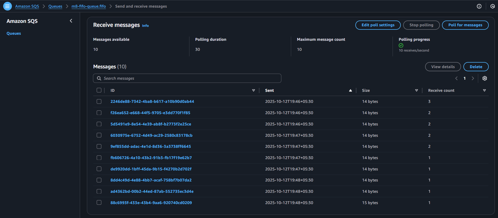


**Verify Message Ordering**

Each message was inspected individually to confirm FIFO behavior:

- Message 1  
  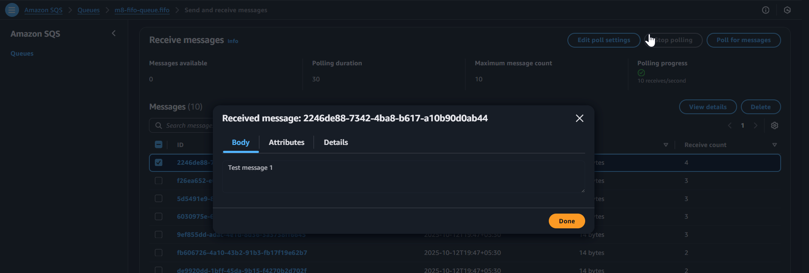

- Message 2  
  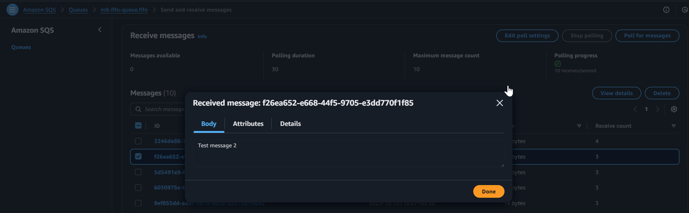

- Message 3  
  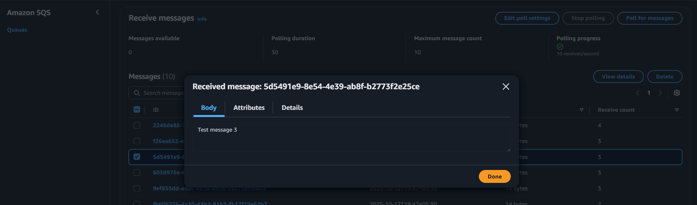

- Message 10  
  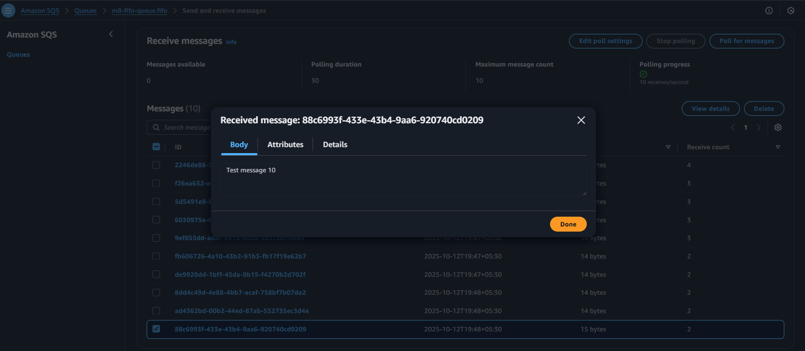

---

**Validate Ordering via AWS CLI**
```bash
aws sqs receive-message \
  --queue-url "$QUEUE_URL" \
  --max-number-of-messages 10 \
  --wait-time-seconds 5 \
  --output json | jq '.Messages[] | {Body, SentTimestamp}'
```

CLI output confirms messages were received in order:  

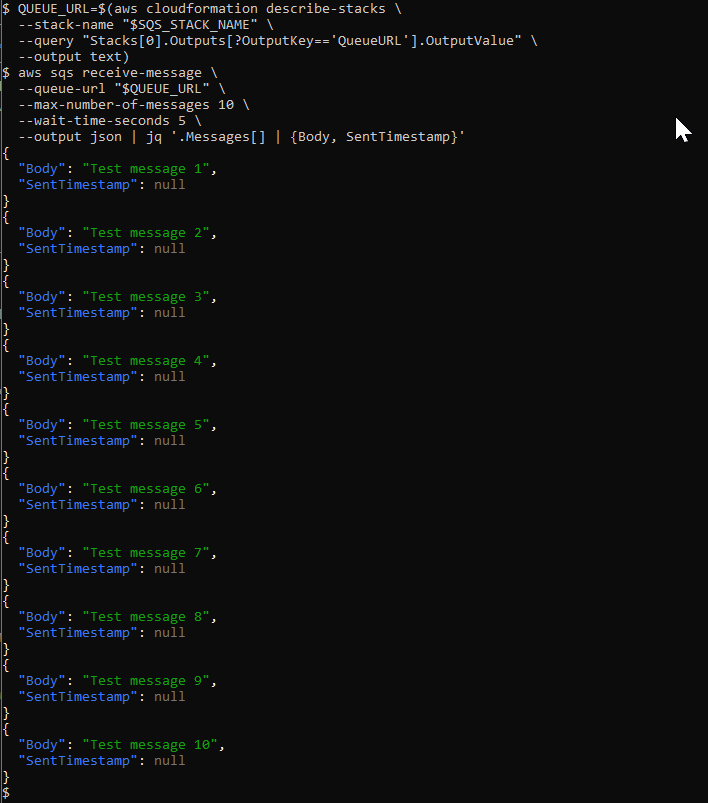


## Cleanup SQS stack resources
**Removes all messages from the queue**  
```bash
aws sqs purge-queue --queue-url $QUEUE_URL
```
**Delete the SQS Stack including the queue**  
```bash
aws cloudformation delete-stack --stack-name $SQS_STACK_NAME
aws cloudformation wait stack-delete-complete --stack-name $SQS_STACK_NAME
```

## 2. Register Your Email in SES and Send a Test Mail

This section documents the steps to verify an email identity using Amazon SES and send a test email to confirm successful configuration.


### Confirm Production Access

Ensure AWS account has SES sending enabled:

```bash
aws ses get-account-sending-enabled
```

Expected output:
```json
{
  "Enabled": true
}
```

### Set Variables for SES Stack Provisioning

```bash
EMAIL=youremail@xxxemailprovider.com
export SES_STACK_NAME="$PREFIX-ses-email-stack"
```

### Deploy SES Email Stack

```bash
aws cloudformation deploy \
  --template-file ses-email-stack.yaml \
  --stack-name $SES_STACK_NAME \
  --parameter-overrides EmailAddress=$EMAIL \
  --capabilities CAPABILITY_NAMED_IAM
```

### Verify SES Stack Deployment

- SES stack creation complete  

  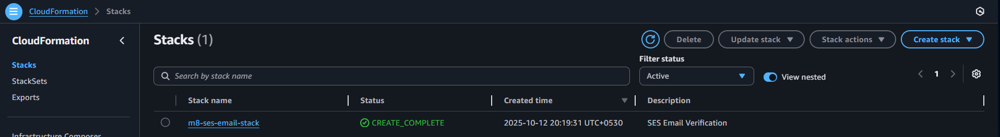

- Stack info view  

  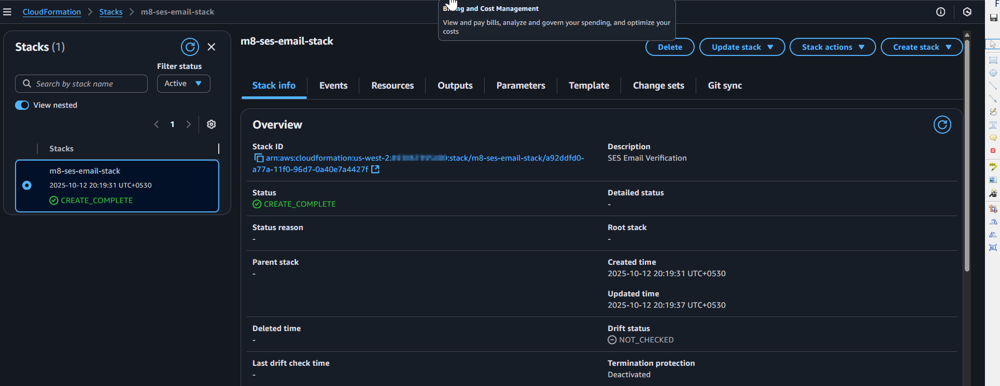

- Stack events  

  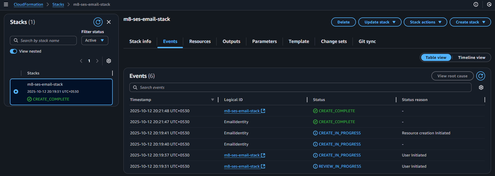

- Stack resources  

  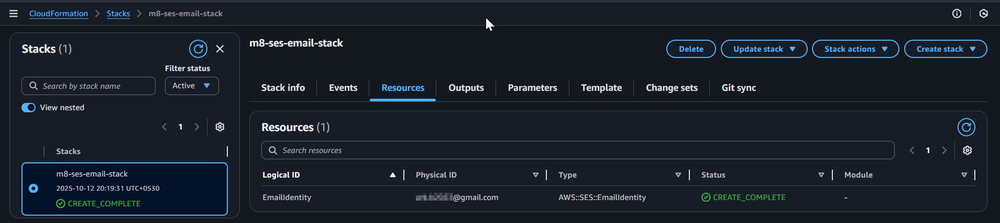

- Stack outputs  

  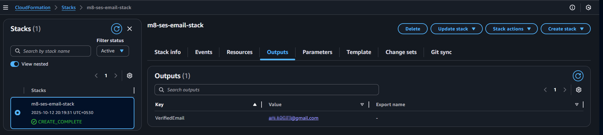

- Stack parameters  

  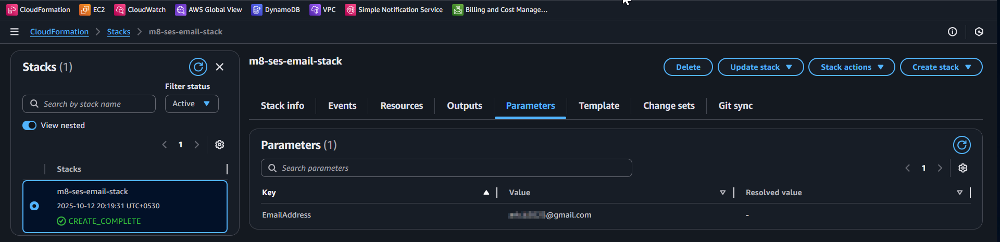

- SES console showing email verification pending  

  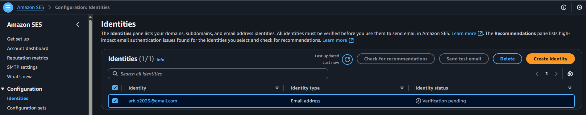

### Complete Email Verification

Check your inbox for a verification email from AWS SES:

- Verification email received  

  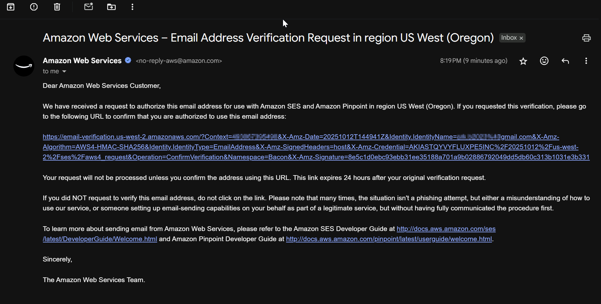

Click the verification link to complete the process.

- SES console showing successful verification  

  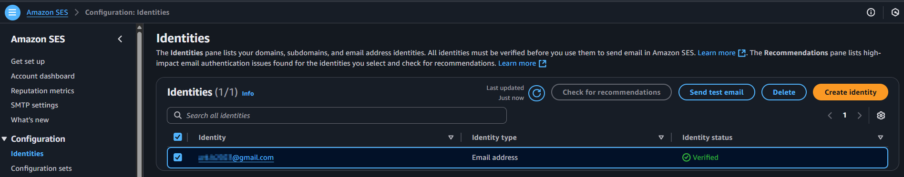


### Send a Test Email

Set the recipient (must be verified if SES is in sandbox mode):  

```bash
DESTINATION="recipient@gmail.com"
```

Send the email using AWS CLI:  

```bash
aws ses send-email \
  --from $EMAIL \
  --destination "ToAddresses=$DESTINATION" \
  --message "Subject={Data=Hello},Body={Text={Data=This is a test email from SES}}"
```

- Inbox shows test email received  

  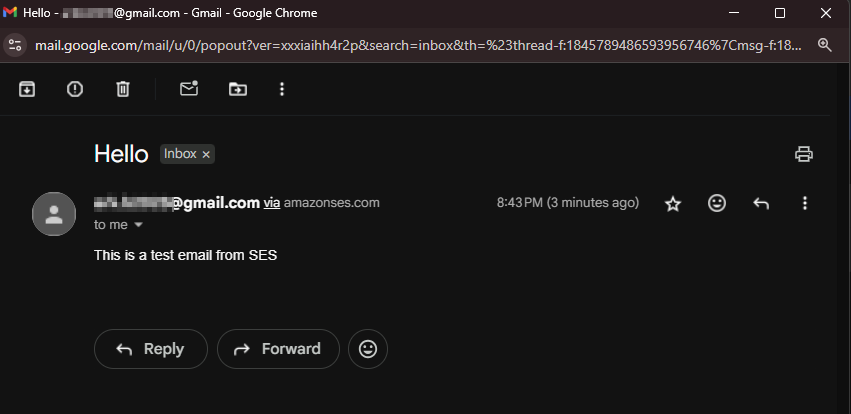

## Cleanup SES stack resources

**Delete Verified Email Identity**

```bash
aws ses delete-identity --identity $EMAIL
```

**Delete the SES CloudFormation Stack**
```bash
aws cloudformation delete-stack --stack-name $SES_STACK_NAME
aws cloudformation wait stack-delete-complete --stack-name $SES_STACK_NAME
```
---