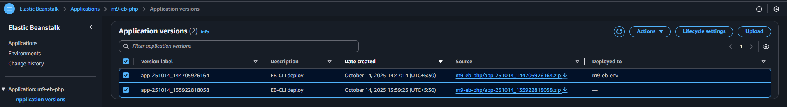
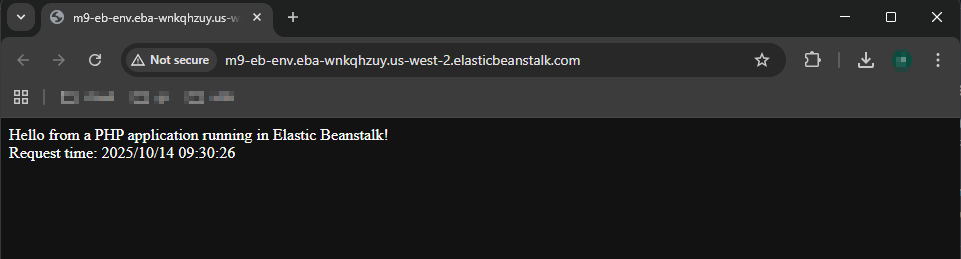

## Module 9: Elastic Beanstalk

You work for XYZ Corporation. Your corporation wants to launch a new web-based application and they do not want their servers to be running all the time. It should also be managed by AWS. Implement suitable solutions.  
Tasks To Be Performed:  
1. Create an Elastic Beanstalk environment with the runtime as PHP.  
2. Upload a simple PHP file to the environment once created  

---


### Solution Overview

This project demonstrates the end-to-end lifecycle of deploying a simple PHP application to AWS Elastic Beanstalk using the Elastic Beanstalk Command Line Interface (EB CLI).

Reference guide: [AWS Elastic Beanstalk PHP Quickstart Guide](https://docs.aws.amazon.com/elasticbeanstalk/latest/dg/php-quickstart.html)

**Key tasks completed:**
- Creating and initializing a PHP application
- Deploying to Elastic Beanstalk with a specified instance type
- Verifying application access via public URL
- Updating and redeploying the application
- Reviewing environment status, application versions, and deployment events
- Inspecting EB-provisioned resources across AWS services (S3, EC2 Load Balancer, CloudWatch, IAM)
- Performing a complete cleanup of all resources

---

### Repository Structure Overview

The project repository is organized as follows

- **`README.md`**  
  Provides a step-by-step summary of the Elastic Beanstalk deployment lifecycle, including CLI commands, environment configuration, screenshots and cleanup notes.

- **`index.php`**  
  Contains the version of the PHP application code deployed via Elastic Beanstalk.

- **`images/`**  
  Folder containing annotated screenshots that capture key milestones across the Elastic Beanstalk deployment lifecycle.


```
.
├── README.md
├── index.php
└── images
    ├── 01-elasticbeanstalk-environment-created.png
    ├── 02-elasticbeanstalk-environment-overview.png
    ├── 03-elasticbeanstalk-environment-events.png
    ├── 04-elasticbeanstalk-applications-m9-eb-php-application-versions.png
    ├── 05-elasticbeanstalk-environment-m9-eb-env-configuration-service-access.png
    ├── 06-elasticbeanstalk-environment-m9-eb-env-configuration-instance-traffic-scaling.png
    ├── 07-elasticbeanstalk-environment-m9-eb-env-health-view.png
    ├── 08-elasticbeanstalk-environment-m9-eb-env-tags-view.png
    ├── 09-01-elasticbeanstalk-environment-events-updated.png
    ├── 09-elasticbeanstalk-applications-m9-eb-php-application-versions-updated.png
    ├── 10-ec2-instance-created.png
    ├── 20-eb-init-success.png
    ├── 21-eb-configyaml.png
    ├── 22-eb-cli-eb-create-success.png
    ├── 23-eb-deploy-success.png
    ├── 24-eb-status-ok.png
    ├── 25-eb-terminate-ok.png
    ├── 31-browser-access.png
    ├── 32-browser-access-v2.png
    ├── 41-s3-bucket-general-purpose-bucket-elasticbeanstalk.png
    ├── 42-s3-bucket-general-purpose-bucket-elasticbeanstalk-objects.png
    ├── 43-s3-bucket-general-purpose-bucket-elasticbeanstalk-properties.png
    ├── 44-s3-bucket-general-purpose-bucket-elasticbeanstalk-permissions-bucket-policy.png
    ├── 45-s3-bucket-general-purpose-bucket-elasticbeanstalk-m9-eb-php-two-zips.png
    ├── 46-s3-bucket-rm.png
    ├── 47-s3-bucket-delete-policy-and-bucket.png
    ├── 50-cloudwatch-alarm-awseb.png
    ├── 61-ec2-load-balancers-awseb.png
    ├── 62-ec2-load-balancers-awseb-listener-rules.png
    └── 63-ec2-load-balancers-awseb-tags.png
```

### Create a PHP Application

```bash
# Create a project directory.
mkdir m9-eb-php/
cd m9-eb-php/

# Add initial PHP code to index.php
echo "<?php echo 'Hello from a PHP application running in Elastic Beanstalk!'; ?>" > index.php
```
---

### Initialize Project Directory for Elastic Beanstalk Deployment

```bash
eb init -i
```
This command interactively initializes local project directory for deployment via Elastic Beanstalk. It configures:

- The target AWS region  
- The application name  
- The platform `PHP`  

It generates a `.elasticbeanstalk/config.yml` file, making project ready for environment creation and deployment using EB CLI commands like `eb create` and `eb deploy`
  
- EB CLI initialization successful:  

  

- Configuration file generated (`.elasticbeanstalk/config.yml`):  

  

### Provision the environment `m9-eb-env` with `t3.micro` instance type

```bash
eb create m9-eb-env --instance_type t3.micro
```
This command provisions a new Elastic Beanstalk environment named `m9-eb-env` using a **t3.micro** EC2 instance type.

*Output shows environment creation successful*

  

---
### Elastic Beanstalk: Console View of Provisioned Environment  

*Newly created environment `m9-eb-env`*

  

*Environment operational status - `health` `Domain` `App name` `platform` `version` `state`*

  

*Environment events view - shows deployment history and event timeline leading to successful application rollout*

  


*Environment application versions view*

  


*Environment configuration service access view - shows `aws-elasticbeanstalk-service-role` and `aws-elasticbeanstalk-ec2-role`*

  

*Environment configuration – instance, traffic, scaling settings*

  

*Environment health view*

  

*Environment tags view*

  

---

### EC2: Console View

Elastic Beanstalk automatically provisions EC2 instance for webserver and an Application Load Balancer (ALB) to distribute traffic to EC2 instances.

- *Provisioned webserver instance*  

  

- *Load balancer*  

  

- *Listener rules for routing HTTP traffic to the environment*  

  

- *Tags applied to the load balancer*  

  

---
### S3: Console View  

Elastic Beanstalk automatically provisions an S3 bucket to store deployment artifacts such as application ZIPs and logs.

- *Provisioned bucket view*  

    

- *Provisioned bucket- objects view*  

  

- *Bucket properties view*

  

- *Bucket policy view*

  

---

### CloudWatch: Console View

Elastic Beanstalk automatically configures CloudWatch alarms to monitor environment health and resource usage.

- *CloudWatch alarm view*

  

---

### Confirm Deployment via Browser Access

```bash
eb open
```
This command launches the default web browser and opens the public URL of the deployed Elastic Beanstalk environment. It confirms that the application is live and accessible.

*Browser screenshot shows application accessible via public URL*

  

---

### Update and Redeploy the Application

Modify `index.php` to include a timestamp for dynamic response:

```php
<?php
  echo "Hello from a PHP application running in Elastic Beanstalk!";
  
  $timestamp = $_SERVER['REQUEST_TIME'];
  echo '<br/>Request time: ' . date('Y/m/d H:i:s', $timestamp);
?>
```

**Deploy the updated version**

```bash
eb deploy
```

*Output shows redeployment successful*

   

**Check the environment status**  

```bash
eb status
```

*Output shows environment details*

   


### Redeployment Validation

- *Elastic Beanstalk Events View – shows redeployment history and event timeline leading to updated application rollout*  

  

- *Elastic Beanstalk Application Versions – displays both the original and redeployed versions for traceability*  

  

- *S3 Bucket – contains two application ZIPs uploaded by EB CLI, representing the initial and updated deployments*  

  

- *Browser access view – confirms the revised PHP application is successfully deployed and accessible via public URL*  

  

---

### Cleanup Resources

After validating the deployment, cleanup all resources provisioned by Elastic Beanstalk.

**Terminate the Environment**
```bash
eb terminate
```

**Delete S3 Bucket and Artifacts**
```bash
aws s3 rm s3://elasticbeanstalk-us-west-2-XXXXXXXXXXXX --recursive
aws s3api delete-bucket-policy --bucket elasticbeanstalk-us-west-2-XXXXXXXXXXXX
aws s3api delete-bucket --bucket elasticbeanstalk-us-west-2-XXXXXXXXXXXX
```

**Remove Application Versions**
```bash
aws elasticbeanstalk delete-application-version \
  --application-name m9-eb-php \
  --version-label app-251014_144705926164 \
  --delete-source-bundle

aws elasticbeanstalk delete-application-version \
  --application-name m9-eb-php \
  --version-label app-251014_135922818058 \
  --delete-source-bundle
```

**Delete the Application**
```bash
aws elasticbeanstalk delete-application \
  --application-name m9-eb-php \
  --terminate-env-by-force
```

**Clean Up IAM Roles and Policies**

```bash
# EC2 Instance Profile Role
aws iam remove-role-from-instance-profile \
  --instance-profile-name aws-elasticbeanstalk-ec2-role \
  --role-name aws-elasticbeanstalk-ec2-role

aws iam delete-instance-profile \
  --instance-profile-name aws-elasticbeanstalk-ec2-role

aws iam detach-role-policy --role-name aws-elasticbeanstalk-ec2-role \
  --policy-arn arn:aws:iam::aws:policy/AWSElasticBeanstalkMulticontainerDocker

aws iam detach-role-policy --role-name aws-elasticbeanstalk-ec2-role \
  --policy-arn arn:aws:iam::aws:policy/AWSElasticBeanstalkWebTier

aws iam detach-role-policy --role-name aws-elasticbeanstalk-ec2-role \
  --policy-arn arn:aws:iam::aws:policy/AWSElasticBeanstalkWorkerTier

aws iam delete-role --role-name aws-elasticbeanstalk-ec2-role

# Service Role
aws iam detach-role-policy \
  --role-name aws-elasticbeanstalk-service-role \
  --policy-arn arn:aws:iam::aws:policy/service-role/AWSElasticBeanstalkEnhancedHealth

aws iam delete-role --role-name aws-elasticbeanstalk-service-role
```

---
