## Module 9: Lambda & SQS

You work for XYZ Corporation. Your corporation wants to launch a new web-based application and they do not want their servers to be running all the time. It should also be managed by AWS. Implement suitable solutions.  
Tasks To Be Performed:  
1. Create a sample Python Lambda function.  
2. Set the Lambda Trigger as SQS and send a message to test invocations.  

### Solution Overview

This solution leverages modular Terraform templates to provision AWS resources independently, including SQS, Lambda, and IAM roles. Infrastructure is deployed, validated, and cleaned up using CLI commands and scripted workflows. Once deployed, a message sent to the SQS queue triggers the Lambda function, which logs the received payload to CloudWatch for verification.

---
### Project Repository Structure

The repository is organized into modular components for clarity and reusability:

- **Root directory** contains the main Terraform configuration, variables, outputs, and helper scripts.
- **`modules/`** holds reusable Terraform modules for provisioning IAM roles, Lambda functions, and SQS queues independently.
- **`lambda/`** includes the Python handler code and deployment package for the Lambda function.
- **`images/`** stores validation screenshots captured from the AWS Console to support the report.

```bash
.
├── README.md
├── images
│   ├── 01-cloudwatch-log-group-lambda-function.png
│   ├── 02-cloudwatch-log-group-lambda-function-log-group-details.png
│   ├── 03-cloudwatch-log-group-lambda-log-events.png
│   ├── 11-iam-roles-lambda-execution-role.png
│   ├── 12-iam-roles-lambda-execution-role-policy-permissions.png
│   ├── 13-iam-roles-lambda-execution-role-trust-relationships.png
│   ├── 14-iam-roles-lambda-execution-role-permissions-policies-details-managed-and-inline.png
│   ├── 21-sqs-queue-created.png
│   ├── 22-sqs-queue-details.png
│   ├── 23-sqs-queue-lambda-triggers.png
│   ├── 31-lambda-function-created.png
│   ├── 32-lambda-function-configuration-triggers.png
│   ├── 33-lambda-function-configuration-permissions.png
│   ├── 34-lambda-function-configuration-cloudwatch-loggroup.png
│   ├── 35-lambda-function-code-view.png
│   └── 41-terraform-output.png
├── lambda
│   └── lambda_function.py
├── main.tf
├── modules
│   ├── iam
│   │   ├── lambda-sqs-policy.json
│   │   ├── main.tf
│   │   ├── outputs.tf
│   │   └── variables.tf
│   ├── lambda
│   │   ├── main.tf
│   │   ├── outputs.tf
│   │   └── variables.tf
│   └── sqs
│       ├── main.tf
│       ├── outputs.tf
│       └── variables.tf
├── outputs.tf
├── terraform.tfvars
└── variables.tf

```
### Prerequisites
```bash
# Create lambda handler code pip package
zip function.zip lambda_function.py
```
### Initialize Terraform project and Provision infrastructure
```bash
# Initialize the Terraform working directory
terraform init

# Validate the configuration files
terraform validate

# Generate an execution plan using input variables
terraform plan -var-file="terraform.tfvars" -out=tfplan

# Apply the saved plan to deploy infrastructure
terraform apply tfplan
```

### Verify provisioned resources
```bash
terraform output
```
- **Output**  

  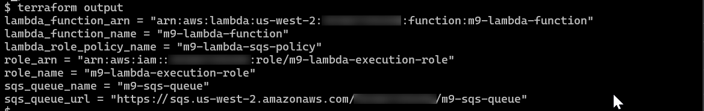

  *Explanation*
  | Output Name               | Description                                                                 |
  |---------------------------|-----------------------------------------------------------------------------|
  | `lambda_function_arn`     | ARN of the deployed Lambda function |
  | `Lambda_function_name`    | Logical name of the Lambda function                 |
  | `Lambda_role_policy_name` | Name of the inline IAM policy attached to the Lambda execution role         |
  | `role_arn`                | ARN of the IAM role assumed by Lambda                                  |
  | `role_name`               | Name of the IAM role                                                |
  | `sqs_queue_name`          | Name of the SQS queue                                               |
  | `sqs_queue_url`           | URL used to send messages to the SQS queue via AWS CLI |

---

### SQS Queue `m9-sqs-queue` Provisioned

- **Queue Created**  
  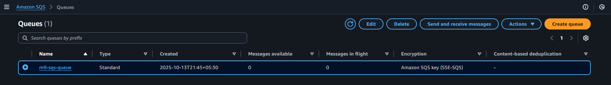

- **Queue Properties**  
  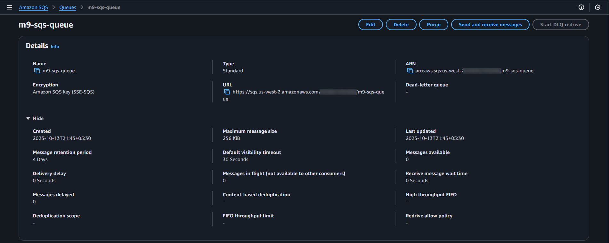

- **Lambda Trigger Configuration**  
  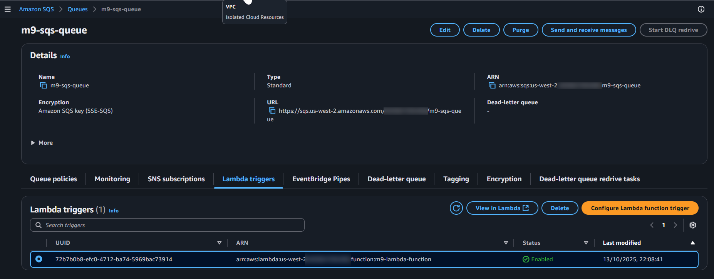

### IAM Role `m9-lambda-execution-role` with Attached Policies and Trust Relationship

- **Role Created**  
  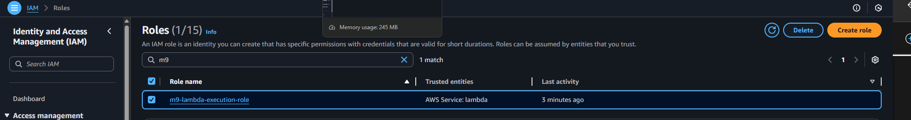

- **Policy Permissions**  
  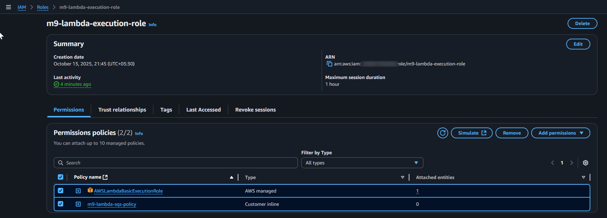

- **Managed and Inline Policy Details**  
  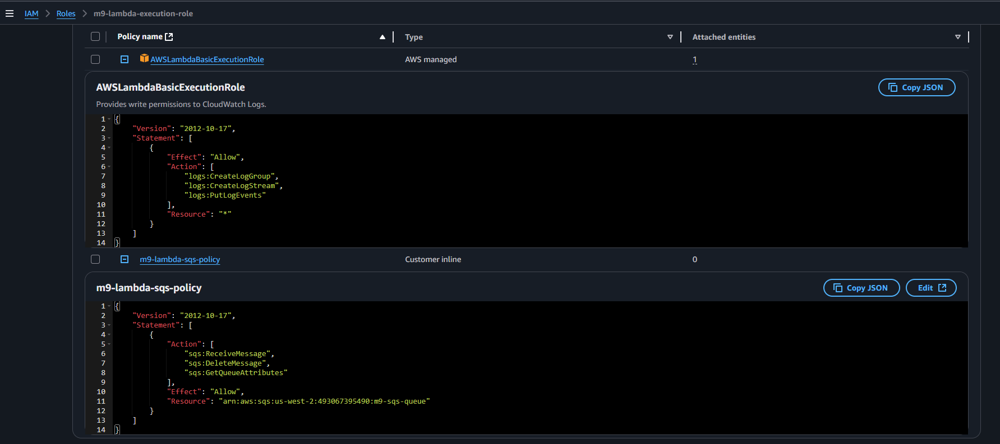

- **Trust Relationship Configuration**  
  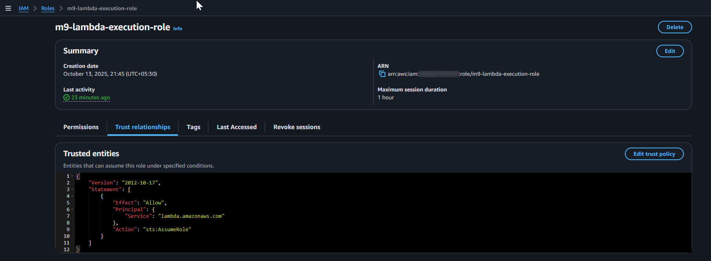

---

### Lambda Function `m9-lambda-function` Provisioned

- **Function Created**  
  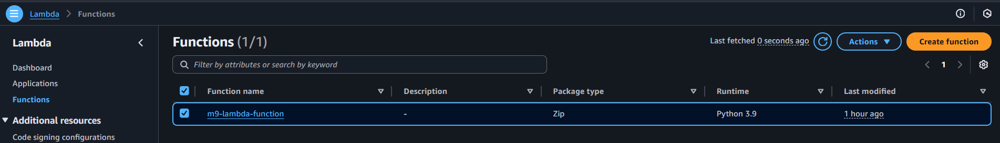

- **Trigger Configuration**  
  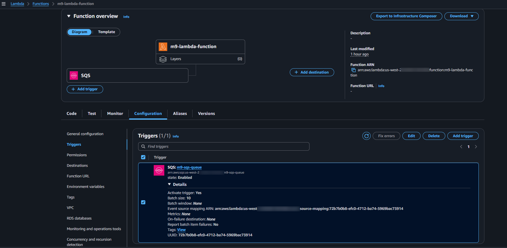

- **Execution Role Permissions**  
  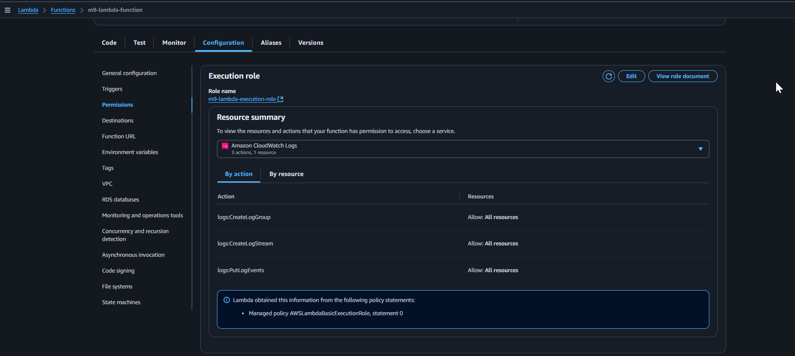

- **CloudWatch Log Group Linked**  
  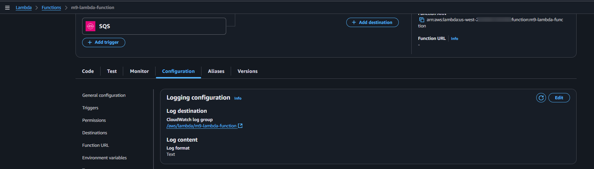

- **Function Code View**  
  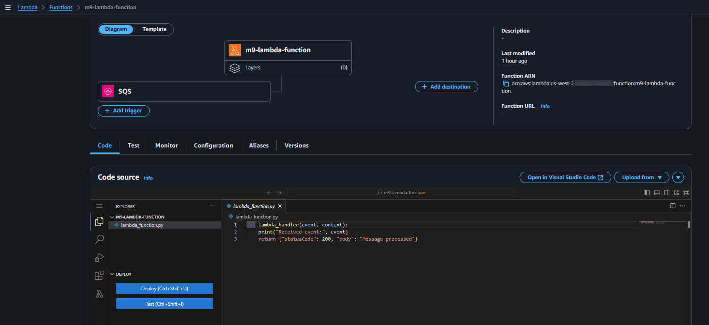


---

### CloudWatch Log Group `/aws/lambda/m9-lambda-function` Provisioned

- **Log Group Created**  
  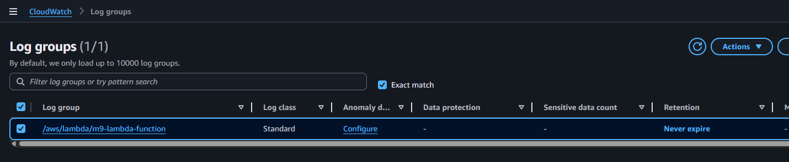

- **Log Group Details**  
  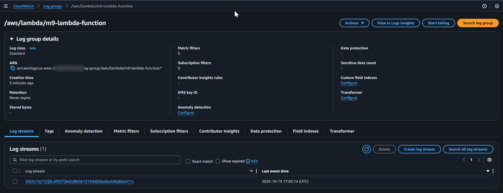


---

### Send Test Message

To validate the integration between SQS and Lambda, a test message was sent to the provisioned SQS queue using the AWS CLI:

```bash
aws sqs send-message \
  --queue-url $(terraform output -raw sqs_queue_url) \
  --message-body "Lambda triggered via SQS — integration test successful!"
```

- **Lambda Execution Logs**  
  CloudWatch confirms successful invocation of the Lambda function triggered by the SQS message.  
  *The highlighted log entry (in `blue`) shows the received payload*  
  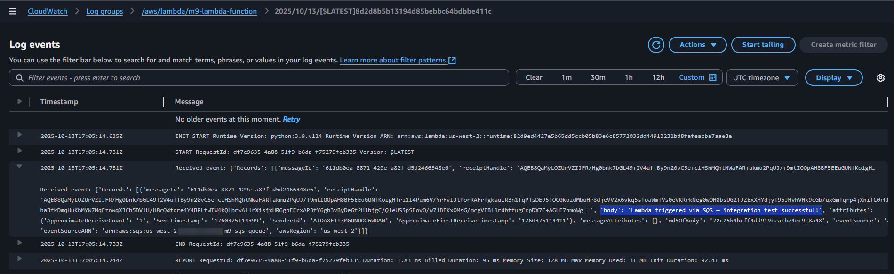

---

### Cleanup

**Destroy Resources**
```bash
terraform destroy -var-file="terraform.tfvars" -auto-approve
```
**Delete CloudWatch log group**
```bash
aws logs delete-log-group --log-group-name "/aws/lambda/m9-lambda-function"
```
---
